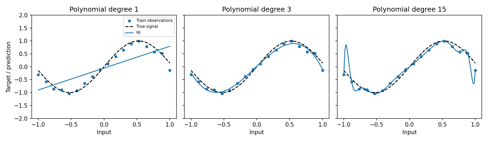

# 02.4 Underfitting, Overfitting, and Generalization

第一编目录 · 本章导读

> Prerequisites: 02.1–02.3. Goal: distinguish representation, optimization, and generalization problems using evidence.

## 1. Motivation: what kind of failure are we seeing?

A bad validation score has several possible causes. The model may be too simple, the optimizer may not have found a useful solution, or the model may have fit details that do not transfer.

**Underfitting** means the learned predictor misses important structure. **Overfitting** means its adaptation to the particular training set hurts performance on new examples relative to a better-fitting compromise.

A train/validation gap alone does not establish the cause. Distribution shift, noisy labels, and evaluation bugs can create similar patterns.

## 2. Training objective versus future risk

Let $\boldsymbol{\theta}$ denote parameters and $\ell$ the per-example loss. Training minimizes the empirical average

$$
\hat R_{\mathrm{train}}(\boldsymbol{\theta})
=\frac{1}{N}\sum_i\ell(f_{\boldsymbol{\theta}}(\mathbf{x}_i),y_i).
$$

The quantity we ultimately care about is an expectation over new examples from a deployment distribution $\mathcal D$:

$$
R(\boldsymbol{\theta})
=\mathbb E_{(\mathbf{x},y)\sim\mathcal D}
 [\ell(f_{\boldsymbol{\theta}}(\mathbf{x}),y)].
$$

We do not know this expectation exactly. Held-out data estimates it, with finite-sample uncertainty and possible distribution mismatch. Lower training risk does not mathematically guarantee lower future risk.

## 3. Three diagnoses that require different interventions

| Observation | Candidate explanation | Useful next check |
|---|---|---|
| High train and validation error | Insufficient capacity, poor features, or optimization failure | Fit a tiny subset; inspect gradients and learning rate |
| Low train, high validation error | Overfitting, leakage in procedure, or distribution mismatch | Inspect splits, labels, regularization, and error categories |
| Both improve slowly | Optimization speed or insufficient training | Controlled learning-rate and training-budget comparison |
| Validation rises while train falls | Increasing adaptation to training details | Restore an earlier validation-selected checkpoint |

Evaluate both splits in evaluation mode using the same loss definition. A training loss including penalties or dropout noise is not directly comparable to a clean validation data loss.

## 4. Capacity through a concrete example

Suppose the target follows a curved function of one input. A straight line cannot represent the curvature no matter how long we optimize it. A low-degree polynomial may capture the main relationship. A very high-degree polynomial can interpolate individual noisy observations and behave wildly between them.

More parameters can improve representational ability, but actual generalization depends on data, optimization, architecture, and regularization. Neural networks do not obey a universal rule that “more parameters always overfit.”

## 5. Bias–variance decomposition, with the missing steps

For a fixed input $x$, suppose the true target is $y=f^{*}(x)+\epsilon$, with zero-mean noise of variance $\sigma^2$. Training on a random dataset $D$ gives a predictor $\hat f_D(x)$.

Define its average over possible training datasets as $\bar f(x)=\mathbb E_D[\hat f_D(x)]$. Add and subtract this mean:

$$
\hat f_D(x)-y
=(\hat f_D(x)-\bar f(x))
 +(\bar f(x)-f^{*}(x))-\epsilon.
$$

Let $a=\hat f_D(x)-\bar f(x)$ and $b=\bar f(x)-f^{*}(x)$. At fixed $x$, $b$ is constant while $\mathbb E_D[a]=0$. Expand explicitly:

$$
(a+b-\epsilon)^2=a^2+b^2+\epsilon^2+2ab-2a\epsilon-2b\epsilon.
$$

Now $\mathbb E[ab]=b\,\mathbb E[a]=0$ and $\mathbb E[b\epsilon]=b\,\mathbb E[\epsilon]=0$. Independence of the fresh observation noise from the training dataset gives $\mathbb E[a\epsilon]=\mathbb E[a]\mathbb E[\epsilon]=0$. Zero means alone would not justify this last equality if the two random quantities were correlated. The result is

$$
\mathbb E[(\hat f_D(x)-y)^2]
=\underbrace{(\bar f(x)-f^{*}(x))^2}_{\text{squared bias}}
+\underbrace{\mathbb E_D[(\hat f_D(x)-\bar f(x))^2]}_{\text{variance}}
+\underbrace{\sigma^2}_{\text{noise}}.
$$

Bias describes a systematic mismatch. Variance describes sensitivity to the sampled training data. Noise is irreducible under the assumed inputs and model of observation.

For three fitted predictions $[1,2,3]$ at an input whose true signal is 2, the mean prediction is 2, squared bias is 0, and prediction variance (divisor 3) is $2/3$. With independent fresh noise of variance $1/4$, expected squared error is $2/3+1/4=11/12$.

This decomposition concerns squared prediction error and repeated datasets. A single training curve does not separately measure all three quantities. The companion script additionally fits repeated noisy training datasets on a fixed design and checks the empirical signal-error identity $\mathrm{mean}_D(\hat f_D-f^{*})^2=(\bar f-f^{*})^2+\mathrm{Var}_D(\hat f_D)$ before adding observation noise.

## 6. Regularization previews

A regularizer changes which solutions training prefers. One example penalizes large weights:

$$
L_{\mathrm{total}}
=L_{\mathrm{data}}+\frac{\lambda}{2}\|\mathbf{w}\|_2^2,
\qquad \lambda\geq0.
$$

The derivative adds $\lambda\mathbf{w}$, encouraging smaller weights under the chosen feature scaling. This is not a guarantee of better validation performance. The value of $\lambda$ is chosen using validation.

Other interventions include augmentation, early stopping, more representative data, and task-appropriate architecture. Section 04.2 derives their mechanisms and the distinction between L2 and AdamW.

## 7. Runnable experiment: separate capacity from optimization

Use a direct least-squares solver so that a poorly tuned optimizer cannot explain the result. Fit polynomials of different degrees to the same observations.

```python
import numpy as np
import torch

rng = np.random.default_rng(10)
x_train = np.linspace(-1, 1, 18)
x_val = np.linspace(-1, 1, 121)
signal = lambda x: np.sin(3 * x)
y_train = signal(x_train) + rng.normal(scale=0.15, size=len(x_train))
y_val = signal(x_val) + rng.normal(scale=0.15, size=len(x_val))

for degree in [1, 3, 15]:
    A = np.vander(x_train, N=degree + 1, increasing=True)
    V = np.vander(x_val, N=degree + 1, increasing=True)
    weights, *_ = np.linalg.lstsq(A, y_train, rcond=None)
    train_mse = np.mean((A @ weights - y_train)**2)
    val_mse = np.mean((V @ weights - y_val)**2)
    print("degree/train/validation:", degree, train_mse, val_mse)

    # The same fitted polynomial is a linear model in expanded features.
    layer = torch.nn.Linear(degree + 1, 1, bias=False).double()
    with torch.no_grad():
        layer.weight.copy_(torch.tensor(weights[None, :]))
    pytorch_prediction = layer(torch.tensor(V)).detach().numpy()[:, 0]
    np.testing.assert_allclose(pytorch_prediction, V @ weights, atol=1e-7)
```

Expect the line to miss curvature and the high-degree fit to be more sensitive to noise. Inspect measured results rather than treating this pattern as guaranteed for every dataset or degree.

High powers can be poorly conditioned numerically. This itself is a reason to choose representations carefully; `lstsq` is more appropriate than explicitly inverting the normal-equation matrix.

## 8. Follow-up experiments and common mistakes

Repeat the experiment over several data seeds and compare distributions of validation errors. Increase the number of training points while leaving the validation grid fixed. Use a plot to inspect where errors occur, especially near boundaries.

A training loss of zero may mean the model fits label noise. An early validation minimum is not proof of overfitting if the validation set is tiny and noisy. “Train longer” and “add regularization” address different hypotheses.

## 9. Exercises

1. Explain how fitting a tiny clean subset helps distinguish a bug from limited generalization.
2. Re-derive why the bias–variance cross terms vanish.
3. Add an L2 penalty to the polynomial model and compare several values on validation.
4. Explain why validation loss can sometimes be lower than online training loss.
5. Design one experiment where increasing data is a better intervention than decreasing width.

## 10. Completion standard and English summary

You can distinguish capacity, optimization, and generalization failures, explain empirical versus future risk, and choose a controlled experiment before changing the model.

Write 100 words answering: “What evidence would justify calling this result overfitting?”

## 配套实验与阅读导航

完整脚本：[lab_02_4.py](../配套实验/lab_02_4.py)。运行环境与注意事项见 实验指南。

以下图来自配套实验，记录的是该固定设置下的结果：



上一节：02.3 训练集验证集与测试集

下一节：03.1 MLP与反向传播