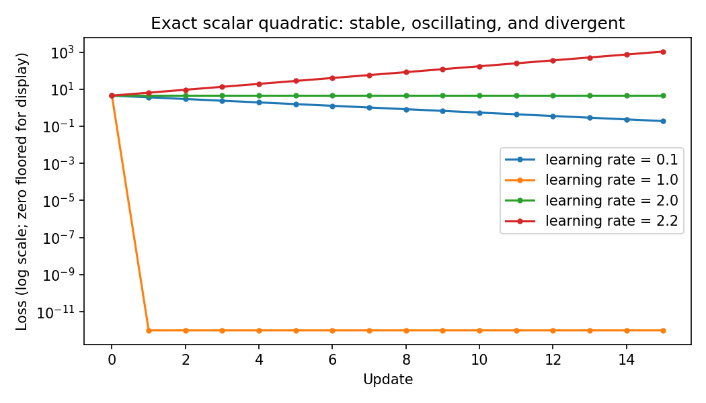

# 04.3 Learning Rates, Schedules, and Training Diagnosis

第一编目录 · 本章导读

> Prerequisites: 04.1–04.2. Goal: turn loss curves and gradient measurements into controlled debugging decisions.

## 1. Motivation: a direction is not a distance

The gradient describes local sensitivity. A learning rate determines how far the optimizer moves. Even an exactly computed gradient can produce a bad update if the step crosses too much curvature.

Before selecting an optimizer, establish a simple baseline with recorded learning rate, batch size, update count, training loss, validation loss, and gradient norms.

## 2. An exact scalar stability calculation

Let the scalar loss be

$$
L(\theta)=\frac{a}{2}(\theta-\theta^*)^2,
\qquad a>0.
$$

Here $a$ is curvature and $\theta^*$ is the minimum. Its gradient is $a(\theta-\theta^*)$. Define the error $e_t=\theta_t-\theta^*$. One SGD step gives

$$
e_{t+1}
=\theta_t-\eta a(\theta_t-\theta^*)-\theta^*
=(1-\eta a)e_t.
$$

Therefore

$$
L(\theta_{t+1})=(1-\eta a)^2L(\theta_t).
$$

For a nonzero error, loss contracts exactly when $|1-\eta a|<1$, or

$$
0<\eta<\frac{2}{a}.
$$

If $\eta a=1$, one step reaches the minimum for this particular quadratic. If $\eta a=2$, the error changes sign but not magnitude: loss is unchanged. If $\eta a>2$, the magnitude grows.

For a positive-definite quadratic in many dimensions, each eigen-direction behaves like a scalar quadratic with its own curvature. The largest eigenvalue determines the restrictive step-size bound. This is an exact statement for that quadratic setting, not a global guarantee for a changing neural-network objective.

## 3. Mini-batch loss curves contain more than optimization progress

Two consecutive mini-batches may have different difficulty. Comparing their losses mixes a parameter change with a data change. An upward mini-batch loss therefore does not necessarily mean the update was wrong.

Use a fixed held-out set and periodic evaluation of the same training subset. Log raw values as well as a smoothed curve so smoothing does not hide spikes.

When comparing runs, state whether budget is measured in epochs, updates, tokens/examples processed, or wall-clock time.

## 4. A learning-rate range test

A range test starts at a very small rate and increases it over a short run, often geometrically:

$$
\eta_t=\eta_{\min}
\left(\frac{\eta_{\max}}{\eta_{\min}}\right)^{t/(T-1)},
\quad t=0,\ldots,T-1.
$$

The ratio is constant between adjacent steps. Observe where loss starts falling and where it becomes unstable, then investigate conservative candidates below the unstable region.

The test changes weights and optimizer state. Restore the initial state before a real comparison. It is a heuristic whose result depends on the optimizer, batch size, loss scaling, and schedule; it is not a universal automatic optimum.

## 5. Why schedules change the rate over time

Early training may benefit from larger movement; late training may benefit from smaller updates. **Warmup** begins cautiously while activations and optimizer statistics are settling.

For $T_w>0$ warmup steps, a simple linear warmup can use $\eta_t=\eta_{\max}(t+1)/T_w$. After warmup, define progress $u\in[0,1]$ and cosine decay:

$$
\eta(u)=\eta_{\min}
+\frac{\eta_{\max}-\eta_{\min}}{2}
 [1+\cos(\pi u)].
$$

At $u=0$, the cosine is 1 and the rate is $\eta_{\max}$; at $u=1$, it is -1 and the rate is $\eta_{\min}$. The curve smoothly interpolates endpoints.

### Fix the off-by-one convention before implementing a schedule

Let $U$ be the total number of optimizer updates and $W$ the warmup count, with $1\leq W<U-1$. Use zero-based update index $t$. For $t<W$, use $\eta_{\max}(t+1)/W$. For $t\geq W$, define $u=(t-W)/(U-W-1)$ and use the cosine expression above. This deliberately repeats the peak at the last warmup update and first decay update, then reaches $\eta_{\min}$ on update $U-1$.

For $U=6,W=2,\eta_{\max}=0.1,\eta_{\min}=0.01$, the six rates are $[0.05,0.1,0.1,0.0775,0.0325,0.01]$. Other endpoint conventions are possible; the point is to document which rate each `optimizer.step()` actually uses. The companion script verifies this sequence and both decay endpoints.

For PyTorch schedulers, follow the intended stepping unit. A scheduler called every batch and one called every epoch produce different schedules. Typically call `optimizer.step()` before `scheduler.step()`; metric-based schedulers also need the specified validation metric.

## 6. What to measure in addition to loss

For parameter tensors $\mathbf{W}^{(l)}$, a global gradient norm is

$$
\|\mathbf{g}\|_2
=\sqrt{\sum_l\|\nabla_{\mathbf{W}^{(l)}}L\|_F^2}.
$$

Measure it before clipping to see the original magnitude. A large gradient is not itself proof of a bug; its meaning depends on loss scale and parameterization.

An update-to-parameter ratio compares the actual change to the current parameter magnitude:

$$
r_t=\frac{\|\boldsymbol{\theta}_{t+1}-\boldsymbol{\theta}_t\|_2}
{\|\boldsymbol{\theta}_t\|_2+\varepsilon}.
$$

For Adam, the actual update is not just learning rate times raw gradient. Inspect the update when diagnosing its step sizes.

## 7. Runnable experiment: rate, curvature, and controlled SGD comparisons

```python
import copy
import math
import torch
from torch import nn

torch.manual_seed(6)
torch.set_num_threads(1)
for rate in [0.1, 1.0, 2.0, 2.2]:
    theta = 0.0
    losses = []
    for _ in range(8):
        losses.append(0.5 * (theta - 3.0)**2)
        theta -= rate * (theta - 3.0)
    print("quadratic rate/losses:", rate, losses)

X = torch.randn(200, 4)
y = X @ torch.tensor([[2.], [-1.], [0.5], [1.]]) + 0.1 * torch.randn(200, 1)
train_x, val_x = X[:150], X[150:]
train_y, val_y = y[:150], y[150:]
initial = nn.Linear(4, 1).state_dict()

for rate in [1e-4, 0.05, 2.0]:
    model = nn.Linear(4, 1)
    model.load_state_dict(copy.deepcopy(initial))
    optimizer = torch.optim.SGD(model.parameters(), lr=rate)
    first_grad, last_val = None, float("inf")

    for step in range(100):
        optimizer.zero_grad(set_to_none=True)
        loss = (model(train_x) - train_y).square().mean()
        if not torch.isfinite(loss):
            print("non-finite loss at step", step)
            break
        loss.backward()
        grad_norm = torch.sqrt(sum(p.grad.square().sum() for p in model.parameters()))
        if first_grad is None:
            first_grad = grad_norm.item()
        if not torch.isfinite(grad_norm):
            break
        optimizer.step()
        with torch.no_grad():
            last_val = (model(val_x) - val_y).square().mean().item()
        if not math.isfinite(last_val) or last_val > 1e10:
            break

    print("linear run:", rate, "first gradient:", first_grad, "validation:", last_val)
```

The companion script asserts that the first gradients match, verifies the scalar loss ratios numerically, and checks geometric-range and warmup/cosine schedule endpoints. The first gradients should match because the initial model and data match. Later gradients differ because learning rates move the parameters to different places.

The scalar rate 2 case should show constant loss, not increasing loss. The high-rate linear run stops when divergence is clear instead of continuing to produce meaningless values.

## 8. A practical debugging sequence

1. Inspect one batch, labels, shapes, dtype, device, and finite values.
2. Fit a tiny clean subset with regularization and augmentation disabled temporarily.
3. Verify the loss is connected to intended parameters and gradients are nonzero where expected.
4. Try a small set of learning rates from the same initialization.
5. Inspect activation and gradient statistics by layer.
6. Compare train/validation splits, preprocessing, and model modes.
7. Only then change architecture based on a specific hypothesis.

For NaN/Inf, find the **first** invalid operation rather than only the final invalid loss. Check logarithms, division, exponentials, input values, and gradient explosions. Autograd anomaly detection can help localize backward failures but slows execution.

Clipping can bound the raw gradient norm passed to the optimizer; it cannot repair wrong labels, a detached graph, or an invalid objective. It does not generally bound an Adam update by learning rate times the clipping threshold.

## 9. Exercises

1. Derive the exact loss ratio for the scalar quadratic.
2. Use curvatures 1 and 100 in a two-parameter quadratic and predict a stable rate.
3. Implement the geometric range schedule, recording rate and loss, then reset the model.
4. Implement warmup plus cosine and verify both endpoints.
5. Log the actual update norm for SGD and Adam under identical initial gradients.
6. Construct a training failure and write a diagnosis with one controlled intervention.

## 10. Completion standard and English summary

You can explain step-size stability, separate sampling noise from optimizer behavior, implement a schedule with the correct stepping unit, and diagnose failures from recorded evidence.

Write a short report with: observation, hypothesis, controlled change, result, and remaining uncertainty.

## 配套实验与阅读导航

完整脚本：[lab_04_3.py](../配套实验/lab_04_3.py)。运行环境与注意事项见 实验指南。

以下图来自配套实验，记录的是该固定设置下的结果：



上一节：04.2 正则化与泛化

下一节：05.1 卷积padding与stride