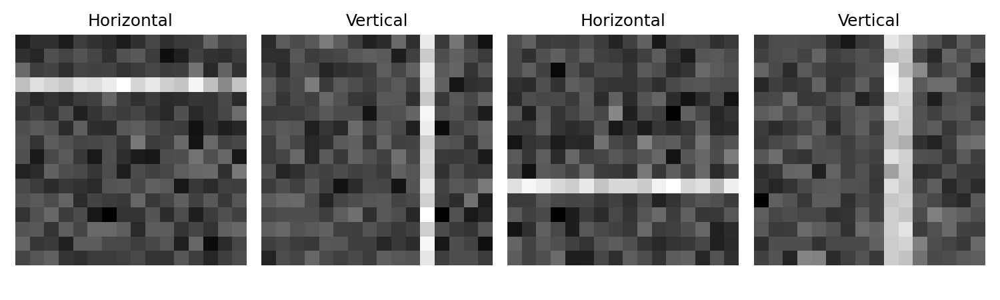
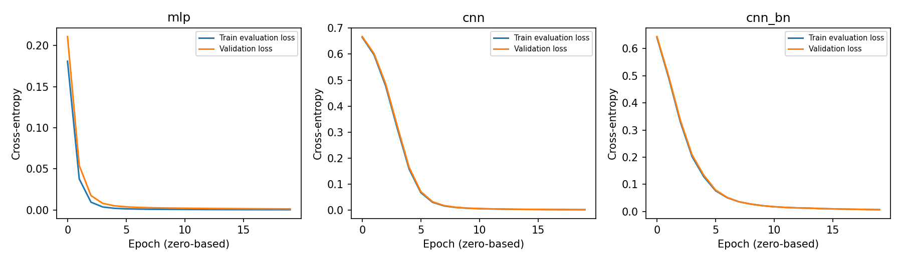
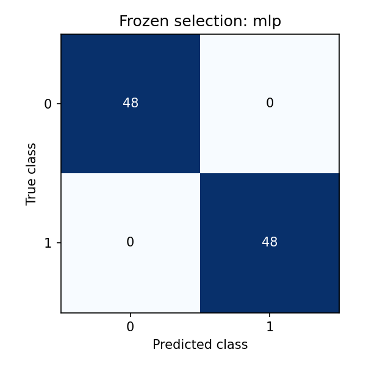

# 05.4 A Complete Visual Classification Experiment

第一编目录 · 本章导读

> Prerequisites: Chapters 01–04 and 05.1–05.3. Goal: assemble a controlled CNN experiment and explain what its results do and do not establish.

## 1. Motivation: architecture knowledge needs experimental evidence

Knowing convolution shapes is useful, but a complete experiment also needs a defined task, a split, a baseline, a training procedure, and an honest evaluation.

We use generated grayscale images containing horizontal or vertical stripes. This keeps the example small, reproducible, and runnable on CPU without downloading a dataset. It tests the pipeline and orientation recognition, not natural-image understanding.

## 2. Specify the task before building the model

Each image has shape $(1,16,16)$. The label is 0 for a horizontal bright stripe and 1 for a vertical bright stripe. Position and thickness vary, and additive noise prevents every input from being identical.

We generate training, validation, and test sets with different random seeds. Their underlying generation rules match, so test performance estimates performance on this generator. Stripe positions and widths intentionally recur across splits; different noise realizations do not constitute a held-out geometry test. To evaluate unseen stripe locations, define disjoint position sets before generating the data. A separate noise-shift test asks a different robustness question.

A $90^\circ$ rotation would swap the class. It is therefore not a label-preserving augmentation here. Translation generally preserves orientation, provided the stripe remains visible.

## 3. Choose a baseline and one controlled architectural change

Our baseline is an MLP on flattened pixels. The CNN uses local kernels and shared weights, followed by pooling and global averaging.

We also compare the CNN with and without BatchNorm while keeping the rest of that CNN configuration fixed. BatchNorm adds a small number of parameters, which we count.

For the two CNN variants, we explicitly verify that corresponding convolution and head tensors start with identical values and that their batch orders match. Reusing a seed alone is not always enough: adding a randomly initialized module can consume random numbers and shift subsequent initializations. BatchNorm here initializes affine scales/shifts deterministically, but we test that property instead of assuming it.

A single comparison at one learning rate does not establish a universally superior architecture. A fairer broader study would tune each method on validation with comparable search budgets and repeat over seeds.

## 4. Derive the training and evaluation quantities

For logits $\mathbf{z}_i\in\mathbb{R}^{2}$ and class label $y_i$, cross-entropy from 02.2 is

$$
L_B=-\frac{1}{B}\sum_i
\log\mathrm{softmax}(\mathbf{z}_i)_{y_i}.
$$

At evaluation, predict $\hat y_i=\arg\max_k z_{ik}$. Confusion-matrix entry $C_{ab}$ counts true class $a$ predicted as $b$. For binary classes, flattening this matrix in row-major order gives $(TN,FP,FN,TP)$ with class 1 positive.

For class $k$, count $TP_k=C_{kk}$, $FP_k=\sum_a C_{ak}-TP_k$, and $FN_k=\sum_b C_{kb}-TP_k$. Compute $F_{1,k}=2TP_k/(2TP_k+FP_k+FN_k)$, then average the two class F1 values to obtain macro F1. This is not generally the F1 computed from macro-averaged precision and recall.

Report data loss, accuracy, class counts, confusion matrix, and a class-sensitive metric such as macro F1. Select the checkpoint and model using validation; use test after those decisions.

## 5. Runnable experiment

The whole block defines data, models, training, validation selection, and final testing. No external dataset, pretrained weights, or GPU is required.

```python
import copy
import torch
import torch.nn.functional as F
from torch import nn
from torch.utils.data import TensorDataset, DataLoader

torch.set_num_threads(1)

def make_images(n, seed, noise=0.15):
    generator = torch.Generator().manual_seed(seed)
    labels = torch.arange(n) % 2
    images = noise * torch.randn(n, 1, 16, 16, generator=generator)
    for i in range(n):
        position = int(torch.randint(2, 12, (), generator=generator))
        width = int(torch.randint(1, 4, (), generator=generator))
        if labels[i] == 0:
            images[i, 0, position:position+width, :] += 1.0
        else:
            images[i, 0, :, position:position+width] += 1.0
    return images, labels.long()

train_x, train_y = make_images(256, 1)
val_x, val_y = make_images(96, 2)
test_x, test_y = make_images(96, 3)
shift_x, shift_y = make_images(96, 4, noise=0.45)

# Training statistics only, fixed for every other split.
mean = train_x.mean()
std = train_x.std(unbiased=False).clamp_min(1e-8)
train_x, val_x = (train_x - mean) / std, (val_x - mean) / std
test_x, shift_x = (test_x - mean) / std, (shift_x - mean) / std

def make_model(name):
    if name == "mlp":
        return nn.Sequential(nn.Flatten(), nn.Linear(256, 32),
                             nn.ReLU(), nn.Linear(32, 2))
    use_bn = name == "cnn_bn"
    def norm(channels):
        return nn.BatchNorm2d(channels) if use_bn else nn.Identity()
    return nn.Sequential(
        nn.Conv2d(1, 8, 3, padding=1), norm(8), nn.ReLU(),
        nn.MaxPool2d(2),
        nn.Conv2d(8, 16, 3, padding=1), norm(16), nn.ReLU(),
        nn.AdaptiveAvgPool2d(1), nn.Flatten(), nn.Linear(16, 2),
    )

@torch.no_grad()
def evaluate(model, images, labels):
    model.eval()
    logits = model(images)
    loss = F.cross_entropy(logits, labels).item()
    predicted = logits.argmax(1)
    confusion = torch.bincount(2 * labels + predicted, minlength=4).reshape(2, 2)
    accuracy = predicted.eq(labels).float().mean().item()
    f1_scores = []
    for cls in range(2):
        tp = confusion[cls, cls].item()
        fp = confusion[:, cls].sum().item() - tp
        fn = confusion[cls, :].sum().item() - tp
        f1_scores.append(2 * tp / max(2 * tp + fp + fn, 1))
    return loss, accuracy, sum(f1_scores) / 2, confusion

# Verify shared initialization for the BN ablation before training.
torch.manual_seed(10)
plain_initial = make_model("cnn").state_dict()
torch.manual_seed(10)
bn_initial = make_model("cnn_bn").state_dict()
for key in plain_initial.keys() & bn_initial.keys():
    torch.testing.assert_close(plain_initial[key],bn_initial[key],atol=0,rtol=0)
batch_orders = {}

models, histories, validation_losses = {}, {}, {}
for name in ["mlp", "cnn", "cnn_bn"]:
    torch.manual_seed(10)
    model = make_model(name)
    loader = DataLoader(TensorDataset(train_x, train_y, torch.arange(len(train_y))), batch_size=32,
                        shuffle=True, generator=torch.Generator().manual_seed(20))
    optimizer = torch.optim.Adam(model.parameters(), lr=0.003)
    best_loss, best_state = float("inf"), None
    history, seen_indices = [], []

    for epoch in range(20):
        model.train()
        for images, labels, example_indices in loader:
            seen_indices.append(example_indices.clone())
            optimizer.zero_grad(set_to_none=True)
            logits = model(images)
            assert logits.shape == (len(images), 2)
            loss = F.cross_entropy(logits, labels)
            assert torch.isfinite(loss)
            loss.backward()
            optimizer.step()
        train_result = evaluate(model, train_x, train_y)
        val_result = evaluate(model, val_x, val_y)
        history.append((train_result[0], val_result[0]))
        if val_result[0] < best_loss:
            best_loss = val_result[0]
            best_state = copy.deepcopy(model.state_dict())

    batch_orders[name] = torch.cat(seen_indices)
    model.load_state_dict(best_state)
    models[name], histories[name], validation_losses[name] = model, history, best_loss
    print(name, "parameters:", sum(p.numel() for p in model.parameters()),
          "best validation:", evaluate(model, val_x, val_y)[:3])

torch.testing.assert_close(batch_orders['cnn'], batch_orders['cnn_bn'], atol=0, rtol=0)
torch.testing.assert_close(batch_orders['mlp'], batch_orders['cnn'], atol=0, rtol=0)
selected = min(validation_losses, key=validation_losses.get)
final_model = models[selected]
print("selected using validation:", selected)
frozen_state = {k:v.clone() for k,v in final_model.state_dict().items()}
test_result = evaluate(final_model,test_x,test_y)
shift_result = evaluate(final_model,shift_x,shift_y)
for key,value in final_model.state_dict().items():
    torch.testing.assert_close(value,frozen_state[key],atol=0,rtol=0)
assert test_result[3].sum().item() == len(test_y)
assert test_result[1] > .9  # Regression guard for this fixed, easy teaching task.
print("test:",test_result)
print("noise-shift test:",shift_result)
print("shared CNN initialization and frozen evaluation verified")
```

The final metrics come from execution. Do not invent expected accuracies in your report; record the actual output. If all models solve the task, that may mean the benchmark is too easy to distinguish them.

The noise-shift set is a separate stress test. Do not mix its score into the original same-distribution test estimate.

## 6. Inspect curves and mistakes

Plot each stored pair of losses against epoch. `history` stores evaluation-mode training data loss and validation loss, making the definitions comparable. In the executable lab accompanying this lesson, plots and example images are saved alongside the script run.

The companion script also confirms that evaluation leaves the selected model's parameters and BatchNorm buffers unchanged. This catches accidental training-mode evaluation. The test confusion matrix is retained from that single frozen test evaluation for plotting; model selection uses validation only.

Inspect several correct and incorrect examples, predictions, and confidences. If there are no errors, increase difficulty in a new, clearly named experiment rather than selectively changing the test until a preferred result appears.

## 7. Extend the experiment in controlled stages

First verify the pipeline can fit a tiny subset. Next run the full baseline. Then vary one factor:

- remove BatchNorm while preserving the CNN branch architecture;
- change training-set size while retaining a fixed validation set;
- change noise level in a declared robustness evaluation;
- introduce a residual block using 05.3 and record the changed parameter count;
- train several seeds and report mean, spread, and individual results.

Transfer the same evaluation discipline to a real dataset later. Subject or source-image grouping may then matter much more than it does for independently generated synthetic samples.

## 8. Exercises

1. Trace every CNN output shape and count all parameters.
2. Explain why a horizontal flip is label-preserving here but a quarter-turn is not.
3. Add per-class precision and recall to evaluation.
4. Compare equal-epoch and equal-wall-time budgets.
5. Produce a one-page report with split, baseline, ablation, curves, confusion matrix, and limitations.
6. Explain whether this experiment gives evidence about natural-image classification.

## 9. Completion standard and English summary

You can run the full pipeline, select using validation, evaluate a frozen choice on test, and write a cautious conclusion supported by the measured results.

Write a 150-word experiment abstract with the task, method, principal finding, and scope limitation.

## 配套实验与阅读导航

完整脚本：[lab_05_4.py](../配套实验/lab_05_4.py)。运行环境与注意事项见 实验指南。

以下图来自配套实验，记录的是该固定设置下的结果：







上一节：05.3 ResNet与深层视觉网络

下一节：06.1 序列数据与时间依赖