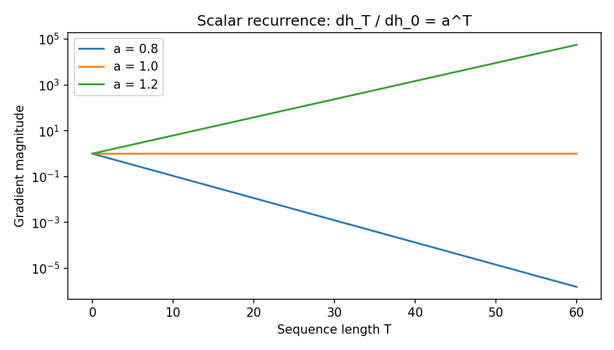

# 06.2 Recurrent Networks, LSTM, and Gradient Flow Through Time

第一编目录 · 本章导读

> Prerequisites: 06.1 and backpropagation. Goal: derive a recurrent state update, understand long gradient paths, and implement an RNN and an LSTM.

## 1. Motivation: carry a summary of the prefix forward

A position-wise classifier ignores history. We need a representation at position $t$ that depends on earlier inputs.

A recurrent network maintains a hidden state $\mathbf{h}_t\in\mathbb{R}^{H}$. It combines the current input $\mathbf{x}_t\in\mathbb{R}^{D}$ with the previous state:

$$
\mathbf{a}_t=\mathbf{W}_{xh}\mathbf{x}_t
+\mathbf{W}_{hh}\mathbf{h}_{t-1}+\mathbf{b},
\qquad
\mathbf{h}_t=\tanh(\mathbf{a}_t).
$$

Here $\mathbf{W}_{xh}\in\mathbb{R}^{H\times D}$ and $\mathbf{W}_{hh}\in\mathbb{R}^{H\times H}$. The same parameters are reused at every position, so parameter count does not grow with sequence length.

The hyperbolic tangent maps values into $(-1,1)$ and introduces nonlinearity. A zero initial state is common, but learned or carried state is also possible.

## 2. Unrolling reveals an ordinary computation graph

For three positions, the dependency is

```text
x1 → h1 → h2 → h3 → prediction
          ↑     ↑
          x2    x3
```

Each state is a new tensor, but the weight matrices are shared. Backpropagation through time (BPTT) is ordinary backpropagation on this unrolled graph.

A shared weight receives gradient contributions from every time it was used, just as a convolution kernel receives contributions from every spatial position.

## 3. Derive one recurrent Jacobian

The derivative of $\tanh(a)$ is $1-\tanh^2(a)$. Therefore define

$$
\mathbf{D}_t=\mathrm{diag}(1-\mathbf{h}_t\odot\mathbf{h}_t).
$$

The local state Jacobian is

$$
\mathbf{J}_t
=\frac{\partial\mathbf{h}_t}{\partial\mathbf{h}_{t-1}}
=\mathbf{D}_t\mathbf{W}_{hh}.
$$

If the loss depends only on the final state, moving backward one step gives

$$
\mathbf{g}_{t-1}=\mathbf{J}_t^{\mathsf T}\mathbf{g}_t.
$$

Across many steps this repeats multiplication by transposed Jacobians. If losses occur at every position, each state also receives a local loss-gradient term, which is added before propagation.

### From the state gradient to shared parameter gradients

Let $\mathbf{u}_t$ be the direct derivative of the loss term at time $t$ with respect to $\mathbf{h}_t$. Let $\boldsymbol{\delta}_t=\nabla_{\mathbf{a}_t}L$ be the total pre-activation gradient, and set $\boldsymbol{\delta}_{T+1}=\mathbf{0}$. Work backward:

$$
\begin{aligned}
\mathbf{g}_t&=\mathbf{u}_t+\mathbf{W}_{hh}^{\mathsf T}\boldsymbol{\delta}_{t+1},\cr
\boldsymbol{\delta}_t&=\mathbf{g}_t\odot(1-\mathbf{h}_t\odot\mathbf{h}_t).
\end{aligned}
$$

The first line adds the direct loss path and the path through the next state. The second applies tanh's local derivative. At each time, the affine map contributes an outer product, and the shared parameters add all those contributions:

$$
\begin{aligned}
\nabla_{\mathbf{W}_{xh}}L&=\sum_t\boldsymbol{\delta}_t\mathbf{x}_t^{\mathsf T},\cr
\nabla_{\mathbf{W}_{hh}}L&=\sum_t\boldsymbol{\delta}_t\mathbf{h}_{t-1}^{\mathsf T},\cr
\nabla_{\mathbf{b}}L&=\sum_t\boldsymbol{\delta}_t,\qquad
\nabla_{\mathbf{x}_t}L=\mathbf{W}_{xh}^{\mathsf T}\boldsymbol{\delta}_t.
\end{aligned}
$$

For $h_0$, the gradient is $\mathbf{W}_{hh}^{\mathsf T}\boldsymbol{\delta}_1$. In batched row notation, replace each outer product by the corresponding matrix product summed over examples. The companion script checks manual BPTT with a loss at **every** time, all shared parameters, the full input, and the initial state against autograd.

## 4. Why gradients vanish or explode

Matrix norms satisfy $\|\mathbf{A}\mathbf{B}\|\leq\|\mathbf{A}\|\|\mathbf{B}\|$. Hence a long product of local Jacobians can strongly shrink or amplify gradients.

A scalar recurrence $h_t=ah_{t-1}$ gives the exact illustration:

$$
h_T=a^Th_0,
\qquad
\frac{\partial h_T}{\partial h_0}=a^T.
$$

For $a=0.8$, the factor decays with $T$; for $a=1.2$, it grows. A tanh RNN adds activation derivatives at most 1, and saturated activations can shrink gradients further.

Real matrix products depend on directions and changing activations. One eigenvalue or one gradient norm does not fully characterize the network, but the scalar example explains the core difficulty of long multiplicative paths.

Gradient clipping can limit explosions; it does not reconstruct a signal already lost to vanishing gradients.

## 5. Build an LSTM from a memory update

A long short-term memory network introduces a cell state $\mathbf{c}_t$ with an additive update. Start with the desired behavior: keep some old memory and write some new content.

Let $\mathbf{f}_t$ be a forget gate, $\mathbf{i}_t$ an input gate, and $\tilde{\mathbf{c}}_t$ candidate content. All have shape $(H,)$. Then

$$
\mathbf{c}_t
=\mathbf{f}_t\odot\mathbf{c}_{t-1}
+\mathbf{i}_t\odot\tilde{\mathbf{c}}_t.
$$

A gate uses sigmoid $\sigma(z)=1/(1+\exp(-z))$ to produce values between 0 and 1. Candidate content uses tanh.

An output gate $\mathbf{o}_t$ controls what part of the cell state is exposed:

$$
\mathbf{h}_t=\mathbf{o}_t\odot\tanh(\mathbf{c}_t).
$$

The four gate/candidate vectors come from affine functions of the current input and previous hidden state. For one packed implementation, form a vector of length $4H$:

$$
\mathbf{q}_t
=\mathbf{W}_{x}\mathbf{x}_t+\mathbf{W}_{h}\mathbf{h}_{t-1}
+\mathbf{b}_x+\mathbf{b}_h.
$$

Here $\mathbf{W}_x:(4H,D)$, $\mathbf{W}_h:(4H,H)$ and both biases have length $4H$. The packed operation computes all four affine maps together; gates still have separate parameters in separate row blocks.

Split it into four $H$-length blocks $(\mathbf{q}^{i},\mathbf{q}^{f},\mathbf{q}^{g},\mathbf{q}^{o})$, and apply sigmoid, sigmoid, tanh, sigmoid respectively. This is PyTorch's gate order.

### One scalar cell update

Suppose old memory is $c_{t-1}=2$, forget gate $f_t=0.75$, input gate $i_t=0.25$, candidate $\tilde c_t=-1$, and output gate $o_t=0.5$. Keeping and writing are separate operations:

$$
c_t=0.75(2)+0.25(-1)=1.25,
\qquad
h_t=0.5\tanh(1.25)\approx0.42414.
$$

The visible state $h_t$ is not the cell memory $c_t$. Along the explicit old-cell edge, the derivative is $f_t=0.75$. A sequence of 30 forget gates equal to 0.99 retains factor $0.99^{30}\approx0.740$, while 30 gates equal to 0.5 retain only $0.5^{30}\approx9.31\times10^{-10}$. Gate values matter.

## 6. What the cell state improves

Along the explicit cell-state edge, holding the computed gates fixed, the local derivative is $\mathrm{diag}(\mathbf{f}_t)$. If forget gates stay near 1, this path can preserve information and gradients over many positions.

The full derivative graph also contains routes through gates and hidden states. LSTM reduces a difficulty; it does not guarantee perfect memory or eliminate all vanishing gradients.

中文提示：LSTM 的关键变化是可控制的“保留旧记忆 + 写入新记忆”的加法通路，不是多写几个门的公式就自动解决长程依赖。

## 7. Runnable experiment: manual RNN and PyTorch LSTM gates

```python
import torch
from torch import nn

torch.manual_seed(13)
torch.set_num_threads(1)
B, T, D, H = 2, 5, 3, 4
X = torch.randn(B, T, D, dtype=torch.float64)
rnn = nn.RNN(D, H, nonlinearity="tanh", batch_first=True).double()

h = torch.zeros(B, H, dtype=torch.float64)
states = []
for t in range(T):
    h = torch.tanh(X[:, t] @ rnn.weight_ih_l0.T
                   + h @ rnn.weight_hh_l0.T
                   + rnn.bias_ih_l0 + rnn.bias_hh_l0)
    states.append(h)
manual = torch.stack(states, dim=1)
actual, final = rnn(X)
torch.testing.assert_close(manual, actual)
torch.testing.assert_close(h, final[0])

cell = nn.LSTMCell(D, H).double()
x = X[:, 0]
h0 = torch.randn(B, H, dtype=torch.float64)
c0 = torch.randn(B, H, dtype=torch.float64)
gates = x @ cell.weight_ih.T + h0 @ cell.weight_hh.T + cell.bias_ih + cell.bias_hh
qi, qf, qg, qo = gates.chunk(4, dim=-1)
i, f, candidate, o = qi.sigmoid(), qf.sigmoid(), qg.tanh(), qo.sigmoid()
c1 = f * c0 + i * candidate
h1 = o * c1.tanh()
reference_h, reference_c = cell(x, (h0, c0))
torch.testing.assert_close(h1, reference_h)
torch.testing.assert_close(c1, reference_c)

for a in [0.8, 1.0, 1.2]:
    initial = torch.tensor(1.0, dtype=torch.float64, requires_grad=True)
    state = initial
    for _ in range(30):
        state = a * state
    state.backward()
    print("a, measured gradient, exact:", a, initial.grad.item(), a**30)
```

PyTorch RNN/LSTM modules include separate input and hidden biases; their sum corresponds to the single bias used in simpler mathematical notation. The companion script also compares the packed LSTM gate computation's gradients for inputs, previous hidden/cell states, and all four parameter tensors with `nn.LSTMCell` under identical output probes.

## 8. Runnable learning task: remember the first observation

```python
import torch
from torch import nn

torch.manual_seed(21)
torch.set_num_threads(1)
X = torch.randn(240, 8, 1)
y = (X[:, 0, 0] > 0).long()
train_x, val_x, train_y, val_y = X[:180], X[180:], y[:180], y[180:]

class RememberFirst(nn.Module):
    def __init__(self):
        super().__init__()
        self.lstm = nn.LSTM(1, 16, batch_first=True)
        self.head = nn.Linear(16, 2)

    def forward(self, x):
        _, (hidden, _) = self.lstm(x)
        return self.head(hidden[-1])

model = RememberFirst()
optimizer = torch.optim.Adam(model.parameters(), lr=0.02)
criterion = nn.CrossEntropyLoss()
for _ in range(160):
    model.train()
    optimizer.zero_grad(set_to_none=True)
    loss = criterion(model(train_x), train_y)
    loss.backward()
    torch.nn.utils.clip_grad_norm_(model.parameters(), 1.0)
    optimizer.step()
model.eval()
with torch.no_grad():
    accuracy = (model(val_x).argmax(-1) == val_y).float().mean().item()
print("remember-first validation accuracy:", accuracy)
```

Repeat with longer sequences, several seeds, and an RNN baseline. Holding the training budget fixed may make longer tasks harder to optimize. A result from this tiny task is not a broad ranking of sequence architectures.

## 9. State management and padding

For independent shuffled sequences, reset state between samples/batches. Carrying hidden state from an unrelated example creates an unintended dependency.

`batch_first=True` changes the input/output sequence layout to $(B,T,H)$, but the returned recurrent hidden state still has layout $(\text{layers}\times\text{directions},B,H)$ for ordinary non-projected RNN/LSTM modules. That is why `hidden[-1]` selects a layer/direction rather than the last time position in the example.

For a continuous stream, carrying state can be appropriate. Truncated BPTT detaches state between chunks: forward information can continue, but gradients no longer cross the detach boundary.

For padded sequences, the last array position may not be the last valid input. A zero input is not generally an identity transition: recurrent weights and biases still update the state. For a right-padded unidirectional sequence, gathering the output at `length - 1` selects a valid final hidden output; using `pack_padded_sequence` also avoids processing padded steps. To obtain a valid final LSTM cell state, use packing or an explicitly length-aware recurrence rather than gathering only hidden outputs. The companion script compares packed final states with individually processed unpadded sequences and shows that naive padded final states differ. A bidirectional final representation also needs deliberate handling; do not assume the last time index contains both directions' intended summaries.

## 10. Exercises

1. Derive the contribution of one shared recurrent weight at two time positions.
2. Explain why clipping cannot solve a vanished gradient.
3. Count RNN and LSTM parameters for given $D,H$, including PyTorch's two bias vectors.
4. Extend the manual gate computation across a full sequence.
5. Compare RNN and LSTM on remembering the first observation with lengths 8, 32, and 64.
6. Explain what gradient information is lost at a truncated-BPTT boundary.

## 11. Completion standard and English summary

You can derive an RNN update, explain BPTT and repeated Jacobians, implement LSTM gates, and manage state and padding correctly.

Write 150 words explaining why an additive memory path helps long-term dependencies but does not guarantee them.

Reference: [RNN](https://docs.pytorch.org/docs/stable/generated/torch.nn.RNN.html), [LSTM](https://docs.pytorch.org/docs/stable/generated/torch.nn.LSTM.html).

## 配套实验与阅读导航

完整脚本：[lab_06_2.py](../配套实验/lab_06_2.py)。运行环境与注意事项见 实验指南。

以下图来自配套实验，记录的是该固定设置下的结果：



上一节：06.1 序列数据与时间依赖

下一节：06.3 Embedding与表示学习
