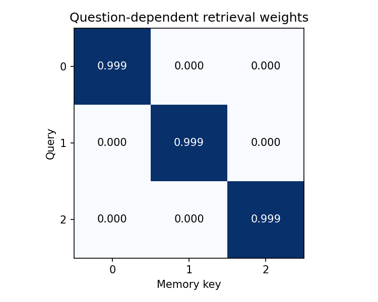

# 07.1 Why Select Information Dynamically?

第二编目录 · 本章导读

> Prerequisites: 06.1–06.3, inner products, and softmax. Goal: motivate attention from a retrieval problem that a value-only mean cannot solve.

## 1. Begin with a question-dependent prediction

Imagine a memory containing several name–number pairs. The same memory can answer “What is Ada's number?” or “What is Lin's number?” The useful record depends on the question.

A model that averages all numbers first loses which number belongs to which name. More training cannot recover that association from the average alone. We want the question to influence **how** we read memory.

This motivates attention: calculate a relevance score for each available record, turn scores into weights, and read a weighted combination of record contents.

## 2. What a fixed summary discards

Let values $\mathbf{v}_1,\ldots,\mathbf{v}_S\in\mathbb{R}^{d_v}$ represent $S$ records. Mean pooling produces

$$
\bar{\mathbf{v}}=\frac{1}{S}\sum_{j=1}^{S}\mathbf{v}_j.
$$

Every question receives the same summary. If values are $[2,8]$, the mean is 5 regardless of which record the question requests.

To see exactly what has been lost, compare two memories:

| Memory | Ada's value | Lin's value | Value-only mean |
|---|---:|---:|---:|
| A | 2 | 8 | 5 |
| B | 8 | 2 | 5 |

The query “Ada?” and mean 5 are identical inputs to a downstream predictor in both cases, but the required answers differ. No deterministic function of **only those inputs** can be correct for both. This is an information-loss argument, not a claim that every fixed-width representation must fail. A representation that retains the associations could solve this tiny problem.

An RNN's final state is a more flexible learned summary than a mean, but all information used by a final-state-only decoder still passes through that fixed-width state. This can make detailed access difficult for long sequences. It does not mean RNNs are mathematically unable to remember anything, or that every attention model handles arbitrary lengths perfectly.

Attention can retain a collection of per-position representations and let a query access them separately.

## 3. Hard selection is a useful starting point

Suppose each record receives a score $s_j$ measuring relevance to the question. Hard selection reads the record with the largest score:

$$
j^*=\arg\max_j s_j,\qquad \mathbf{o}=\mathbf{v}_{j^*}.
$$

This resembles indexed retrieval. However, the selected index changes discontinuously as scores cross. Ordinary backpropagation through an argmax does not provide a useful gradient for learning how slightly changing scores should change the selected content.

We can instead use a smooth weighted read during training.

## 4. Construct a soft selection step by step

Exponentiation makes scores positive. Dividing by their total makes the weights sum to one:

$$
\alpha_j
=\frac{\exp(s_j/\tau)}{\sum_{\ell=1}^{S}\exp(s_\ell/\tau)},
\qquad \tau>0.
$$

The positive scalar $\tau$ is a temperature. Smaller temperature makes the weights more concentrated when there is a clear largest score; larger temperature makes them more uniform.

Read the weighted sum:

$$
\mathbf{o}=\sum_{j=1}^{S}\alpha_j\mathbf{v}_j
\in\mathbb{R}^{d_v}.
$$

For values $[2,8]$ and scores $[\log3,0]$ with $\tau=1$, the weights are $[3/4,1/4]$ and the readout is $3.5$. Changing the question can swap the scores and produce $6.5$.

Why this particular normalization? Exponentials are positive and differentiable, and their ratio depends only on score differences:

$$
\frac{\alpha_i}{\alpha_j}
=\exp\!\left(\frac{s_i-s_j}{\tau}\right).
$$

A gap of $\tau\log 3$ therefore means a 3:1 weight ratio, regardless of the other scores. Softmax is a useful design choice, not the only possible differentiable weighting rule. With tied largest scores, taking $\tau$ toward zero shares weight across the ties rather than selecting a unique record.

The output is a mixture, not necessarily an exact database record. Without dropout, the weights are nonnegative and sum to one, so the output lies in the convex hull of the current values. Learned projections and subsequent blocks can perform additional transformations.

## 5. Similarity and content need not be the same thing

Matching a person's name and retrieving their telephone number require different representations. Section 07.2 formalizes this as a query, keys, and values.

For now, use a one-hot identity vector as the question and as each record's address. Their inner product is 1 for a match and 0 otherwise. Increasing the match-score scale makes the weighted read approximate selection.

This experiment isolates retrieval mechanics. The identity vectors are specified by us, not learned semantic features.

## 6. Runnable experiment: one memory, different questions

```python
import numpy as np
import torch

keys = np.eye(3, dtype=np.float64)
values = np.array([[2., 20.], [8., 80.], [-3., -30.]])
queries = np.eye(3, dtype=np.float64)
scores = 8.0 * queries @ keys.T
shifted = scores - scores.max(axis=-1, keepdims=True)
weights = np.exp(shifted) / np.exp(shifted).sum(axis=-1, keepdims=True)
outputs = weights @ values
reference = torch.softmax(torch.tensor(scores), dim=-1) @ torch.tensor(values)
np.testing.assert_allclose(outputs, reference.numpy())
np.testing.assert_allclose(weights.sum(-1), 1)
assert np.max(np.abs(outputs - values)) < 0.1

print("fixed mean:", values.mean(axis=0))
print("question-dependent reads:\n", outputs)
print("weights:\n", weights)

# Reorder paired keys and values: retrieval meaning is unchanged.
permutation = [2, 0, 1]
reordered_scores = 8.0 * queries @ keys[permutation].T
reordered_weights = torch.softmax(torch.tensor(reordered_scores), dim=-1)
reordered_output = reordered_weights @ torch.tensor(values[permutation])
torch.testing.assert_close(reordered_output, reference)

for temperature in [0.2, 1.0, 5.0]:
    probabilities = torch.softmax(torch.tensor([2., 0., -1.]) / temperature, dim=-1)
    print("temperature / weights:", temperature, probabilities)
```

The mean is identical for every query, while attention reads differ. Reordering matching key–value pairs preserves the answer. Reordering values without their keys changes the meaning of memory.

## 7. What attention does not establish

An attention weight describes a particular computational mixture. A large weight does not, by itself, prove causal importance to the final prediction: values, output projections, residual paths, and other layers all matter.

Attention also does not supply order automatically. A symmetric read over records is suitable for some memory problems; language needs positional structure. Chapter 09 adds it.

Dynamic reading requires computation over the available memory. Accessing all positions can become expensive as sequences grow; Chapter 10 analyzes that cost.

## 8. Experiments and common mistakes

Keep keys fixed and change values: the weights should stay the same while the readout changes. Keep values fixed and change the query: the weights should change.

Do not interpret a nearly uniform read as “nothing happened”: it may be a useful average. Conversely, a very sharp distribution can be confidently wrong if relevance scores are poor.

## 9. Exercises

1. Construct two different memories with the same mean but different answers to a named query.
2. Calculate the two-record numerical example by hand.
3. Explain why moving keys and values with different permutations breaks retrieval.
4. Compare hard selection and soft selection near two equal scores.
5. Write an example where a mixture of values is more useful than selecting only one.

## 10. Completion standard and English summary

You can explain why a question-independent summary may lose needed information and implement a differentiable weighted read.

Write 100–150 words explaining what is dynamic in attention, and which parts of this experiment were hand-designed.

## 配套实验与阅读导航

完整脚本：[lab_07_1.py](../配套实验/lab_07_1.py)。运行环境、结果与解释见 实验指南。

下图来自配套实验的固定设置，解释时应保留课件中说明的适用范围：



上一节：06.3 Embedding 与表示学习

下一节：07.2 Query Key Value