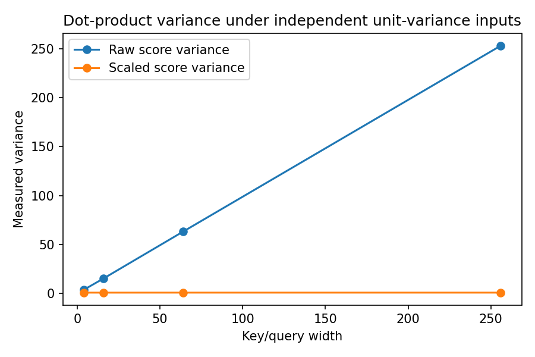

# 07.3 Scaled Dot-Product Attention, Including Its Backward Pass

第二编目录 · 本章导读

> Prerequisites: 07.2, variance of sums, and the chain rule. Goal: derive the scale factor and every main attention gradient.

## 1. Motivation: matching scores change scale with vector width

A dot product adds $d_k$ coordinate products. As width increases, the scores can become larger even if each coordinate has a comparable scale. Large score differences can make softmax nearly one-hot at initialization, reducing useful gradients through the weights.

The standard scale controls this growth. It is a scale heuristic based on explicit assumptions, not a guarantee that all trained scores have variance one.

## 2. Derive the square-root factor

Assume query and key coordinates are mutually independent, have mean zero, and each has variance one. For one coordinate product $q_rk_r$,

$$
\mathbb E[q_rk_r]=0,\qquad
\mathrm{Var}(q_rk_r)=\mathbb E[q_r^2]\mathbb E[k_r^2]=1.
$$

If coordinate products are independent, the variance of their sum is the sum of variances:

$$
\mathrm{Var}\!\left(\sum_{r=1}^{d_k}q_rk_r\right)=d_k.
$$

Its standard deviation is $\sqrt{d_k}$. Dividing the score by that quantity gives variance one under the assumptions:

$$
s_j=\frac{\mathbf{q}^{\mathsf T}\mathbf{k}_j}{\sqrt{d_k}}.
$$

Correlations, different variances, and training change the result. Learned normalization or temperature may be used in other architectures. The denominator is the **per-head key dimension**, not automatically the entire model dimension.

## 3. Assemble the forward computation

With rows representing queries and keys, define

$$
\mathbf{S}=\frac{\mathbf{Q}\mathbf{K}^{\mathsf T}}{\sqrt{d_k}},
\quad
\mathbf{A}=\mathrm{softmax}_{\text{keys}}(\mathbf{S}),
\quad
\mathbf{O}=\mathbf{A}\mathbf{V}.
$$

Shapes are $\mathbf{Q}:(T_q,d_k)$, $\mathbf{K}:(T_k,d_k)$, $\mathbf{V}:(T_k,d_v)$, $\mathbf{S},\mathbf{A}:(T_q,T_k)$, and $\mathbf{O}:(T_q,d_v)$.

For numerical stability subtract each score row's maximum before exponentiating. Adding a common constant to a row cancels from softmax. Masking and dropout are introduced later; this derivation assumes neither.

## 4. Begin backward at the weighted read

Let a scalar loss $L$ provide $\mathbf{G}_O=\partial L/\partial\mathbf{O}$. Since

$$
O_{ic}=\sum_j A_{ij}V_{jc},
$$

changing $A_{ij}$ affects every output feature $c$ of query $i$. Summing these paths gives

$$
(\mathbf{G}_A)_{ij}=\sum_c(\mathbf{G}_O)_{ic}V_{jc},
\qquad
\mathbf{G}_A=\mathbf{G}_O\mathbf{V}^{\mathsf T}.
$$

A value is reused by all queries, so

$$
(\mathbf{G}_V)_{jc}=\sum_i A_{ij}(\mathbf{G}_O)_{ic},
\qquad
\mathbf{G}_V=\mathbf{A}^{\mathsf T}\mathbf{G}_O.
$$

This is the same “sum all uses of a shared value” rule as Part I.

## 5. Differentiate one softmax row

For one row, $a_j=\exp(s_j)/Z$ with $Z=\sum_\ell\exp(s_\ell)$. For $j=k$, both numerator and denominator change; for $j\ne k$, only the denominator changes. Since $\partial Z/\partial s_k=\exp(s_k)$, the quotient rule gives

$$
\begin{aligned}
\frac{\partial a_j}{\partial s_k}
&=\frac{\delta_{jk}\exp(s_j)Z-\exp(s_j)\exp(s_k)}{Z^2}\\
&=a_j(\delta_{jk}-a_k).
\end{aligned}
$$

Here $\delta_{jk}$ is 1 when $j=k$ and 0 otherwise. The second term appears because changing one score also changes the common denominator.

For upstream entries $g_{a,j}$,

$$
\begin{aligned}
g_{s,k}
&=\sum_jg_{a,j}a_j(\delta_{jk}-a_k)\\
&=a_k\left(g_{a,k}-\sum_jg_{a,j}a_j\right).
\end{aligned}
$$

Compute the row scalar $r=\sum_jg_{a,j}a_j$, subtract it from each upstream entry, then multiply elementwise by the probabilities.

Each score-gradient row sums to zero, matching softmax's invariance to a common score shift. This backward rule avoids constructing a separate $T_k\times T_k$ Jacobian for every query.

## 6. Differentiate the scores

Let $c=1/\sqrt{d_k}$. From $S_{ij}=c\sum_rQ_{ir}K_{jr}$,

$$
\mathbf{G}_Q=c\,\mathbf{G}_S\mathbf{K},
\qquad
\mathbf{G}_K=c\,\mathbf{G}_S^{\mathsf T}\mathbf{Q}.
$$

### Continue to the parameters and the shared input

Let a single sequence be $\mathbf{X}\in\mathbb{R}^{T\times D}$, with tokens stored as **rows**, as in PyTorch. Use weights $\mathbf{W}_Q,\mathbf{W}_K:(d_k,D)$ and $\mathbf{W}_V:(d_v,D)$:

$$
\mathbf{Q}=\mathbf{X}\mathbf{W}_Q^{\mathsf T}
+\mathbf{1}\mathbf{b}_Q^{\mathsf T},
$$

and similarly for K and V. Here $\mathbf{1}\in\mathbb{R}^{T}$ broadcasts one bias to all positions.

To see why a weight gradient is a sum, expand one projected entry:

$$
Q_{ir}=\sum_a X_{ia}(W_Q)_{ra}+(b_Q)_r.
$$

Changing $(W_Q)_{ra}$ affects every position $i$. The chain rule therefore gives

$$
\frac{\partial L}{\partial(W_Q)_{ra}}
=\sum_i (G_Q)_{ir}X_{ia}.
$$

This is exactly the $(r,a)$ entry of $\mathbf{G}_Q^{\mathsf T}\mathbf{X}$. Apply the same reasoning to K and V:

$$
\begin{aligned}
\nabla_{\mathbf{W}_Q}L&=\mathbf{G}_Q^{\mathsf T}\mathbf{X},&
\nabla_{\mathbf{b}_Q}L&=\mathbf{G}_Q^{\mathsf T}\mathbf{1},\\
\nabla_{\mathbf{W}_K}L&=\mathbf{G}_K^{\mathsf T}\mathbf{X},&
\nabla_{\mathbf{b}_K}L&=\mathbf{G}_K^{\mathsf T}\mathbf{1},\\
\nabla_{\mathbf{W}_V}L&=\mathbf{G}_V^{\mathsf T}\mathbf{X},&
\nabla_{\mathbf{b}_V}L&=\mathbf{G}_V^{\mathsf T}\mathbf{1}.
\end{aligned}
$$

For the shared source, all three branches contribute:

$$
\boxed{\nabla_{\mathbf{X}}L
=\mathbf{G}_Q\mathbf{W}_Q
+\mathbf{G}_K\mathbf{W}_K
+\mathbf{G}_V\mathbf{W}_V.}
$$

Each term has shape $(T,D)$. With a batch, sum weight/bias contributions over examples as well as positions; do not add another averaging factor if the upstream loss gradients already include the mean reduction.

For cross-attention, the query source receives only the Q branch; the memory source receives the sum of K and V branches. Residual paths, when present, add their own contribution.

### A numerical backward pass before the larger experiment

Use one scalar query $q=1$, keys $k_1=\log 3,k_2=0$, and scalar values $v_1=2,v_2=8$. Here $d_k=1$, so no extra scaling is needed. Forward gives

$$
\mathbf{s}=(\log 3,0)^{\mathsf T},
\quad \mathbf{a}=(0.75,0.25)^{\mathsf T},
\quad o=3.5.
$$

Choose $L=\tfrac12(o-5)^2$. Start with the loss derivative $g_o=o-5=-1.5$, **not** an assumed gradient of 1. Now reverse the weighted read:

$$
\mathbf{g}_v=\mathbf{a}g_o=(-1.125,-0.375)^{\mathsf T},
\quad
\mathbf{g}_a=g_o\mathbf{v}=(-3,-12)^{\mathsf T}.
$$

The softmax row scalar is $r=0.75(-3)+0.25(-12)=-5.25$. Thus

$$
\mathbf{g}_s
=\mathbf{a}\odot(\mathbf{g}_a-r\mathbf{1})
=(1.6875,-1.6875)^{\mathsf T}.
$$

Finally, $g_q=\sum_j(g_s)_jk_j=1.6875\log 3$ and
$\mathbf{g}_k=q\mathbf{g}_s=(1.6875,-1.6875)^{\mathsf T}$.

Interpret the sign: decreasing the first score and increasing the second shifts weight toward value 8, moving the readout toward target 5. This is a local gradient argument; a large optimizer step can still overshoot.

中文提示：反传顺序是输出加权和 → softmax → 点积，不要把 attention 的梯度误认为交叉熵特例的 p−t；这里 softmax 上游通常是任意向量。

## 7. Runnable experiment: NumPy backward against autograd

```python
import numpy as np
import torch

rng = np.random.default_rng(23)
Q = rng.normal(size=(3, 4))
K = rng.normal(size=(5, 4))
V = rng.normal(size=(5, 2))
Gout = rng.normal(size=(3, 2))
scale = Q.shape[-1] ** -0.5

S = scale * Q @ K.T
S = S - S.max(axis=-1, keepdims=True)
A = np.exp(S)
A /= A.sum(axis=-1, keepdims=True)
O = A @ V
GA = Gout @ V.T
GV = A.T @ Gout
GS = A * (GA - (GA * A).sum(axis=-1, keepdims=True))
GQ, GK = scale * GS @ K, scale * GS.T @ Q

qt = torch.tensor(Q, requires_grad=True)
kt = torch.tensor(K, requires_grad=True)
vt = torch.tensor(V, requires_grad=True)
out = (scale * qt @ kt.T).softmax(-1) @ vt
(out * torch.tensor(Gout)).sum().backward()
np.testing.assert_allclose(O, out.detach().numpy(), atol=1e-12)
for manual, variable in [(GQ, qt), (GK, kt), (GV, vt)]:
    np.testing.assert_allclose(manual, variable.grad.numpy(), atol=1e-12)
np.testing.assert_allclose(GS.sum(-1), 0, atol=1e-12)
print("forward and Q/K/V gradients match")

variance_results = []
for width in [4, 16, 64, 256]:
    q = rng.normal(size=(4000, width))
    k = rng.normal(size=(4000, width))
    raw = (q * k).sum(-1)
    variance_results.append((width, raw.var(), (raw / np.sqrt(width)).var()))
print("width / raw variance / scaled variance:", variance_results)
```

The variance experiment should show growth with width before scaling and roughly stable variance afterward. Finite samples do not produce exact theoretical values.

The companion script additionally constructs Q/K/V from a shared input and three biased affine maps. It checks all weight/bias gradients, the **sum** of the three input-gradient branches, and one weight with central differences:

$$
\frac{\partial L}{\partial \theta}
\approx\frac{L(\theta+\epsilon)-L(\theta-\epsilon)}{2\epsilon}.
$$

Here $\theta$ is one selected scalar weight, all other weights are held fixed, and $\epsilon=10^{-5}$ is a numerical-check step, not an optimizer learning rate. The script uses float64 to reduce cancellation error.

## 8. Saturation, convex mixtures, and failure cases

Softmax derivative entries can become small near a one-hot distribution. This does not mean every network gradient vanishes: value and residual paths still exist, and the downstream loss matters.

Identical scores give uniform weights. Identical values produce the same readout regardless of the weight distribution, so the task may provide no useful gradient to distinguish scores through that readout.

An infinite or NaN input cannot be repaired simply by subtracting a row maximum. Masking a whole row to $-\infty$ also needs explicit treatment; see 08.3.

## 9. Exercises

1. Re-derive the softmax derivative using the quotient rule.
2. Check one Q entry with finite differences in double precision.
3. Explain why identical values can make score gradients zero for a readout-only loss.
4. Replace unit-variance coordinates with variance $\sigma_q^2,\sigma_k^2$ and derive the score variance.
5. Add a batch axis and reproduce every gradient formula with batched matrix multiplication.

## 10. Completion standard and English summary

You can derive scaled attention and backpropagate through the weighted read, softmax, and scores, verifying all gradients numerically.

Write 150 words explaining the assumptions behind $1/\sqrt{d_k}$ and why it helps rather than guarantees stable learning.

Reference: [Attention Is All You Need](https://arxiv.org/abs/1706.03762).

## 配套实验与阅读导航

完整脚本：[lab_07_3.py](../配套实验/lab_07_3.py)。运行环境、结果与解释见 实验指南。

下图来自配套实验的固定设置，解释时应保留课件中说明的适用范围：



上一节：07.2 Query Key Value

下一节：08.1 Self-Attention的矩阵形式