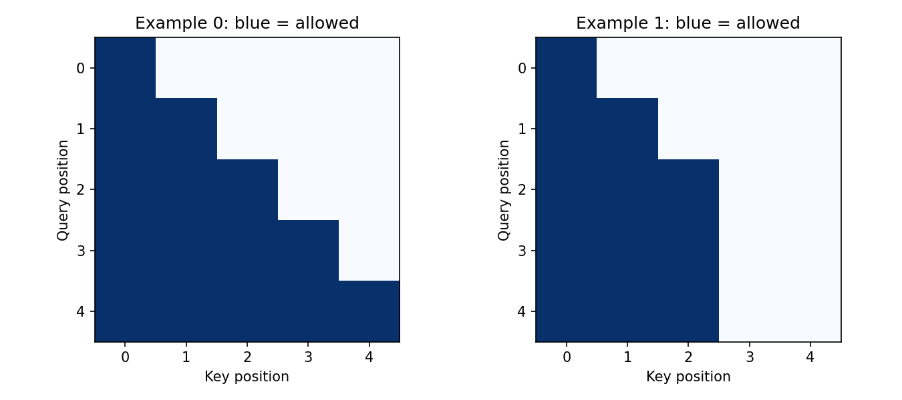

# 08.3 Masks, Causality, and Attention Complexity

第二编目录 · 本章导读

> Prerequisites: 08.1–08.2 and valid-token loss averaging. Goal: implement visibility constraints and test them as behavior.

## 1. Motivation: a model must not read unavailable information

An autoregressive model predicts the next token using a prefix. During training, the complete sequence is present in memory. Without a visibility constraint, a position could read the answer from a later position.

Padding creates a second constraint: added filler positions should not become useful keys. Neither constraint is enforced merely by ignoring some losses.

## 2. Define allowed connections before choosing an API

Let $M_{ij}$ be true when query position $i$ is allowed to read key position $j$. For a standard square causal self-attention mask,

$$
M_{ij}=(j\leq i).
$$

The diagonal is allowed because the input token at position $i$ is available when predicting the **next** token. The targets must be shifted by one, as in 06.1.

For padded inputs, let $v_{n,j}$ indicate a real key. Combine constraints with logical AND:

$$
M_{n,i,j}=(j\leq i)\land v_{n,j}.
$$

A query's validity is separate from key validity. A padded query can still produce an output from real keys; mask its loss or explicitly zero its output as appropriate.

For three tokens with only the first two valid, the allowed matrix is

$$
\mathbf{M}=\begin{bmatrix}
1&0&0\\
1&1&0\\
1&1&0
\end{bmatrix}.
$$

The last row still reads real keys despite being a padded **query**. To define that read as zero, also AND with query validity; the last row then becomes entirely blocked and needs the policy below.

## 3. Mask before softmax

To remove disallowed entries from the normalization, replace their scores with $-\infty$:

$$
S'_{ij}=
\begin{cases}
S_{ij},&M_{ij}=1,\\
-\infty,&M_{ij}=0.
\end{cases}
$$

Exponentiating gives zero weight for forbidden positions when at least one finite allowed score remains.

Masking probabilities **after** softmax without renormalizing leaves a row sum below one and lets forbidden scores affect the denominator. Multiplying scores by zero is also wrong: a score of zero still receives positive probability.

A large finite negative value is only an approximation to masking and behaves especially poorly for fully masked rows.

## 4. Fully masked rows need an explicit policy

If every score is $-\infty$, subtracting the maximum computes $-\infty-(-\infty)$, which is undefined. A simple softmax implementation may produce NaNs.

For real queries, an empty allowed set often indicates an invalid mask. For intentionally padded queries, we can define output zero. The example below safely normalizes a placeholder row, then zeros its weights. Inputs still must be finite. This is one explicit policy, not a universal API rule: alternatively reject the mask or remove padded queries before the attention call. The important requirement is to choose and test a policy rather than silently accept NaNs.

The zero policy applies to the attention **read** $\mathbf{A}\mathbf{V}$. An output projection bias can turn a zero read into a nonzero output; adding a residual can do so as well. If the full block must emit zero at padded queries, mask it at the required later boundary too.

Do not assume all APIs handle empty rows identically across versions and backends.

## 5. PyTorch Boolean masks have different meanings

| API argument | Boolean true means |
|---|---|
| Our `allowed` mask | Read this key |
| `F.scaled_dot_product_attention(attn_mask=...)` | Participate in attention |
| `nn.MultiheadAttention(attn_mask=...)` | Block this connection |
| `nn.MultiheadAttention(key_padding_mask=...)` | Ignore this key |

Read the selected API's contract; do not reuse the same Boolean tensor blindly.

SDPA also applies the supplied `dropout_p` even if the surrounding module is in evaluation mode. Pass 0 during evaluation explicitly. Setting a module to `eval()` does not rewrite a functional call's arguments.

## 6. Runnable experiment: safe masks and future-token invariance

```python
import math
import torch
import torch.nn.functional as F

def masked_attention(Q, K, V, allowed):
    # Explicit teaching contract: Q/K/V are (B,h,T,features).
    if any(t.ndim != 4 for t in (Q, K, V)):
        raise ValueError("Q/K/V must have four named axes")
    if Q.shape[:2] != K.shape[:2] or K.shape[:3] != V.shape[:3]:
        raise ValueError("Q/K/V batch, head, or memory-length mismatch")
    if Q.shape[-1] != K.shape[-1] or K.shape[-2] == 0:
        raise ValueError("query/key widths must match; memory must be nonempty")
    if allowed.dtype != torch.bool or allowed.ndim not in (2, 4):
        raise ValueError("allowed must be Boolean (Tq,Tk) or (B,1 or h,Tq,Tk)")
    scores = Q @ K.transpose(-2, -1) / math.sqrt(Q.shape[-1])
    allowed = allowed.expand_as(scores)
    has_key = allowed.any(dim=-1, keepdim=True)
    masked = scores.masked_fill(~allowed, -torch.inf)
    safe = torch.where(has_key, masked, torch.zeros_like(masked))
    weights = safe.softmax(-1)
    weights = torch.where(has_key, weights, torch.zeros_like(weights))
    return weights @ V, weights

torch.manual_seed(26)
B, h, T, d = 2, 2, 5, 3
Q = torch.randn(B, h, T, d, dtype=torch.float64)
K = torch.randn_like(Q)
V = torch.randn_like(Q)
causal = torch.ones(T, T, dtype=torch.bool).tril()
key_valid = torch.tensor([[1, 1, 1, 1, 1], [1, 1, 1, 0, 0]], dtype=torch.bool)
allowed = causal[None, None] & key_valid[:, None, None, :]
output, weights = masked_attention(Q, K, V, allowed)

reference = F.scaled_dot_product_attention(Q, K, V, attn_mask=allowed, dropout_p=0.0)
torch.testing.assert_close(output, reference, atol=1e-10, rtol=1e-8)
assert weights.masked_select(~allowed.expand_as(weights)).abs().max() == 0

# Change only future keys/values. Earlier outputs must stay identical.
K2, V2 = K.clone(), V.clone()
K2[:, :, 3:] += 100
V2[:, :, 3:] -= 100
changed, _ = masked_attention(Q, K2, V2, allowed)
torch.testing.assert_close(output[:, :, :3], changed[:, :, :3])

empty = torch.zeros(T, T, dtype=torch.bool)
zero_output, zero_weights = masked_attention(Q, K, V, empty)
torch.testing.assert_close(zero_output, torch.zeros_like(zero_output))
assert torch.isfinite(zero_weights).all()
print("mask correctness, future isolation, and empty-row policy verified")
```

The companion script also tests backward with a mixture of valid and fully masked rows: gradients stay finite, empty-query Q gradients are zero, and padded K/V gradients are zero. A separate all-empty read checks all three input gradients are zero. These are properties of the explicit zero-read policy, not promises about every backend.

This checks an attention layer with fixed Q. It also exercises broadcasting: `allowed` begins with `(B, 1, T, T)` and expands over heads. The helper rejects a three-axis mask: a tensor `(B,T,T)` aligns its first axis against **heads**, not batch, when broadcast against `(B,h,T,T)`. If $B=h$, this mistake may silently pass shape checks. Use `(B,1,T,T)` for a per-example mask; check intended axis meaning even when sizes coincide. The complete model in 09.4 also tests that changing future **input tokens** cannot affect earlier logits through any block.

## 7. Where the quadratic cost comes from

For $T$ queries and $T$ keys, every query compares with every key, giving $T^2$ scores per head.

With total width $D=h d_h$, computing QK and AV costs on the order of $BT^2D$ multiply-add work. Projections add order $BTD^2$. A conventional implementation materializes $BhT^2$ score/probability entries.

Doubling $T$ quadruples this explicit map's size, while model parameter count stays unchanged. A causal mask removes future dependencies, but applying it to an already-created dense matrix does not by itself eliminate the dense storage or all arithmetic.

Efficient kernels can avoid materializing the whole matrix; this is different from changing the mathematical attention rule.

## 8. Exercises and pitfalls

1. Draw the mask for four inputs and their shifted next-token targets.
2. Explain why masking only padded target losses does not stop reading padded keys.
3. Construct a fully masked row and describe your chosen policy.
4. Translate an allowed mask to `MultiheadAttention`'s blocking convention.
5. Estimate dense map memory for $B=2,h=8,T=2048$ in float32.
6. Implement a full-model future-token perturbation check after reading 09.4.

## 9. Completion standard and English summary

You can derive and combine masks, explain API polarity, avoid invalid all-masked normalization, and calculate the source of quadratic attention cost.

Write 150 words explaining how a model can have a decreasing training loss while violating causality.

Reference: [Scaled dot-product attention](https://docs.pytorch.org/docs/stable/generated/torch.nn.functional.scaled_dot_product_attention.html).

## 配套实验与阅读导航

完整脚本：[lab_08_3.py](lab_08_3.py)。运行环境、结果与解释见 实验指南。

下图来自配套实验的固定设置，解释时应保留课件中说明的适用范围：



上一节：08.2 Multi-Head Attention

下一节：09.1 Position Encoding