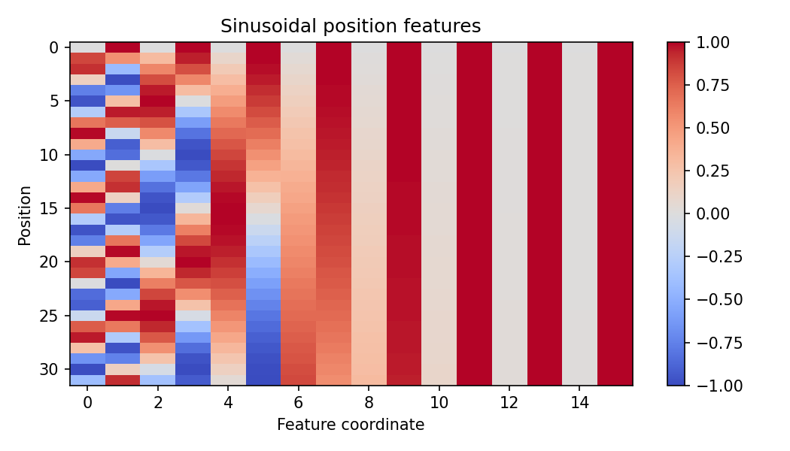

# 09.1 Position Information: Absolute, Relative, and Rotary

第二编目录 · 本章导读

> Prerequisites: 08.1 and basic trigonometry. Goal: explain why position is needed and verify how sinusoidal and rotary encodings work.

## 1. Motivation: content alone does not describe order

Section 08.1 proved permutation equivariance for position-free, unmasked self-attention. Reordering token vectors merely reorders its outputs. An averaged representation cannot distinguish different orders of the same tokens.

A causal mask introduces a prefix structure, so it changes that proof. Nevertheless, explicit positional schemes provide a useful and deliberate way to represent where tokens occur and how far apart they are.

We need to decide what to encode: an absolute index, a relative displacement, or a transformation whose interactions depend on relative position.

## 2. Learned absolute position embeddings

Let token embedding $\mathbf{e}_t\in\mathbb{R}^{D}$ represent content and position embedding $\mathbf{p}_t\in\mathbb{R}^{D}$ represent index $t$. Add them:

$$
\mathbf{x}_t=\mathbf{e}_t+\mathbf{p}_t.
$$

Adding preserves model width, whereas concatenation changes it and needs a compatible downstream projection. Addition is a design choice, not the only mathematically valid combination.

A learned position table contains $T_{\max}D$ parameters. Indices beyond its trained/configured range are not automatically supported. Extending the table or reusing positions requires an explicit method and evaluation.

Token embeddings alone repeat for repeated tokens. Adding positions allows two identical tokens at different indices to enter the network differently.

## 3. Sinusoidal positions use multiple frequencies

Instead of learning a table, give each pair of coordinates a sine/cosine wave. Let $D$ be even and pair index $r=0,\ldots,D/2-1$. Define frequency

$$
\omega_r=10000^{-2r/D}.
$$

At position $t$,

$$
p_{t,2r}=\sin(t\omega_r),
\qquad
p_{t,2r+1}=\cos(t\omega_r).
$$

High-frequency pairs change quickly across adjacent positions; low-frequency pairs change slowly. A combination of scales gives a richer position signal than one repeating wave.

For a displacement $\Delta$, define $a=t\omega_r$ and $b=\Delta\omega_r$. Start from $\sin(a+b)=\sin a\cos b+\cos a\sin b$ and $\cos(a+b)=\cos a\cos b-\sin a\sin b$. Collect the two coordinates:

$$
\begin{bmatrix}\sin((t+\Delta)\omega_r)\cr\cos((t+\Delta)\omega_r)\end{bmatrix}
=
\begin{bmatrix}
\cos(\Delta\omega_r)&\sin(\Delta\omega_r)\cr
-\sin(\Delta\omega_r)&\cos(\Delta\omega_r)
\end{bmatrix}
\begin{bmatrix}\sin(t\omega_r)\cr\cos(t\omega_r)\end{bmatrix}.
$$

The matrix depends on $\Delta$, not $t$. This gives a structural reason these features can support relative-position relationships. It does **not** imply that adding sinusoids makes the entire attention score a function only of displacement: content–position cross terms also exist.

For $D=4$, the two frequencies are 1 and 0.01. At $t=0$, the encoding is $(0,1,0,1)$; at $t=1$, it is approximately $(0.84147,0.54030,0.01000,0.99995)$. One pair changes quickly while the other changes slowly.

The functions can be evaluated beyond training length, but mathematical computability does not guarantee model generalization to those positions.

## 4. Relative attention bias modifies scores directly

An alternative adds a displacement-dependent bias to attention scores:

$$
S_{ij}=\frac{\mathbf{q}_i^{\mathsf T}\mathbf{k}_j}{\sqrt{d_k}}
+b(i-j).
$$

The function $b$ can be learned, bucketed, or prescribed. It expresses a prior preference based on relative displacement while content still affects the dot product.

A bias does not need to add feature dimensions. Its range, bucketing, and extrapolation behavior must be defined. Different position schemes are alternatives; they are not all required in every Transformer.

## 5. Derive rotary position embeddings from a 2D rotation

For a coordinate pair $\mathbf{u}\in\mathbb{R}^{2}$, define a rotation matrix

$$
\mathbf{R}(\phi)=
\begin{bmatrix}
\cos\phi&-\sin\phi\cr
\sin\phi&\cos\phi
\end{bmatrix}.
$$

To see what the matrix does, take $\mathbf{u}=(1,0)^{\mathsf T}$: the result is $(\cos\phi,\sin\phi)^{\mathsf T}$, whose squared length is $\cos^2\phi+\sin^2\phi=1$. More generally, $\mathbf{R}(\phi)^{\mathsf T}\mathbf{R}(\phi)=\mathbf{I}$ preserves every vector's length.

Rotate a query pair at position $i$ by $i\omega$, and a key pair at position $j$ by $j\omega$:

$$
\tilde{\mathbf{q}}_i=\mathbf{R}(i\omega)\mathbf{q}_i,
\qquad
\tilde{\mathbf{k}}_j=\mathbf{R}(j\omega)\mathbf{k}_j.
$$

Their inner product becomes

$$
\begin{aligned}
\tilde{\mathbf{q}}_i^{\mathsf T}\tilde{\mathbf{k}}_j
&=\mathbf{q}_i^{\mathsf T}\mathbf{R}(i\omega)^{\mathsf T}
  \mathbf{R}(j\omega)\mathbf{k}_j\cr
&=\mathbf{q}_i^{\mathsf T}\mathbf{R}((j-i)\omega)\mathbf{k}_j.
\end{aligned}
$$

Why did two rotations become one? Transposition reverses a rotation, so $\mathbf{R}(i\omega)^{\mathsf T}=\mathbf{R}(-i\omega)$; composing rotations adds their angles. The product is therefore $\mathbf{R}((j-i)\omega)$.

For $\omega=1$ and both unrotated vectors equal to $(1,0)^{\mathsf T}$, the score is $\cos(j-i)$. Moving both positions by the same offset does not change that score. For general content vectors the score depends on **content and relative displacement**, not displacement alone. Apply different frequencies to different coordinate pairs to obtain RoPE.

中文提示：sinusoidal 是把位置向量加到输入里；RoPE 是旋转每个 head 的 Q/K，让点积带上相对位置信息。两种公式相似，但运算位置和含义不同。

This example pairs adjacent coordinates. Other implementations pair halves of the vector; conventions and checkpoint layouts must match. Common RoPE attention rotates Q and K, not V. Partial rotary dimensions and scaled-frequency variants also exist.

## 6. Position indices during generation

When a prefix has length $P$, the next token has position index $P$ under zero-based absolute indexing. A cache does not reset positions to zero.

For cached RoPE keys, usually store keys after rotating them at their original positions. Do not rotate old keys again at a new offset. Section 10.2 tests position-correct incremental computation.

## 7. Runnable experiment: sinusoidal encoding and rotary identities

```python
import math
import torch

def sinusoidal(length, width):
    assert width % 2 == 0
    positions = torch.arange(length, dtype=torch.float64)[:, None]
    frequency = torch.exp(-math.log(10000.0) *
                          torch.arange(0, width, 2, dtype=torch.float64) / width)
    result = torch.empty(length, width, dtype=torch.float64)
    result[:, 0::2] = torch.sin(positions * frequency)
    result[:, 1::2] = torch.cos(positions * frequency)
    return result

def rotate_pairs(x, positions):
    # x: (T,D), positions: (T,); adjacent pairs, even D.
    D = x.shape[-1]
    assert D % 2 == 0
    frequencies = 10000.0 ** (-torch.arange(0, D, 2, dtype=x.dtype) / D)
    angles = positions.to(x.dtype)[:, None] * frequencies
    a, b = x[:, 0::2], x[:, 1::2]
    result = torch.empty_like(x)
    result[:, 0::2] = a * angles.cos() - b * angles.sin()
    result[:, 1::2] = a * angles.sin() + b * angles.cos()
    return result

torch.manual_seed(27)
positions = torch.arange(6)
Q = torch.randn(6, 8, dtype=torch.float64)
K = torch.randn(6, 8, dtype=torch.float64)
Qr, Kr = rotate_pairs(Q, positions), rotate_pairs(K, positions)
torch.testing.assert_close(Qr.norm(dim=-1), Q.norm(dim=-1))
shift = 13
shifted_scores = rotate_pairs(Q, positions + shift) @ rotate_pairs(K, positions + shift).T
torch.testing.assert_close(Qr @ Kr.T, shifted_scores, atol=1e-12, rtol=1e-10)

i, j = 2, 5
relative_key = rotate_pairs(K[j:j+1], torch.tensor([j-i]))
torch.testing.assert_close((Qr[i] * Kr[j]).sum(), (Q[i] * relative_key[0]).sum())
position_table = sinusoidal(32, 16)
print("sinusoidal table:", position_table.shape)
print("norm preservation and relative-position identity verified")
```

The common-shift identity holds with fixed content Q/K and this RoPE convention. It does not claim a whole trained network is invariant to arbitrary prompt shifts when other position-dependent components or boundaries change.

## 8. Experiments and common mistakes

Compare the same token vector at two absolute positions. Then inspect sinusoidal similarities at different distances. Similarity is a useful visualization, not a proof of unambiguous positions at all lengths.

Do not confuse sequence length, position ID, and token ID. A model can process a short batch whose position IDs are large, or a padded batch where valid position counts differ across examples.

Increasing a configured maximum context without testing position behavior and resource use is insufficient.

## 9. Exercises

1. Derive the sinusoidal pair transformation for a shift $\Delta$.
2. Verify rotary norm preservation from $\mathbf{R}^{\mathsf T}\mathbf{R}=\mathbf{I}$.
3. Explain why adding position vectors changes the permutation experiment in 08.1.
4. Write the correct position IDs for a three-token chunk after a five-token cache.
5. Compare the parameters required by learned positions and sinusoidal positions.

## 10. Completion standard and English summary

You can implement absolute and rotary positions, explain relative displacement in RoPE scores, and maintain correct generation offsets.

Write 150 words comparing “can compute positions at a longer length” with “has demonstrated generalization at that length.”

References: [Attention Is All You Need](https://arxiv.org/abs/1706.03762), [RoFormer](https://arxiv.org/abs/2104.09864).

## 配套实验与阅读导航

完整脚本：[lab_09_1.py](../配套实验/lab_09_1.py)。运行环境、结果与解释见 实验指南。

下图来自配套实验的固定设置，解释时应保留课件中说明的适用范围：



上一节：08.3 Mask与复杂度

下一节：09.2 FFN Residual与LayerNorm
