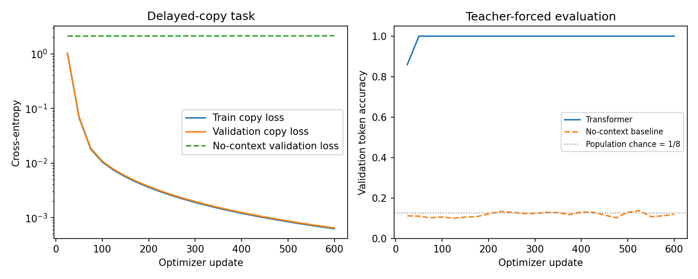

# 09.4 Build, Train, and Test a Minimal Transformer

第二编目录 · 本章导读

> Prerequisites: Chapters 07–09.3. Goal: connect all components in a small decoder-only model and verify both its computation and its learning behavior.

## 1. Motivation: a complete model should answer a precise task

Our task is delayed copying. A prompt contains four random symbols, and the model should generate the same four symbols in order.

For example:

```text
prompt:   [3, 7, 2, 5]
expected: [3, 7, 2, 5]
full training sequence: [3, 7, 2, 5, 3, 7, 2, 5]
```

The first four symbols are random, so predicting them from shorter prefixes is not learnable beyond chance. We supervise only the copy portion. To solve all possible prompts, the model needs information from earlier positions; the current token alone does not determine any one of these targets.

This is a small sequence-learning task, not a natural-language benchmark. It makes the role of context clear without introducing tokenization or external datasets.

## 2. Specify shapes, targets, and supervision before coding

Use vocabulary size $V=9$: IDs 1–8 are symbols; ID 0 is unused in this fixed-length task. Prompt length is $P=4$. The full sequence has length 8.

Training input is the first 7 tokens; targets are the final 7 tokens shifted left. The scored logit positions are 3–6:

```text
input position: 0 1 2 3 4 5 6
target is at:  1 2 3 4 5 6 7
score loss?:   N N N Y Y Y Y
```

At input position 3, the model has seen the full prompt and predicts the first copied token at full-sequence position 4. At position 6 it predicts the last copied token.

For prompt `[3,7,2,5]`, the scored pairs are:

| Logit/input position | Current input | Target | An available source of the answer |
|---|---:|---:|---|
| 3 | 5 | 3 | Prompt position 0 |
| 4 | 3 | 7 | Prompt position 1 |
| 5 | 7 | 2 | Prompt position 2 |
| 6 | 2 | 5 | Prompt position 3 |

A row of logits predicts the **next** token, not the input in that row. Slicing `[:,3:]` selects these four rows. Flattening `(B,4,9)` to `(4B,9)` changes only the layout for cross-entropy; it does not mix examples inside attention.

Causal attention allows a query to see itself and previous inputs, never future ones. We do not need padding for this fixed-length dataset.

## 3. Model specification

Use width $D=32$, four heads, two Pre-LN blocks, FFN width 64, learned absolute positions, final LayerNorm, and an untied vocabulary head.

The data flow is:

```text
token IDs → token embedding + position embedding
          → causal block → causal block → final LayerNorm
          → vocabulary logits
```

Each block preserves $(B,T,D)$. The head produces $(B,T,V)$. Dropout is zero for the small deterministic demonstration.

The implementation uses ordinary linear layers, normalization, softmax, and matrix multiplication. It does not call a prebuilt Transformer or attention layer.

## 4. Complete model implementation

This block also appears in the companion `transformer_core.py` so later efficiency experiments can reuse exactly the same model. Run the companion script or place both code blocks below in one Python file.

```python
import math
import torch
from torch import nn

class CausalSelfAttention(nn.Module):
    def __init__(self, width, heads):
        super().__init__()
        if width % heads:
            raise ValueError("width must be divisible by heads")
        self.heads = heads
        self.head_dim = width // heads
        self.qkv = nn.Linear(width, 3 * width)
        self.out = nn.Linear(width, width)

    def forward(self, x):
        B, T, D = x.shape
        Q, K, V = self.qkv(x).chunk(3, dim=-1)
        def split(z):
            return z.reshape(B, T, self.heads, self.head_dim).transpose(1, 2)
        Q, K, V = split(Q), split(K), split(V)
        scores = Q @ K.transpose(-2, -1) / math.sqrt(self.head_dim)
        allowed = torch.ones(T, T, dtype=torch.bool, device=x.device).tril()
        probabilities = scores.masked_fill(~allowed, -torch.inf).softmax(-1)
        read = probabilities @ V
        return self.out(read.transpose(1, 2).reshape(B, T, D))

class DecoderBlock(nn.Module):
    def __init__(self, width, heads, ff_width):
        super().__init__()
        self.norm1 = nn.LayerNorm(width)
        self.attn = CausalSelfAttention(width, heads)
        self.norm2 = nn.LayerNorm(width)
        self.ffn = nn.Sequential(nn.Linear(width, ff_width), nn.GELU(),
                                  nn.Linear(ff_width, width))

    def forward(self, x):
        x = x + self.attn(self.norm1(x))
        return x + self.ffn(self.norm2(x))

class TinyTransformer(nn.Module):
    def __init__(self, vocab=9, width=32, heads=4, ff_width=64,
                 depth=2, max_length=16):
        super().__init__()
        self.max_length = max_length
        self.token = nn.Embedding(vocab, width)
        self.position = nn.Embedding(max_length, width)
        self.blocks = nn.ModuleList([DecoderBlock(width, heads, ff_width)
                                     for _ in range(depth)])
        self.final_norm = nn.LayerNorm(width)
        self.head = nn.Linear(width, vocab, bias=False)

    def forward(self, ids):
        B, T = ids.shape
        if T < 1 or T > self.max_length:
            raise ValueError("input length outside configured range")
        positions = torch.arange(T, device=ids.device)
        x = self.token(ids) + self.position(positions)[None, :, :]
        for block in self.blocks:
            x = block(x)
        return self.head(self.final_norm(x))

    @torch.no_grad()
    def generate(self, prompt, new_tokens):
        if new_tokens < 0 or prompt.shape[1] + new_tokens > self.max_length:
            raise ValueError("requested generation exceeds configured range")
        self.eval()
        result = prompt.clone()
        for _ in range(new_tokens):
            next_id = self(result)[:, -1].argmax(dim=-1, keepdim=True)
            result = torch.cat([result, next_id], dim=1)
        return result
```

This generation method recomputes the prefix at every step for clarity. Section 10.2 adds a cache and verifies that predictions remain equivalent.

The function sets evaluation mode and leaves it there; call `model.train()` before returning to training.

## 5. Design a genuine held-out split

There are $8^4=4096$ possible four-symbol prompts. Enumerate them, randomly permute with a fixed generator, and take disjoint subsets for training, validation, and test.

This avoids accidentally placing an identical prompt in both training and evaluation. The distributions still share the same symbol vocabulary and copying rule; we are not testing new alphabets or arbitrary lengths.

Select the best checkpoint using validation copy loss. Only after that selection evaluate test and free-running generation.

## 6. Complete training and evaluation experiment

```python
import copy
import torch
import torch.nn.functional as F

torch.manual_seed(30)
torch.set_num_threads(1)
generator = torch.Generator().manual_seed(31)
alphabet = torch.arange(1, 9)
all_prompts = torch.cartesian_prod(alphabet, alphabet, alphabet, alphabet)
order = torch.randperm(len(all_prompts), generator=generator)
train_prompt = all_prompts[order[:512]]
val_prompt = all_prompts[order[512:640]]
test_prompt = all_prompts[order[640:768]]
split_sets = [set(map(tuple, part.tolist()))
              for part in (train_prompt, val_prompt, test_prompt)]
assert all(split_sets[i].isdisjoint(split_sets[j])
           for i in range(3) for j in range(i + 1, 3))
batch_rng_state = generator.get_state()

def supervised_batch(prompts):
    full = torch.cat([prompts, prompts], dim=1)
    return full[:, :-1], full[:, 1:]

model = TinyTransformer()
optimizer = torch.optim.AdamW(model.parameters(), lr=0.003, weight_decay=0.01)

@torch.no_grad()
def evaluate_copy(prompts):
    model.eval()
    inputs, targets = supervised_batch(prompts)
    logits = model(inputs)[:, 3:]
    labels = targets[:, 3:]
    loss = F.cross_entropy(logits.reshape(-1, 9), labels.reshape(-1)).item()
    accuracy = logits.argmax(-1).eq(labels).float().mean().item()
    return loss, accuracy

history = []
initial_val = evaluate_copy(val_prompt)[0]
best_loss, best_state = float("inf"), None
for step in range(600):
    model.train()
    indices = torch.randint(len(train_prompt), (64,), generator=generator)
    inputs, targets = supervised_batch(train_prompt[indices])
    optimizer.zero_grad(set_to_none=True)
    logits = model(inputs)[:, 3:]
    loss = F.cross_entropy(logits.reshape(-1, 9), targets[:, 3:].reshape(-1))
    assert torch.isfinite(loss)
    loss.backward()
    grad_norm = torch.nn.utils.clip_grad_norm_(model.parameters(), 1.0)
    assert torch.isfinite(grad_norm)
    optimizer.step()
    if (step + 1) % 25 == 0:
        train_loss, _ = evaluate_copy(train_prompt)
        val_loss, val_accuracy = evaluate_copy(val_prompt)
        history.append((step + 1, train_loss, val_loss, val_accuracy))
        if val_loss < best_loss:
            best_loss = val_loss
            best_state = copy.deepcopy(model.state_dict())

model.load_state_dict(best_state)
model.eval()
with torch.no_grad():
    # Perturb future inputs; earlier logits must not change.
    inputs, _ = supervised_batch(test_prompt[:4])
    changed = inputs.clone()
    changed[:, 4:] = (changed[:, 4:] % 8) + 1
    torch.testing.assert_close(model(inputs)[:, :4], model(changed)[:, :4],
                               atol=1e-6, rtol=1e-5)
    generated = model.generate(test_prompt, new_tokens=4)[:, 4:]
    exact_match = generated.eq(test_prompt).all(dim=1).float().mean().item()

print("parameter count:", sum(p.numel() for p in model.parameters()))
print("initial / best validation loss:", initial_val, best_loss)
test_metrics = evaluate_copy(test_prompt)
print("teacher-forced test loss / accuracy:", test_metrics)
print("free-running exact match:", exact_match)
print("prompt / generated:", test_prompt[:5], generated[:5])
# A regression guard for this fixed synthetic setup, not a general quality bar.
assert best_loss < initial_val * 0.1
assert test_metrics[1] > 0.9 and exact_match > 0.8

```

The companion script saves learning curves and prints example predictions and baseline metrics, including the independently trained baseline described below. Numerical values in the experiment guide come from actual execution. The broad success assertions are regression guards for this fixed synthetic setup; they are not a guarantee for new seeds, changed tasks, or different architectures.

## 7. Why both evaluation methods matter

Teacher-forced evaluation predicts every copied token using the correct previous copied tokens. Free-running generation feeds the model's own outputs back into later steps.

Exact sequence match requires all four generated tokens to be correct. Token accuracy can look high even when many sequences contain at least one error.

Here the prompt always remains accessible, so copying may be robust to an earlier generated mistake. Other tasks may have much stronger error propagation.

## 8. Debug before making the model larger

If learning fails, first inspect shifted labels and the four scored positions. Check loss connectivity, finite gradients, and prefix causality. Try fitting a tiny subset.

If a model achieves excellent training loss but poor held-out copying, inspect overfitting, positional shortcuts, and data overlap. Do not repeatedly tune on test.

### A trained no-context baseline, not just an intervention

The companion script also trains a separate position-wise network: the same embedding width, two residual FFNs, and a vocabulary head, but **no operation mixes tokens**. It uses the same split, 600 updates, batch index order, learning rate, clipping, and checkpoint-selection rule. Its parameter count and compute are lower because attention is absent; this is an information-access comparison, not an equal-parameter efficiency benchmark.

Why expect failure before looking at results? Write the independent uniform prompt symbols as $a,b,c,d$. At the four scored positions, current-input/target pairs are $(d,a),(a,b),(b,c),(c,d)$. In the full uniform prompt distribution, each target is independent of the current symbol and position. A position-wise predictor cannot distinguish the eight equally likely answers:

$$
\max_{\text{current-token-only predictor}}
\mathrm{Accuracy}_{\text{population}}=\frac18,
\qquad
\inf L_{\text{population}}=\log 8\approx2.0794.
$$

The infimum allows assigning negligible probability to unused ID 0. Uniform logits over **all nine** output IDs give $\log9$, a different starting reference. A finite held-out subset can fluctuate around the population bound, so the script does not require exactly 12.5% measured accuracy. It verifies the uniform conditional counts exhaustively over all 4,096 prompts.

The learning figure overlays the independently trained baseline. This provides evidence for the role of cross-position access, but does not prove that attention is the only architecture capable of copying; recurrent or other sequence models can also transmit context.

Simply disabling attention in an already trained network measures a destructive intervention, not an equally trained architecture comparison.

## 9. Scope and extensions

The model omits padding, dropout, cache, variable-length EOS stopping, sampling, distributed training, and real text. Each omission is explicit so the current experiment remains inspectable.

Extend one feature at a time: variable prompt lengths require correct masks and a suitable position scheme; caching requires offsets and layer-local state; language training requires a tokenizer and a realistic data split.

## 10. Exercises

1. Trace every tensor shape and count the parameters.
2. Explain why loss starts at input position 3 rather than 4.
3. Reproduce the included no-context baseline, then change its FFN width. Explain why more position-wise capacity cannot remove the full-population information limit.
4. Compare copy lengths 4 and 8 without claiming length generalization from in-range success.
5. Add top-k sampling and explain why it may be undesirable for exact copying.
6. Write a report distinguishing teacher-forced token accuracy and free-running exact match.

## 11. Completion standard and English summary

You can implement a causal decoder, train it on a specified objective, verify no future leakage, select using validation, and evaluate generation on held-out prompts.

Write a 150–200-word experiment abstract with architecture, split, objective, measured result, and limitations.

## 配套实验与阅读导航

完整脚本：[lab_09_4.py](../配套实验/lab_09_4.py)。运行环境、结果与解释见 实验指南。

下图来自配套实验的固定设置，解释时应保留课件中说明的适用范围：



上一节：09.3 Encoder Decoder与训练目标

下一节：10.1 预归一化与后归一化