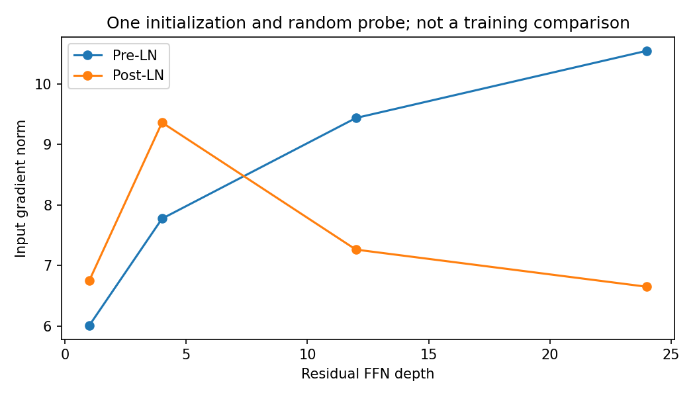

# 10.1 Pre-Normalization, Post-Normalization, and Depth

第二编目录 · 本章导读

> Prerequisites: 09.2 and Jacobian chain rules. Goal: derive how normalization placement changes the direct gradient path.

## 1. Motivation: the same pieces can compose differently

Residual addition and LayerNorm are not interchangeable operations. Normalizing before a branch and normalizing after an addition create different functions and different gradient paths.

Architectural names alone do not explain the effect. We will write the computation, differentiate it, and inspect a controlled example.

## 2. Compare one sublayer

Let $\mathcal F$ be attention or an FFN and $\mathcal N$ be LayerNorm.

Pre-LN uses

$$
\mathbf{y}_{\mathrm{pre}}=\mathbf{x}+\mathcal F(\mathcal N(\mathbf{x})).
$$

Post-LN uses

$$
\mathbf{y}_{\mathrm{post}}=\mathcal N(\mathbf{x}+\mathcal F(\mathbf{x})).
$$

Both accept and return the same shape. They generally do not produce the same values even with identical parameters.

A complete block contains separate attention and FFN residual sublayers. This section analyzes one sublayer to make the gradient algebra readable.

## 3. Derive the Jacobians

For one token, $\mathbf{x},\mathbf{y}\in\mathbb{R}^{D}$. A Jacobian is a $D\times D$ matrix with entry $(J_{\mathcal F})_{ij}=\partial \mathcal F_i/\partial x_j$. It maps a small input perturbation to a first-order output perturbation. If the sublayer mixes positions, flatten all positions conceptually and use the corresponding larger Jacobian; the chain-rule structure is unchanged.

Let $\mathbf{J}_{\mathcal F}$ and $\mathbf{J}_{\mathcal N}$ be local Jacobians evaluated at their respective inputs. The identity matrix $\mathbf{I}$ comes from differentiating the unchanged residual input.

Trace Pre-LN one operation at a time: let $\mathbf{z}=\mathcal N(\mathbf{x})$, then $\mathbf{r}=\mathcal F(\mathbf{z})$, then $\mathbf{y}=\mathbf{x}+\mathbf{r}$. Perturbing the input gives

$$
\mathrm{d}\mathbf{z}=\mathbf{J}_{\mathcal N}(\mathbf{x})\,\mathrm{d}\mathbf{x},
\quad
\mathrm{d}\mathbf{r}=\mathbf{J}_{\mathcal F}(\mathbf{z})\,\mathrm{d}\mathbf{z},
\quad
\mathrm{d}\mathbf{y}=\mathrm{d}\mathbf{x}+\mathrm{d}\mathbf{r}.
$$

Substituting the first two expressions into the third produces the Jacobian below. The matrix order is the order of the forward path: normalize first, branch second.

For Pre-LN,

$$
\mathbf{J}_{\mathrm{pre}}
=\mathbf{I}+\mathbf{J}_{\mathcal F}\mathbf{J}_{\mathcal N}.
$$

For Post-LN, set $\mathbf{z}=\mathbf{x}+\mathcal F(\mathbf{x})$. Then

$$
\mathbf{J}_{\mathrm{post}}
=\mathbf{J}_{\mathcal N}(\mathbf{z})
 \left(\mathbf{I}+\mathbf{J}_{\mathcal F}(\mathbf{x})\right).
$$

The Post-LN direct residual route still passes through the normalization Jacobian. Pre-LN has an identity term outside that normalization.

For an upstream column gradient $\mathbf{g}_y=\nabla_{\mathbf{y}}L$, backpropagation uses $\mathbf{g}_x=\mathbf{J}^{\mathsf T}\mathbf{g}_y$. Consequently,

$$
\begin{aligned}
\mathbf{g}_{x,\mathrm{pre}}
&=\mathbf{g}_y+\mathbf{J}_{\mathcal N}^{\mathsf T}
                    \mathbf{J}_{\mathcal F}^{\mathsf T}\mathbf{g}_y,\\
\mathbf{g}_{x,\mathrm{post}}
&=(\mathbf{I}+\mathbf{J}_{\mathcal F})^{\mathsf T}
                    \mathbf{J}_{\mathcal N}^{\mathsf T}\mathbf{g}_y.
\end{aligned}
$$

The local evaluation points are the ones specified in each forward graph; the symbols do not imply identical numerical Jacobians in the two models. An identity contribution does not provide a positive lower bound on gradient norm: another branch can partially cancel it.

Backpropagation multiplies the transposes of these Jacobians. Across many layers, placement changes the products that gradients encounter.

This motivates why Pre-LN is often easier to optimize in deep settings. It does not prove universal superiority or rule out successfully trained Post-LN models with suitable initialization and schedules.

## 4. A zero-branch thought experiment

If $\mathcal F$ is identically zero, a Pre-LN sublayer returns $\mathbf{x}$ exactly. Its Jacobian is the identity.

A Post-LN sublayer instead returns $\mathcal N(\mathbf{x})$. LayerNorm removes a common shift in feature coordinates, so shifting every feature by the same scalar does not change its normalized output. Its Jacobian therefore has a zero direction associated with that common shift.

More concretely, for $\mathbf{x}=(1,2,3)^{\mathsf T}$ the zero-branch Pre-LN output stays $(1,2,3)^{\mathsf T}$. Post-LN with unit affine scale and zero shift outputs approximately $(-1.2247,0,1.2247)^{\mathsf T}$. If we add the same scalar $c$ to all three inputs, that Post-LN output is unchanged:

$$
\mathcal N(\mathbf{x}+c\mathbf{1})=\mathcal N(\mathbf{x})
\quad\Longrightarrow\quad
\mathbf{J}_{\mathcal N}\mathbf{1}=\mathbf{0}.
$$

The implication comes from differentiating with respect to $c$ at zero. This makes a direct and falsifiable example of the structural difference without training noise.

## 5. Why a gradient norm comparison can be misleading

Using the sum of normalized features as a probe may produce an almost constant scalar. A nearly zero gradient can then be a property of the chosen probe, not evidence that the entire model cannot learn.

Use a generic weighted output probe, inspect Jacobians or several directions, and report the exact configuration. One seed and one norm do not establish an optimization theorem.

The final LayerNorm in a Pre-LN network also changes the end-to-end gradient. Identity routes through internal blocks do not mean the entire model's Jacobian is identity.

## 6. Residual stream scale and final normalization

In a Pre-LN stack, branches receive normalized inputs but their outputs are added to an accumulating residual stream. Its magnitude can change with depth.

A final norm provides a controlled scale before the output head. Initialization, residual scaling, learning-rate warmup, and normalization epsilon still matter. Pre-LN does not remove the need for these decisions.

## 7. Runnable experiment: exact identities and a depth probe

```python
import copy
import torch
from torch import nn

torch.manual_seed(32)
D = 8
norm = nn.LayerNorm(D, elementwise_affine=False).double()
x = torch.randn(D, dtype=torch.float64)

pre_jacobian = torch.autograd.functional.jacobian(lambda z: z + 0 * norm(z), x)
post_jacobian = torch.autograd.functional.jacobian(lambda z: norm(z + 0 * z), x)
torch.testing.assert_close(pre_jacobian, torch.eye(D, dtype=torch.float64))
torch.testing.assert_close(post_jacobian @ torch.ones(D, dtype=torch.float64),
                           torch.zeros(D, dtype=torch.float64), atol=1e-10, rtol=0)

class ResidualMLP(nn.Module):
    def __init__(self, width, pre):
        super().__init__()
        self.pre = pre
        self.norm = nn.LayerNorm(width)
        self.branch = nn.Sequential(nn.Linear(width, 2*width), nn.GELU(),
                                     nn.Linear(2*width, width))

    def forward(self, z):
        if self.pre:
            return z + self.branch(self.norm(z))
        return self.norm(z + self.branch(z))

depth_results = []
for depth in [1, 4, 12, 24]:
    torch.manual_seed(33)
    pre = nn.Sequential(*[ResidualMLP(D, True) for _ in range(depth)]).double()
    post = copy.deepcopy(pre)
    for block in post:
        block.pre = False
    probe = torch.randn(2, 3, D, dtype=torch.float64)
    source = torch.randn_like(probe)
    norms = []
    for stack in [pre, post]:
        z = source.clone().requires_grad_()
        (stack(z) * probe).sum().backward()
        norms.append(z.grad.norm().item())
    depth_results.append((depth, *norms))

print("depth / pre-LN input grad norm / post-LN input grad norm:", depth_results)
print("zero-branch Jacobian identities verified")
```

This is a residual-FFN probe, not a trained complete Transformer benchmark. It isolates normalization placement while keeping branch parameters equal. The gradient norm curves are observations under one initialization.

## 8. Training experiment design

To compare full Transformers, keep dataset, objective, width, depth, attention mask, batch order, and evaluation definitions controlled. Tune learning-rate/warmup fairly for each placement instead of imposing one setting and declaring a universal winner.

Report convergence, validation performance, gradient statistics, and failure cases. Changing final normalization or residual scaling at the same time adds another factor that must be named.

## 9. Exercises

1. Re-derive the two Jacobians using the chain rule.
2. Explain the common-shift null direction of LayerNorm.
3. Compare a random output probe with the sum of normalized features.
4. Add a final norm to the Pre-LN probe and interpret the changed gradient.
5. Design a two-depth full-model comparison with a controlled learning-rate search.

## 10. Completion standard and English summary

You can derive the different gradient paths and interpret a numerical probe without turning it into an unsupported general claim.

Write 150 words explaining why normalization placement changes optimization even when tensor shapes and parameter counts match.

Further reading: [On Layer Normalization in the Transformer Architecture](https://arxiv.org/abs/2002.04745).

## 配套实验与阅读导航

完整脚本：[lab_10_1.py](lab_10_1.py)。运行环境、结果与解释见 实验指南。

下图来自配套实验的固定设置，解释时应保留课件中说明的适用范围：



上一节：09.4 从零实现最小Transformer

下一节：10.2 长上下文与注意力效率