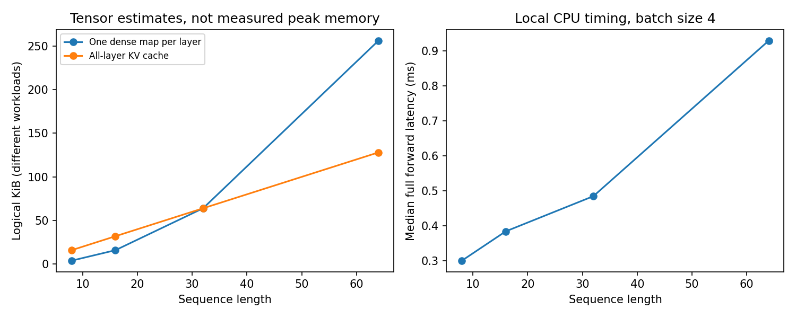

# 10.3 Parameter Counts, Memory, Throughput, and Compute Budgets

第二编目录 · 本章导读

> Prerequisites: 09.4 and 10.2. Goal: calculate what scales with width and length, then measure a small implementation honestly.

## 1. Motivation: “bigger” can mean several different things

Increasing model width, layer count, sequence length, or batch size affects different resources. Parameter count alone does not describe training memory or inference latency.

Before scaling an experiment, write a budget: number of examples or tokens, updates, maximum sequence length, trainable parameters, memory, and wall-clock time.

The same numerical loss can result from different amounts of data and computation. A useful comparison records those budgets rather than only the final score.

## 2. Derive an exact parameter count for our teaching decoder

Use vocabulary size $V$, model width $D$, FFN width $F$, layer count $L$, and learned maximum position count $M$.

Our 09.4 model has:

| Component | Trainable scalars |
|---|---:|
| Token embeddings | $VD$ |
| Learned positions | $MD$ |
| One block's biased Q/K/V and output projections | $4D^2+4D$ |
| One block's biased two-matrix FFN | $2DF+F+D$ |
| One block's two affine LayerNorms | $4D$ |
| Final LayerNorm | $2D$ |
| Untied, bias-free vocabulary head | $VD$ |

Adding them gives

$$
N_{\mathrm{param}}
=2VD+MD+L(4D^2+2DF+9D+F)+2D.
$$

This formula is exact for the declared architecture. Tied embeddings, bias-free projections, RMSNorm, gated FFNs, or GQA change it.

Changing the processed sequence length $T$ does not change this parameter count as long as it stays within the existing position table.

## 3. Count matrix work and state the convention

A matrix multiplication of shapes $(m,k)$ and $(k,n)$ uses roughly $mkn$ multiply-accumulate operations (MACs). Counting multiplication and addition separately gives approximately twice as many FLOPs.

Ignoring biases, activation functions, softmax, normalization, and embedding lookup, one block's forward MAC count is approximately

$$
C_{\mathrm{block}}
=4BTD^2+2BTFD+2BT^2D.
$$

Here $B$ is batch size, $T$ is processed length, and $h$ is the number of heads, with $d_h=D/h$. Follow one matrix product at a time:

| Operation | Matrix shape per example/head | MACs over the batch |
|---|---|---:|
| Three input projections | $(T,D)(D,D)$, three times | $3BTD^2$ |
| Attention scores | $(T,d_h)(d_h,T)$, $h$ heads | $BhT^2d_h=BT^2D$ |
| Weighted values | $(T,T)(T,d_h)$, $h$ heads | $BT^2D$ |
| Output projection | $(T,D)(D,D)$ | $BTD^2$ |
| FFN expansion and contraction | $(T,D)(D,F)$ and $(T,F)(F,D)$ | $2BTDF$ |

Adding these rows gives the formula. Dense masked attention still forms the full square in our implementation; a specialized triangular kernel may reduce constant factors.

For $B=1,T=8,D=32,F=64$, projections use 32,768 MACs, the FFN 32,768, and the two attention products 4,096: 69,632 MACs per block. Here attention is not the dominant term. At fixed $F=2D$, attention equals projection+FFN matrix work when $2T^2D=8TD^2$, or $T=4D$. This crossover is a simple arithmetic estimate, not a runtime guarantee.

The vocabulary head adds $BTDV$ MACs. This can matter greatly for large vocabularies.

Backward for matrix-heavy layers often adds about twice the forward work, so a training step is roughly three forward passes' matrix work under simple assumptions. This is an estimate, not a profiler measurement; activation recomputation, optimizer updates, padding, and kernels change actual work.

## 4. Separate parameter memory from activation memory

For ordinary float32 parameters with dense float32 gradients and Adam's two float32 moment buffers:

$$
M_{\mathrm{persistent}}\approx
(4+4+4+4)N_{\mathrm{param}}
=16N_{\mathrm{param}}\text{ bytes}.
$$

Optimizer buffers may be allocated lazily. Additional master weights, mixed-precision choices, distributed shards, and temporary optimizer storage change this estimate.

Activations depend on batch and sequence length. An explicit float32 attention map alone needs

$$
M_{\mathrm{map}}=4BhT^2\text{ bytes per layer}.
$$

Training may retain additional tensors for backward. Memory-efficient attention kernels can avoid retaining this whole map; activation checkpointing trades recomputation for storage.

KV cache is an inference resource with linear length growth under the formula from 10.2. It should not be added indiscriminately to a teacher-forced training memory estimate that never allocates such a cache.

## 5. Effective batch and update budgets

With micro-batch size $B_\mu$, $A$ accumulation steps, and $R$ synchronized data-parallel workers, an idealized effective batch is $B_\mu A R$ sequences. For example, $B_\mu=4,A=8,R=2$ gives 64 sequences per update. At 128 valid supervised tokens per sequence, that is 8,192 supervised tokens per update; padding or prefix-only context changes the count.

For the copy run in 09.4, 600 updates of batch size 64 process 38,400 sequence presentations, but only 512 unique training prompts. Each presentation has 7 input tokens and 4 supervised targets: 268,800 input-token presentations versus 153,600 supervised-token presentations. Repeated presentations are computation, not additional unique data.

For language-like losses, valid-token counts may differ between micro-batches. Accumulate a total summed loss divided by the intended total token count, or use an equivalent correct weighting. Averaging unequal micro-batch means equally changes the objective.

Warmup and decay schedules must use a defined step unit. Doubling accumulation while leaving a per-update schedule untouched changes how many tokens are processed at each learning rate.

## 6. What scaling laws can and cannot tell us here

Empirical scaling laws describe performance trends across model, data, and compute ranges under specified training recipes. They help motivate budgeting data and parameters together.

They do not imply that one larger model always wins, that a formula replaces clean evaluation, or that a tiny synthetic copy experiment predicts frontier language-model quality. Chapter 12 develops pretraining and scaling with those distinctions in place.

At this stage, learn to make a resource estimate, verify it, and decide which bottleneck limits your own experiment.

## 7. Runnable experiment: exact count, logical memory, and CPU timing

The model import uses the companion `transformer_core.py` from 09.4.

```python
import statistics
import time
import torch
from transformer_core import TinyTransformer

torch.manual_seed(35)
torch.set_num_threads(1)
V, D, F, L, M, h = 9, 32, 64, 2, 128, 4
model = TinyTransformer(vocab=V, width=D, heads=h, ff_width=F,
                        depth=L, max_length=M).eval()
formula = 2*V*D + M*D + L*(4*D*D + 2*D*F + 9*D + F) + 2*D
actual = sum(p.numel() for p in model.parameters())
assert formula == actual
print("exact trainable parameters:", actual)
print("FP32 parameter bytes:", sum(p.numel()*p.element_size() for p in model.parameters()))
print("rough FP32 Adam persistent bytes:", 16 * actual)

resource_rows = []
with torch.inference_mode():
    for T in [8, 16, 32, 64]:
        B = 4
        ids = torch.randint(1, V, (B, T))
        for _ in range(4):
            model(ids)
        elapsed = []
        for _ in range(7):
            start = time.perf_counter()
            for _ in range(10):
                model(ids)
            elapsed.append((time.perf_counter() - start) / 10)
        seconds = statistics.median(elapsed)
        dense_map_bytes = B * h * T * T * 4
        kv_bytes = 2 * L * B * T * h * (D // h) * 4
        forward_macs = L * (4*B*T*D*D + 2*B*T*F*D + 2*B*T*T*D) + B*T*D*V
        resource_rows.append((T, seconds*1000, B*T/seconds,
                              dense_map_bytes, kv_bytes, forward_macs))
print("T / ms / input tokens per second / map bytes per layer / KV bytes / forward MACs")
for row in resource_rows:
    print(row)
```

The memory quantities are logical tensor estimates, not measured process RSS or GPU allocated memory. Timing is a local CPU observation for this implementation and environment.

## 8. Measure the right workload

Warm up first. Disable gradient recording for inference. On an asynchronous GPU, synchronize appropriately or use timed GPU events; a host timer around kernel launches alone can undercount execution.

Report hardware, dtype, batch size, lengths, mode, and repetitions. Use medians or distributions rather than one timing.

Input tokens per second during full-prefix processing is not the same metric as generated tokens per second during cached decode. Prefill, first-token latency, per-token decode latency, and end-to-end request latency answer different questions.

Do not infer CUDA performance from this CPU experiment.

## 9. A practical budget sheet

For an experiment, record:

- fixed dataset split and total unique training examples;
- valid tokens processed and number of optimizer updates;
- architecture, parameter count, dtype, and maximum context;
- peak memory if measured, clearly separated from estimates;
- measured training time and inference workload definition;
- validation criterion used for selection and one final test evaluation.

If a run is too slow, identify whether projection/FFN work, attention length, data loading, or Python overhead dominates before changing architecture.

## 10. Exercises

1. Verify the exact parameter formula for three widths.
2. Derive how doubling $T$ changes projections, attention work, and explicit map memory.
3. Compare weight tying with an untied vocabulary head.
4. Calculate correct loss weights for unequal micro-batch token counts.
5. Benchmark prefill and cached one-token decode separately using 10.2.
6. Write a budget for a larger experiment that fits your measured resources.

## 11. Completion standard and English summary

You can count model parameters, estimate the major compute and memory terms, measure a named workload, and report the limits of that measurement.

Write 150 words explaining why parameter count alone cannot predict Transformer runtime or memory use.

## 配套实验与阅读导航

完整脚本：[lab_10_3.py](lab_10_3.py)。运行环境、结果与解释见 实验指南。

下图来自配套实验的固定设置，解释时应保留课件中说明的适用范围：



上一节：10.2 长上下文与注意力效率

下一节：第 11 章：语言模型基础（大纲）