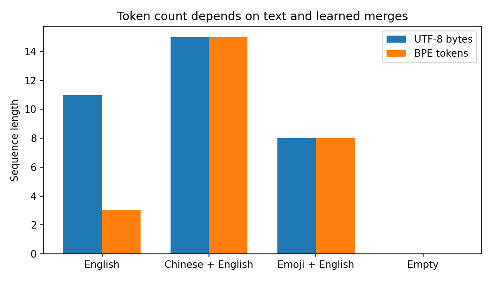

# 11.1 Tokenization and Vocabulary

第三编目录 · 本章导读


> Prerequisites: Embedding (06.3), decoder input shapes (09.4). Goal: explain what a token is and implement a small, lossless byte-level BPE tokenizer.

## 1. Why a language model needs a tokenizer

A neural network receives numeric tensors, but text is a variable-length sequence of characters and bytes. We need a reproducible mapping from text to a sequence of discrete IDs. A vocabulary then assigns an embedding vector to each ID.

A token is **a unit chosen by a tokenizer**, not necessarily a word, character, or meaningful concept. “unhappiness” might be one token or several. Chinese characters, whitespace, punctuation, and emoji all consume tokens according to the actual tokenizer.

Let the vocabulary be $\mathcal V$ with size $V$. Encoding a string produces $(x_1,\ldots,x_T)$, where $x_t\in\{0,\ldots,V-1\}$. These integers are addresses, not ordered measurements: token 100 is not semantically “twice” token 50. An embedding matrix $\mathbf E\in\mathbb R^{V\times d}$ maps each address to a row of width $d$.

## 2. Three starting points and their tradeoffs

A word-level tokenizer makes common words convenient but needs a policy for unseen words. A character-level tokenizer has fewer units, but sequences become longer. A byte tokenizer has a fixed 256-byte alphabet and can encode arbitrary UTF-8 text without an unknown-word token.

Bytes and characters differ. The ASCII letter `a` is one UTF-8 byte; many Chinese characters use three; an emoji may use four or form a longer multi-code-point sequence. Never decode each byte token independently as UTF-8: concatenate the bytes first.

Subword methods start from smaller units and combine frequent sequences. They trade a larger vocabulary for fewer sequence positions. There is no universal “characters per token” constant across languages and tokenizers.

## 3. Build BPE from one local decision

Byte Pair Encoding repeatedly merges a frequent adjacent pair. Consider three training sequences:

```text
a b a b
a b a c
a b
```

Initially, the pair `(a,b)` occurs 4 times, `(b,a)` twice, and `(a,c)` once. Create a new token `AB` and replace non-overlapping occurrences:

```text
AB AB
AB a c
AB
```

The number of units falls from 10 to 6. A new vocabulary entry records that `AB` decodes to the bytes for `a` followed by `b`. Repeat pair counting on the **updated** sequences, not on the original text.

Overlapping matches require a policy. For `a a a` and merge `(a,a)`, left-to-right replacement produces `AA a`, not two overlapping tokens. Frequency ties also need deterministic handling.

中文确认：训练 tokenizer 学的是“哪些相邻单元合并、先合并谁”，不是语言模型的参数；语言模型训练时通常固定这套规则。

## 4. Training and encoding are different operations

Tokenizer training counts pairs on the training corpus and chooses an ordered merge list. Encoding new text applies that already learned list. It must not learn new merges from the test sentence.

Our implementation begins with IDs 0–255 for raw bytes. Each merge gets a new ID and a byte-string decoding entry. At inference, starting from raw bytes, applying merges in learned rank order gives the deterministic segmentation used by this implementation.

For a concrete two-merge example, assign `a=97`, `b=98`, `c=99`. If rank 0 merges `(97,98)→256` and rank 1 merges `(256,99)→257`, then `abc` becomes `[256,99]` and finally `[257]`. A “longest string match” that ignores merge ranks is not the rule we learned.

The alternative reference encoder repeatedly selects the best-ranked pair **currently present**. New tokens receive increasing IDs and all occurrences of a selected pair are merged before later ranks, so applying the learned list in order is equivalent here. The lab compares the two algorithms on 100 seeded mixed-language strings, not merely on training examples.

Real tokenizers add engineering choices: Unicode normalization, regex pre-tokenization, reserved tokens, efficient priority queues, and explicit special-token policies. Our small implementation deliberately omits these. It is not a reproduction of any deployed model's tokenizer.

Because no Unicode normalization is applied and all raw bytes remain representable, this teaching implementation satisfies

$$
\operatorname{decode}(\operatorname{encode}(s))=s
$$

for every valid input Python string encodable as UTF-8. A production tokenizer that normalizes text may instead round-trip only the normalized form.

This guarantee applies to encoding valid text and decoding the result. An arbitrary generated sequence of byte IDs can still be invalid UTF-8—for example the lone byte 255. Our decoder raises a UnicodeDecodeError for that case; a production streaming decoder may buffer incomplete sequences or use a documented replacement policy. Encoding coverage and validity of arbitrary generated bytes are different properties.

## 5. Why the choice changes model cost

A token embedding table has $Vd$ parameters. If the output head is untied, it adds another $Vd$ weights; tying shares the table rather than making the vocabulary free.

For a batch of $B$ sequences of length $T$, input IDs have shape $(B,T)$ and logits have shape $(B,T,V)$. Increasing $V$ increases the softmax head's output dimension. Increasing $T$ increases activation work and, for dense attention, the number of query–key pairs quadratically.

For example, halving token count from 200 to 100 reduces dense attention's position pairs from 40,000 to 10,000, but doubling vocabulary increases output-head work at each position. Actual runtime also depends on width, kernels and memory. Compression alone does not establish a globally optimal tokenizer.

A model's context limit is a **token** limit. A change of tokenizer can change how much text fits without changing that numeric limit.

## 6. Boundaries are part of the specification

Keep these objects distinct:

- PAD fills a rectangular batch; usually it should not become a prediction target.
- BOS provides a starting context; EOS teaches the model when a sequence ends.
- Role or message delimiters mark structured conversations.
- Ordinary text that spells something like `<assistant>` need not be allowed to inject a trusted delimiter.

In the following chapters, the tiny LM uses an explicit **word vocabulary for a controlled grammar**, not this byte BPE. That choice keeps sequence lengths and error analysis readable. BPE is an independent tokenizer experiment; its ID space must never be passed into that word-vocabulary model.

If using a pretrained model, retain its tokenizer, special-token IDs and chat template unless deliberately resizing/retraining compatible components.

## 7. Experiment: build, freeze, and test

The implementation is in [llm_core.py](llm_core.py), class `ByteBPE`. Read `fit`, `replace`, `encode` and `decode` in that order. The companion lab trains only on a small English corpus, then checks English, Chinese, emoji, whitespace and empty text.

Predict before running: which inputs can benefit from learned English merges? Will the Chinese example become unrepresentable, or merely use more tokens? The round-trip test answers representability; the count chart answers compression. Neither evaluates language-model quality.

```python
# Standalone arithmetic check; the complete BPE experiment is in lab_11_1.py.
pair_counts = {}
for sequence in ["abab", "abac", "ab"]:
    for pair in zip(sequence, sequence[1:]):
        pair_counts[pair] = pair_counts.get(pair, 0) + 1
assert pair_counts[("a", "b")] == 4
assert pair_counts[("b", "a")] == 2
text = "你好!"
assert bytes(list(text.encode("utf-8"))).decode("utf-8") == text
print(pair_counts, "UTF-8 bytes:", len(text.encode("utf-8")))
```

### Code bridge: the left-to-right merge

Read this small function against the `AB` hand example. It advances by two only after consuming a matched pair, so overlapping occurrences are not double-counted.

```python
def merge_pair(ids, pair, new_id):
    result = []
    i = 0
    while i < len(ids):
        if i + 1 < len(ids) and (ids[i], ids[i+1]) == pair:
            result.append(new_id)
            i += 2
        else:
            result.append(ids[i])
            i += 1
    return result

assert merge_pair([97,98,97,98], (97,98), 256) == [256,256]
assert merge_pair([97,97,97], (97,97), 256) == [256,97]
```

The full tokenizer repeats this operation across each document separately. It does not form pairs across document boundaries.

## 8. Pitfalls and exercises

Common mistakes include fitting on train+test, counting characters as tokens, assigning new token IDs without resizing embeddings, and stripping whitespace without acknowledging changed text.

1. Perform two BPE merges on the three-sequence example. State your tie-breaking rule.
2. Explain why vocabulary size is 256 plus the number of learned merges in this implementation.
3. Add a repeated emoji to training and measure how token counts change.
4. Construct a Unicode example where normalizing text changes exact round-trip behavior.
5. Compare total logits elements for $(B,T,V)=(2,100,1000)$ and $(2,70,2000)$.
6. Explain why a tokenizer's ability to encode a word does not mean the model understands it.

## 9. Completion standard and English summary

You can distinguish bytes, characters, subwords and IDs; hand-execute BPE; explain the sequence-length/vocabulary tradeoff; and test tokenizer compatibility and boundaries.

Write 120–180 words explaining why a tokenizer is a learned or designed interface rather than a semantic dictionary.

Reference: [Sennrich et al., subword units](https://arxiv.org/abs/1508.07909).


## 配套实验与阅读导航

完整脚本：[lab_11_1.py](lab_11_1.py)。运行方法和实测记录见 实验指南。



上一节：10.3 训练规模与计算预算

下一节：11.2 Causal Language Modeling