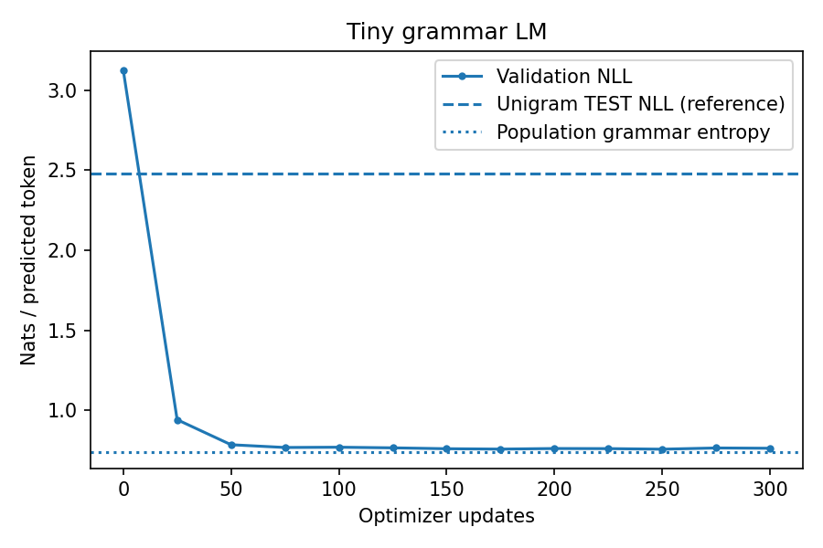

# 11.3 Training a Tiny Language Model

第三编目录 · 本章导读


> Prerequisites: 09.4 decoder implementation and 11.2 causal loss. Goal: train, evaluate and challenge a tiny language-model pipeline.

## 1. What we are trying to learn

A large natural-language model is too expensive for a first controlled experiment. We instead use a small artificial language whose rules and uncertainty are known.

The grammar generates sentences such as:

```text
the red fox sees the blue owl .
the gold cat helps the green dog .
```

There are four colors, four animals and three verbs. Each sentence independently chooses two colors, two animals and one verb. Thus the full population contains $4^4\cdot3=768$ distinct sentences.

This is a language-model pipeline experiment, not evidence of broad natural-language understanding. The vocabulary, syntax and sequence length are tiny and fixed.

## 2. First define the evaluation unit

Each complete sentence is a data unit. We enumerate the 768 possible sentences, shuffle with a fixed seed, and select 384 training, 96 validation and 96 test sentences. The remaining 192 are unused. The three selected sets have no identical sentences.

Words and many short patterns intentionally overlap across splits: the question is whether the model learns the grammar for unseen **combinations**, not an unseen vocabulary or a new linguistic domain.

The word vocabulary is explicitly specified by the grammar rather than fitted on test text. It includes PAD/BOS/EOS and a few role tokens reserved for Chapter 13. The BPE ID space from 11.1 is unrelated.

We choose checkpoints using validation NLL only. Test metrics are computed after that selection. Never repeatedly inspect test results to tune the model.

## 3. Follow the model's shapes

Each sentence has 8 content tokens plus BOS/EOS, yielding 9 next-token targets. With batch size $B=32$, inputs have shape $(32,9)$.

Our decoder uses width $d=32$, four heads of width 8, two pre-LN blocks, FFN width 64 and a learned position table of length 24. If vocabulary size is $V$, embedding outputs have shape $(32,9,32)$ and logits have shape $(32,9,V)$.

The model architecture follows 09.4: token/position embeddings → pre-LN causal attention and FFN blocks → final norm → vocabulary head. The full code is in [llm_core.py](llm_core.py), not an opaque pretrained dependency.

Here $V=19$. Count parameters rather than treating the total as a magic number. Token and untied head weights contribute $2Vd$; positions contribute $24d$; final LayerNorm contributes $2d$. Each block has attention $4d^2+4d$, FFN $4d^2+3d$, and two LayerNorms $4d$, totaling $8d^2+11d$. Therefore

$$
P=2Vd+24d+2(8d^2+11d)+2d=19\,136
\quad(d=32,V=19).
$$

The lab checks this ledger against the actual model. Biases matter even though they are small.

No padding key mask is needed for these equal-length sentences. The SFT batch builder also supports right padding (the main 16-example SFT task happens to have equal lengths): causal attention prevents valid earlier positions reading padded suffixes, and the loss ignores padded targets. Left padding or arbitrary interior padding would require additional handling; do not generalize this simplification.

## 4. An achievable loss is not necessarily zero

Some token positions are uncertain even for a perfect population model. After `the` at the start, any of four colors is equally valid. After a color, any of four animals is valid. The verb has three choices. Fixed syntax positions are deterministic.

The sequence entropy under the uniform grammar is

$$
H_{\mathrm{sequence}}
=\log4+\log4+\log3+\log4+\log4
=\log768.
$$

There are 9 supervised positions including EOS, so the population conditional-entropy average is

$$
H_{\mathrm{token}}=\frac{\log768}{9}\approx0.7382
\quad\text{nats/token}.
$$

This is the population reference, not a hard lower bound on every finite held-out estimate or the training loss. Memorization can lower training loss; a finite disjoint split can shift conditional frequencies.

A good model should learn predictable syntax and distribute probability over possible content. Demanding 100% next-token accuracy on random content misunderstands the task.

Four positions are deterministic: two occurrences of `the`, punctuation and EOS. Four positions independently choose one of four colors/animals; the verb chooses one of three. Thus the Bayes-optimal **population** token accuracy is

$$
\frac{4+4(1/4)+1/3}{9}=\frac{16}{27}\approx59.26\%.
$$

This explains why the measured 58.91% can accompany a good model. It is not a hard ceiling for a particular finite split. Per-position metrics reveal whether low accuracy comes from uncertain content or a failure to learn deterministic syntax.

## 5. A baseline makes the result interpretable

Fit a unigram distribution from training target counts with add-one smoothing:

$$
q(k)=\frac{c_k+1}{\sum_jc_j+V}.
$$

It predicts the same distribution at every position, ignoring context. This simple baseline is deliberately weaker and is not parameter-matched. It answers: does the decoder exploit contextual grammar beyond global word frequency?

The lab reports test NLL for both models, decoder perplexity, token accuracy and the validation curve. A lower NLL than the unigram is meaningful on this controlled distribution, not a claim about real-world performance.

## 6. Training loop and checkpoint choice

The shared `fit_model` function performs these operations:

1. Sample training sentence indices from a dedicated generator.
2. Build shifted inputs, targets and the valid-token mask.
3. Compute summed NLL divided by valid count.
4. Backpropagate, clip gradient norm to 1, and take an AdamW step.
5. Evaluate validation NLL every 25 updates.
6. Save a deep copy of the best model state and restore it at the end.

The experiment runs 300 updates with batch size 32 and learning rate 0.003. Sampling is with replacement, so “updates × batch size” counts sentence exposures, not unique sentences.

The best-state snapshot here selects a model; it is not a complete resumable optimizer checkpoint. Section 12.3 makes that distinction explicit.

## 7. Verify causality before trusting the loss

For an input sequence, change tokens at positions 5 and later. Logits at positions 0–4 must remain unchanged. This detects many future-read bugs.

Append PAD tokens to the right and verify all original logits remain unchanged. These checks concern computation invariants, not generalization.

```python
import math
choices = [4, 4, 3, 4, 4]
sequence_count = math.prod(choices)
entropy_per_target = sum(math.log(n) for n in choices) / 9
assert sequence_count == 768
print("grammar entropy:", entropy_per_target)
print("reference perplexity:", math.exp(entropy_per_target))
```

Run `lab_11_3.py` for the actual decoder training, baseline and invariance assertions. The plotted curve comes from execution, not invented demonstration values.

## 8. Free generation is a separate observation

Beginning with `BOS the red`, greedy decoding repeatedly picks the highest-probability next token until EOS or the requested limit. A prefix already ending in EOS is returned unchanged in this teaching API. The configured context capacity limits inputs to each forward pass: a final generated token can make the returned list one token longer because that final token has not yet been fed back. Another step would require more context capacity. This is a local convention, not a claim about a serving API's length rules.

Many completions are valid. Exact match to one randomly chosen held-out sentence would penalize other correct completions. Here we inspect syntax and stopping behavior instead of treating one completion as uniquely correct.

Greedy decoding may repeatedly choose the same valid color or animal. That does not by itself mean training failed; Chapter 13 compares stochastic decoding. Conversely, a fluent-looking example does not prove that all held-out conditionals are learned.

## 9. Experiments, pitfalls and exercises

Keep the split fixed and vary one factor: number of training sentences, decoder width, number of updates, or context information. Record validation NLL and the test result only after choosing the experiment.

1. Count predictable versus random positions and derive the entropy reference.
2. Remove positional embeddings. Which signals still reveal position?
3. Train a current-token-only model as a stronger independent baseline.
4. Intentionally allow future attention and measure the resulting leakage.
5. Create a new grammar order for an OOD test; do not merge it with the in-distribution test.
6. Explain why checkpoint selection and resumable training require different saved state.

## 10. Completion standard and English summary

You can reproduce the train/validation/test pipeline, explain nonzero irreducible population uncertainty, compare a baseline and verify causality. Write a report that includes at least one limitation and separates measured results from assumptions.


## 配套实验与阅读导航

完整脚本：[lab_11_3.py](lab_11_3.py)。运行方法和实测记录见 实验指南。



上一节：11.2 Causal Language Modeling

下一节：12.1 预训练数据与目标