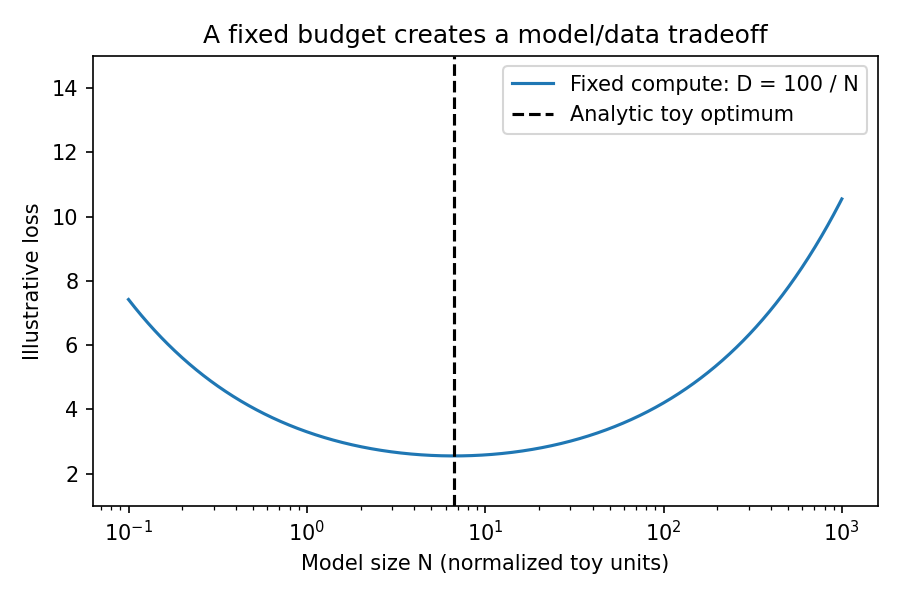

# 12.2 Scaling Laws and Compute Allocation

第三编目录 · 本章导读


> Prerequisites: 10.3 compute accounting and basic derivatives. Goal: reason about compute allocation with empirical scaling models without treating fitted laws as universal truths.

## 1. A fixed budget forces a choice

A larger model can represent more complicated patterns, but costs more per training token. Under a fixed compute budget, making it larger leaves fewer tokens to train on. A very small model may underfit; a very large model trained briefly may be undertrained.

Scaling laws summarize regularities observed across families of experiments. They are not architectural guarantees and do not remove the need to measure data quality, downstream tasks and systems cost.

We will derive an optimum for a **hypothetical** law. Its constants are chosen for teaching, not fitted to OpenAI models or any frontier system.

## 2. Define the variables before the equation

Let $N$ be model parameter count, $D$ the number of training-token exposures, and $C$ training compute. A common rough dense-model estimate is $C\approx\kappa ND$, with $\kappa$ often approximated as 6 for forward/backward FLOPs accounting.

This ignores or simplifies attention's sequence-length contribution, embeddings, optimizer work, recomputation, sparsity and hardware utilization. Actual wall-clock budget is not identical to FLOPs.

As an accounting example, $N=10^8$ parameters and $D=10^9$ token exposures give $C\approx6\times10^{17}$ FLOPs. At an **assumed measured sustained** rate of $10^{13}$ FLOPs/s, that is about 60,000 seconds, or 16.7 hours. This is arithmetic under assumptions, not a timing measurement of our machine. Peak advertised throughput is not sustained throughput.

Assume a separable excess-loss model

$$
L(N,D)=L_\infty+A N^{-\alpha}+B D^{-\beta},
$$

where $L_\infty$ is a fitted asymptotic floor, $A,B>0$ are scale constants and $\alpha,\beta>0$ are exponents. None of these constants is automatically shared across tokenizers, datasets or model families.

The two positive terms express diminishing returns: increasing $N$ reduces one term, increasing $D$ reduces the other. It is a modeling approximation, not a derived law of intelligence.

## 3. Substitute the budget constraint

Define $K=C/\kappa$, so $ND=K$ and $D=K/N$. Substitute:

$$
L(N)=L_\infty+A N^{-\alpha}+B K^{-\beta}N^\beta.
$$

The first variable term decreases with $N$; the second increases because fewer training tokens remain. Differentiate:

$$
\frac{dL}{dN}
=-\alpha A N^{-\alpha-1}
+\beta B K^{-\beta}N^{\beta-1}.
$$

Set the derivative to zero and multiply by $N$:

$$
\alpha A N^{-\alpha}
=\beta B K^{-\beta}N^\beta.
$$

Rearranging gives

$$
N^{\ast}
=\left(\frac{\alpha A}{\beta B}K^\beta\right)^{1/(\alpha+\beta)},
\qquad
D^{\ast}=\frac{K}{N^{\ast}}.
$$

In log-size $u=\log N$, the two terms are positive exponentials with positive second derivatives. The stationary point is the unique minimum within this idealized continuous model. To see the second derivative explicitly, let $u=\log N$. Then

$$
L(u)=L_\infty+A e^{-\alpha u}+BK^{-\beta}e^{\beta u},
\qquad
\frac{d^2L}{du^2}
=\alpha^2A e^{-\alpha u}+\beta^2BK^{-\beta}e^{\beta u}>0.
$$

Real architectures impose discrete widths, depth and hardware constraints. If the feasible interval is $N_{\min}\le N\le N_{\max}$, the best continuous choice is the unconstrained optimum clipped to that interval; check nearby feasible architectures afterward. A memory or latency bound can prevent the analytic optimum from being usable.

中文确认：最优点不是“模型误差项必然等于数据误差项”，而是两项乘上各自指数后的边际收益平衡。

## 4. Work a concrete toy example

Choose $L_\infty=1$, $A=2$, $B=3$, $\alpha=\beta=0.5$ and normalized budget $K=100$. Then

$$
N^{\ast}=\frac{2}{3}\sqrt{100}\approx6.67,
\qquad D^{\ast}=15.
$$

These are normalized toy units, not actual billions of parameters or tokens. A choice $N=1,D=100$ has loss $3.3$. A choice $N=100,D=1$ has loss $4.2$. The balanced choice yields about $2.55$.

If compute rises by a factor of four, the idealized optimum scales as

$$
N^{\ast}\propto C^{\beta/(\alpha+\beta)},
\qquad
D^{\ast}\propto C^{\alpha/(\alpha+\beta)}.
$$

With equal exponents both double. Different fitted exponents give different allocations. If $\alpha=0.4,\beta=0.2$, then model size scales as $C^{1/3}$ and tokens as $C^{2/3}$; an eightfold compute increase doubles $N$ and quadruples $D$. The lab verifies an unequal-exponent optimum as well as the symmetric example.

## 5. How an actual study would differ

Collect a grid of model sizes and training-token budgets, use compatible training recipes and evaluation data, and account for uncertainty. Plot individual learning curves, not only final points. Hold out experimental configurations when testing the fitted law's predictions.

A trend fit on a narrow range can extrapolate badly. Changing tokenizer changes loss units; changing data mixture changes the task. Data repetition means $D$ counts exposures rather than independent information.

Chinchilla-style compute-optimal training is a landmark example of studying allocation, not a permanent universal token-per-parameter rule. Deployment can favor training a smaller model longer because inference cost across many future requests also matters.

## 6. Why lower pretraining loss is not the whole objective

Task performance may improve unevenly with loss. Tool correctness, refusal behavior, reasoning, multilingual performance and robustness need separate evaluation.

Inference-time compute is another budget: generating multiple candidates and verifying them can change task success without changing parameters. It is not captured by this pretraining $N,D$ law; 13.4 introduces candidate selection and its failure modes.

MoE introduces total parameters versus active parameters per token. Do not plug total expert count into a dense FLOPs formula without analyzing routing and active computation.

## 7. Experiment

The lab sweeps $N$ under fixed toy $ND=100$, plots the resulting loss, verifies the analytic minimum against a grid and checks the derivative numerically.

```python
import math
A, B, alpha, beta, K = 2., 3., .5, .5, 100.
n = ((alpha*A)/(beta*B)*K**beta)**(1/(alpha+beta))
d = K/n
assert math.isclose(n*d, K)
assert math.isclose(n, 20/3)
print("toy optimum:", n, d)
```

The graph is a computation from an assumed formula, **not measured training curves**. Keep that distinction in your report.

## 8. Exercises and completion standard

1. Repeat the derivative when $\alpha\ne\beta$.
2. Explain why doubling both model size and tokens approximately quadruples dense training FLOPs.
3. Construct a budget where inference cost changes which model you would deploy.
4. Identify three reasons repeated tokens need not behave like equally many unique tokens.
5. Design a small experiment grid and state what you would not extrapolate from it.
6. Explain why validation loss across two different tokenizers is not directly comparable.

You can derive the toy optimum, state its assumptions and distinguish compute, data uniqueness and downstream utility.

References: [Kaplan et al.](https://arxiv.org/abs/2001.08361), [Hoffmann et al.](https://arxiv.org/abs/2203.15556).


## 配套实验与阅读导航

完整脚本：[lab_12_2.py](../配套实验/lab_12_2.py)。运行方法和实测记录见 实验指南。



上一节：12.1 预训练数据与目标

下一节：12.3 训练工程