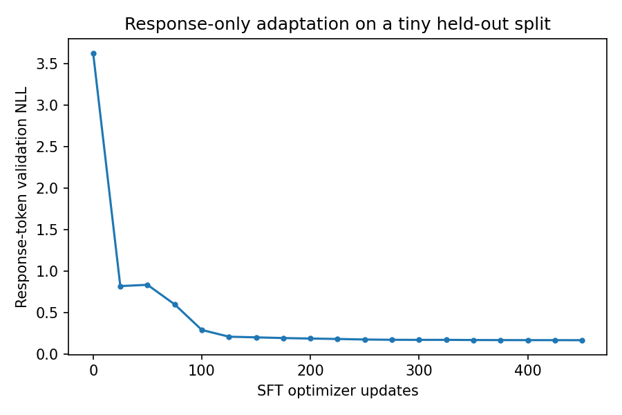

# 13.1 Supervised Fine-Tuning

第三编目录 · 本章导读


> Prerequisites: 11.2 causal loss, 11.3 tiny LM, 12.3 token weighting. Goal: understand supervised fine-tuning as a conditional objective and actually adapt the tiny pretrained decoder.

## 1. Pretraining and following instructions are different distributions

A pretrained model learns to continue its training text. A user-facing assistant is expected to respond to a request in a particular format, follow instructions and stop appropriately.

Supervised fine-tuning (SFT) supplies examples of the desired conditional behavior. Let $x$ be a prompt and $y=(y_1,\ldots,y_R)$ the desired response. We maximize

$$
p_\theta(y\mid x)=\prod_{t=1}^{R}p_\theta(y_t\mid x,y_{\lt t}).
$$

Taking negative logs produces the familiar next-token loss, now restricted to response targets. Architecture need not change; formatting, data distribution and supervision do.

SFT can improve behavior but is not a guarantee of factuality or safety. Training data can teach incorrect answers just as effectively as correct ones.

## 2. Serialize the conversation deliberately

Our teaching example uses explicit IDs for BOS, USER and ASSISTANT:

```text
BOS USER describe red fox ASSISTANT the red fox . EOS
|--------------- prompt ----------| |---- response ---|
```

The role delimiter belongs to the prompt. The first supervised target is `the`, predicted from the output aligned with the preceding ASSISTANT input.

If the complete serialized sequence is $s_0,\ldots,s_{L-1}$ and response begins at original index $a$, shifted output index $a-1$ predicts $s_a$. The response mask starts at $a-1$, **not** at $a$.

Real models use tokenizer-specific chat templates and may supervise multiple assistant turns. Plain strings such as “User:” are not automatically equivalent to the pretrained template. Preserve the exact role and termination conventions when adapting an existing model.

## 3. Derive the response-only objective

Let $m_{b,t}$ indicate response-target positions. For token-weighted SFT,

$$
L_{\mathrm{SFT}}
=-\frac{1}{M}\sum_{b,t}m_{b,t}
\log p_\theta(s_{b,t+1}\mid s_{b,0:t}),
\qquad M=\sum_{b,t}m_{b,t}.
$$

The causal visibility is unchanged: response tokens can read the prompt and earlier response tokens. The prompt contributes context, even though predicting its own tokens is not scored.

At an unsupervised output logit, the **direct loss gradient** is zero. But prompt input embeddings and intermediate states can receive gradients because later supervised outputs attend to them.

中文确认：“prompt 不计 loss”不等于“prompt 不参与计算或没有梯度”。把 prompt 输入也 detach，会改变条件学习过程。

## 4. Hand-check the mask

The prompt above has 6 tokens, so the first response is original index 6 and shifted index 5. The five targets `the red fox . EOS` are scored.

For a multi-turn conversation, one “response start” is insufficient if later user turns must be excluded. Attach a boolean supervision flag to **each original token** during serialization. If original flag $a_j$ says whether token $s_j$ is an assistant target, shifted loss mask position $t$ is $m_t=a_{t+1}$. Role delimiters and assistant-ending markers follow the chosen template's explicit policy.

Our `causal_batch(..., target_starts=...)` helper supervises one contiguous suffix only. Do not use it unchanged for several assistant spans. The added lab fixture manually constructs a two-turn original-token mask, then shifts it once and checks that the intervening user span remains unscored.

For a shorter response, right-pad the batch and exclude padded targets. Never infer the response boundary merely by searching for ordinary text that happens to look like a role marker; use the serialization metadata.

Truncation is another boundary decision. If truncation removes every assistant target, reject or drop the example deliberately. Do not divide by zero or silently train on a prompt-only record.

## 5. The complete local experiment

The companion lab first trains the 19,136-parameter grammar LM from 11.3. It then builds 16 instruction examples: all four colors × four animals, asking the model to describe the requested pair.

The response is `the COLOR ANIMAL . EOS`. We shuffle pairs into 10 train, 3 validation and 3 test examples with no repeated pair across splits. This is an extremely small compositional test, not a realistic instruction benchmark.

SFT runs 450 updates with a token-weighted response-only loss. The best checkpoint is selected by validation response NLL. We report:

- response NLL before and after adaptation;
- held-out response token accuracy;
- greedy whole-response exact match on the three test prompts;
- original grammar validation NLL before and after SFT.

The last metric checks retention on the original task. A useful adaptation can still damage old behavior; “lower SFT loss” alone does not quantify that cost.

In the verified local run, validation response NLL fell from about 3.631 to 0.165. Test token accuracy was 93.33%, but free-response exact match was only 2/3: the prompt requesting a green dog generated “the green cat .”. The original grammar validation NLL rose from about 0.757 to 1.909. Keep this failure in the report: the run demonstrates useful adaptation **and** incomplete compositional generalization and retention. Three test examples provide no precise population success estimate. Moreover, the role IDs and the word `describe` were reserved in the vocabulary but absent from the pretraining inputs; the adaptation must learn their input use. The SFT color–animal combinations are held out from **SFT**, not necessarily unseen in pretraining sentences. This evaluates adaptation to the instruction format, not acquisition of wholly new words or facts.

## 6. Gradient and alignment checks

Why can prompt states still learn? Consider the simpler readout $o=\sum_j\alpha_j h_j$ with fixed attention weights. If only $o$ is supervised, then $\partial L/\partial h_j=\alpha_j\,\partial L/\partial o$. The earlier state $h_j$ needs no separate local loss to receive this gradient. Learned attention adds further paths through its scores.

The lab retains the logits' gradient and asserts that prompt-target positions have zero direct gradient. It also asserts that the USER embedding receives a nonzero contextual gradient. This is stronger than merely printing a mask.

```python
import torch
# Original indices: BOS=0, USER=1, describe=2, red=3, fox=4, ASSISTANT=5.
response_start = 6
sequence_length = 11
mask = torch.arange(sequence_length-1) >= response_start-1
assert mask.tolist() == [False]*5 + [True]*5
print("first supervised shifted output:", int(mask.nonzero()[0,0]))
```

Run `lab_13_1.py` for actual pretraining followed by SFT. Both phases are fixed-seed CPU teaching runs; no external checkpoint is downloaded. The additional variable-length fixture compares one padded batch against separately scored examples, including the full parameter gradients. All main SFT responses have five targets; the variable-length fixture is needed to exercise padding rather than assuming the main task already tested it.

## 7. Data quality and forgetting

Deduplicate by conversation or source group before splitting. Near-identical prompt templates with the answer trivially copied can make a test easy; acknowledge the intended task. Check response correctness, formatting, language and coverage.

Full-parameter SFT changes the whole network. Smaller learning rates, fewer updates, retained pretraining examples or adapters can reduce some changes, but no method guarantees that all old capabilities remain. Evaluate both target behavior and retention.

Do not confuse response-token accuracy with task success. A model can produce many correct tokens while missing a required number, returning invalid JSON or failing to stop. Choose task-level metrics.

## 8. Experiments and exercises

1. Move the response mask one position right. Which target is lost?
2. Compare full-sequence loss with response-only loss while keeping initialization and data order fixed.
3. Add a second assistant turn and explicitly define which targets are scored.
4. Measure how SFT learning rate changes target success and old-task NLL.
5. Add an unseen verb instruction rather than only unseen color–animal pairs. Explain the harder generalization claim.
6. Construct an all-truncated-response example and state the rejection policy.

## 9. Completion standard and English summary

You can align response targets, distinguish direct logit gradients from contextual gradients, run a real fine-tuning phase and assess retention. Write an English report that does not generalize from three synthetic test cases to broad instruction-following ability.

Reference: [InstructGPT](https://arxiv.org/abs/2203.02155).


## 配套实验与阅读导航

完整脚本：[lab_13_1.py](../配套实验/lab_13_1.py)。运行方法和实测记录见 实验指南。



上一节：12.3 训练工程

下一节：13.2 Parameter-Efficient Fine-Tuning