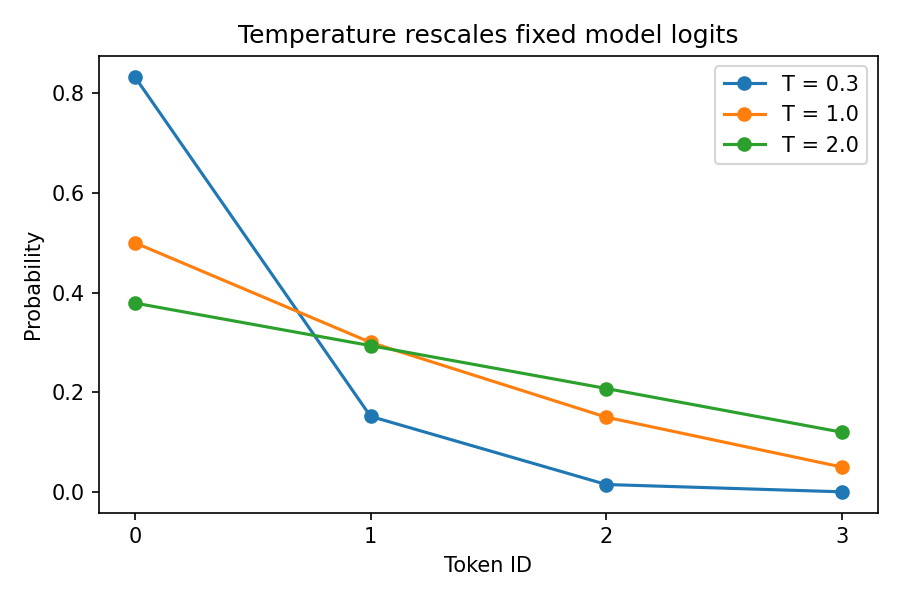

# 13.4 Decoding and Inference-Time Decisions

第三编目录 · 本章导读


> Prerequisites: causal LM probabilities, softmax, 10.2 KV cache. Goal: implement decoding filters and understand why probability, task success and compute budgets are different objectives.

## 1. The model supplies a distribution; a decoder makes a choice

At each step, an autoregressive model returns logits for the next token. Training determines the logits. Decoding determines which token is selected and fed back.

Greedy, sampling and beam search can produce different sequences with **unchanged parameters**. No decoding strategy can guarantee a factual or correct answer when the model's conditional distribution is wrong.

Keep the stopping policy explicit: EOS, maximum new tokens, context capacity and any allowed stop sequences. Hitting a length limit produces a truncated output, not evidence that the task finished.

## 2. Greedy is locally optimal, not globally optimal

Greedy chooses the largest conditional probability at each step. Consider this two-step tree:

| First choice | First probability | Best second probability | Best full path |
|---|---:|---:|---:|
| A | 0.6 | 0.5 | 0.30 |
| B | 0.4 | 0.99 | 0.396 |

Greedy chooses A and achieves path probability 0.30. A search retaining both prefixes can discover B→x with probability 0.396.

This does not mean the most probable sequence is the best answer for every task. Language can be multimodal, and highly probable generic responses can be unhelpful.

## 3. Temperature changes probability ratios

For logits $z_i$ and temperature $\tau>0$,

$$
p_i(\tau)=\frac{\exp(z_i/\tau)}{\sum_j\exp(z_j/\tau)}.
$$

The ratio is

$$
\frac{p_i(\tau)}{p_j(\tau)}
=\exp\left(\frac{z_i-z_j}{\tau}\right).
$$

Lower temperature magnifies logit gaps; higher temperature flattens them. With a unique maximum, the zero-temperature limit concentrates on that token. At ties it need not select a unique token.

Do not literally divide by zero to implement greedy. The lab requires positive temperature and treats argmax as a separate operation. Positive temperature alone preserves the ordering of finite logits.

A stable softmax subtracts the maximum, but doing that **after** an overflowing division is too late. For logits near 10,000 and $\tau=10^{-300}$, direct division can produce positive infinity. Our teaching function first computes $z_i-\max_jz_j$ in float64 and then divides by $\tau$. At least one scaled score remains exactly zero; extremely negative scores may become $-\infty$, meaning zero probability at that precision. The function returns float64 probabilities, and rejects empty/integer/nonfinite logit vectors.

We choose a deterministic tie convention: lower token IDs win stable ties in top-k. Other libraries may use different tie behavior.

Temperature is not a correctness or creativity meter. A low-temperature wrong answer is still wrong, and high temperature may simply add errors.

## 4. Top-k retains a fixed number of candidates

Sort logits and keep the $k$ largest, set the rest to $-\infty$, then normalize. With $k=1$, sampling is greedy except for the chosen tie convention.

The support size is fixed even if the distribution is uncertain at one step and sharp at another. Validate $1\le k\le V$ rather than silently accepting invalid values.

Filtering changes the distribution; it is not unbiased sampling from the original model.

## 5. Top-p retains enough probability mass

Sort probabilities $p_{(1)}\ge p_{(2)}\ge\cdots$. Find the smallest $K$ whose cumulative mass reaches threshold $p_{\mathrm{cut}}\in(0,1]$:

$$
K=\min\left\{k:\sum_{j=1}^{k}p_{(j)}\ge p_{\mathrm{cut}}\right\}.
$$

Keep those $K$ entries and renormalize. For $[0.5,0.3,0.15,0.05]$ and threshold 0.7, keep the first two, yielding $[0.625,0.375,0,0]$.

The crossing token must remain. Removing every token whose cumulative mass is above 0.7 would remove the second token and implement the wrong rule.

The full script computes **preceding** cumulative mass by shifting the cumulative sum right and prepending zero. It removes entries whose preceding mass is already at least the threshold. This keeps the crossing token without subtractive cancellation. The small hand-check below uses `cumsum - probability` only on a benign example. At threshold 1, the full function explicitly disables nucleus removal; any prior top-k filtering still applies.

中文确认：top-p 不是“删除单个概率低于 p 的 token”，而是“按概率从高到低，保留累计质量达到 p 的最短前缀”。

## 6. Combination order and random streams

If combining temperature, top-k and top-p, state the order. Our implementation applies temperature, then top-k, then top-p using the post-top-k normalized distribution. Other orders can produce different support.

A random generator seed reproduces the draw sequence only under compatible probability computations, device/version and call order. It does not make all distributed serving systems deterministic.

The lab uses a dedicated generator and checks repeatability of 1000 categorical draws. It does not infer semantic quality from sampling frequencies.

## 7. Beam search scores prefixes in log space

A beam of width $K$ retains up to $K$ candidate prefixes. Expanding a prefix adds one log conditional probability:

$$
s(y_{1:t})=\sum_{j=1}^{t}\log p(y_j\mid x,y_{<j}).
$$

Keeping only the best $K$ prefixes makes search approximate; a prefix pruned early may later have led to the best full sequence. Larger beams cost more model computation and cache memory.

Raw sequence log probability typically favors shorter completed sequences. Length penalties change the ranking objective and need an explicit formula. EOS-completed candidates must not be expanded as if they were unfinished.

Our tiny tree test has exactly two non-EOS steps, so it isolates local versus global choice without implementing a production beam decoder or length penalty.

## 8. Inference-time compute and verification

Instead of one trajectory, sample multiple candidates and choose using a verifier, tool result or rubric. This spends more compute without changing model weights. It can help when correct candidates are generated and the selection signal identifies them.

If each candidate independently succeeds with probability $q$, the chance of at least one success among $n$ is

$$
1-(1-q)^n.
$$

For $q=0.2,n=5$, this is about 0.672. Independence is often unrealistic, and “one candidate is correct” does not mean your selector can recognize it. Imperfect verifiers, correlated failures and reward hacking reduce practical gains. The new counterexample contains a correct candidate in every set but deliberately gives failures the higher verifier score: candidate availability is 100%, selected accuracy 0%. Increasing candidate count alone cannot repair a selector with the wrong criterion.

Distinguish pass@k-style oracle availability from selected-answer accuracy. Evaluate cost, latency and final task success together. Longer generated reasoning or explanations are not automatic evidence of correctness.

## 9. Numerical check and full experiment

```python
import torch
p = torch.tensor([.5,.3,.15,.05],dtype=torch.float64)
keep = p.cumsum(0)-p < .7
filtered = p*keep
filtered /= filtered.sum()
torch.testing.assert_close(filtered,torch.tensor([.625,.375,0.,0.],dtype=torch.float64))
print("top-p:",filtered,"independent candidate availability:",1-.8**5)
```

The companion script validates thresholds, invalid arguments, seeded sampling, EOS termination and the two-step beam counterexample. The temperature plot uses fixed logits: it is not a model-training curve.

## 10. Exercises and completion standard

1. Compute the filtered distribution at top-p 0.4, 0.8 and 1.0.
2. Construct a case where top-k before top-p differs from top-p alone.
3. Add EOS to the beam tree and specify completed-beam handling.
4. Compare a verifier's false-positive rate with candidate availability.
5. Measure repeated-answer diversity and correctness separately on a real task.
6. Explain why KV caching changes computation reuse but not the intended sampling distribution.

You can implement and test basic decoding policies and distinguish sequence probability from usefulness, correctness and compute efficiency.

Reference: [Nucleus sampling](https://arxiv.org/abs/1904.09751).


## 配套实验与阅读导航

完整脚本：[lab_13_4.py](lab_13_4.py)。运行方法和实测记录见 实验指南。



上一节：13.3 Preference Optimization

下一节：14.1 Prompt结构化输出与工具调用