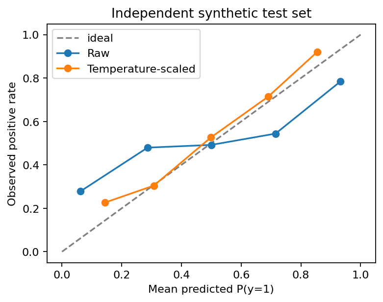

# 17.1 Baselines, Metrics, Splits, and Calibration

第四编目录 · 本章导读

> English-first · guided self-study · CPU laboratory · reading and mastery recorded separately.


## 1. Define the decision before measuring the model

An accuracy number is meaningful only relative to a task, population, decision rule, and data split. A 99% accurate detector may simply predict the majority class when only 1% of examples are positive.

Start with a baseline: majority prediction, a simple linear model, a single-modality model, or the previous deployed version. Keep evaluation inputs and scoring rules identical. Specify the unit of analysis: frame, event, document, user, or session.

Separate training, validation, and final test. Use validation to select thresholds, hyperparameters, prompt templates, and calibration. Split related examples by source group and, when appropriate, time. Preprocessing statistics and learned vocabularies must also respect the split.

## 2. Derive precision, recall, and F1 from counts

Let $y_i\in\{0,1\}$ be the true label and $p_i\in[0,1]$ a predicted positive-class probability. Predict positive when $p_i\geq\tau$.

True positives TP are correctly predicted positives; FP are negative examples predicted positive; FN are missed positives; TN are correctly predicted negatives.

Precision asks “Among predicted positives, how many are correct?” Recall asks “Among actual positives, how many did we find?”

$$
P=\frac{\mathrm{TP}}{\mathrm{TP}+\mathrm{FP}},
\qquad
R=\frac{\mathrm{TP}}{\mathrm{TP}+\mathrm{FN}}.
$$

The harmonic mean penalizes an imbalance between them:

$$
F_1=\frac{2PR}{P+R}
=\frac{2\mathrm{TP}}{2\mathrm{TP}+\mathrm{FP}+\mathrm{FN}}.
$$

The count form can remain defined when precision is undefined. Our code returns `None` for undefined precision or recall rather than silently converting them to zero. Report the convention; different libraries offer different defaults.

Example: labels $(1,0,1,0)$ and scores $(.9,.8,.4,.1)$ at threshold .5 give TP=FP=FN=TN=1, so precision, recall, F1, and accuracy are all .5. This coincidence is not a general identity.

## 3. Ranking: AUROC and average precision

AUROC can be understood without integrating a plotted curve. Compare every positive score $p^+$ with every negative score $p^-$. Give one point if the positive is higher, half a point for a tie, and zero if lower:

$$
\operatorname{AUROC}
=\frac{1}{n_+n_-}
\sum_{i:y_i=1}\sum_{j:y_j=0}
\left[
\mathbf{1}_{\{p_i>p_j\}}
+\frac12\mathbf{1}_{\{p_i=p_j\}}
\right].
$$

Here $n_+,n_-$ count positive and negative examples. If either is zero, AUROC is undefined.

In the four-case example, .9 beats both negatives, and .4 beats only .1: three wins among four pairs, so AUROC=.75 despite threshold accuracy=.5.

For rare positives, also inspect the precision–recall curve. **Average precision (AP)** sums precision at each score threshold, weighted by the increase in recall:

$$
\operatorname{AP}
=\sum_k(R_k-R_{k-1})P_k.
$$

Thresholds descend from high to low scores, with tied scores entering together. In the example, the first positive gives $(.5)(1)$ and the second gives $(.5)(2/3)$, so AP=$5/6$. AP is not generally identical to trapezoidal PR-AUC; label the implementation.

A random-ranking AP baseline is related to positive prevalence, while AUROC's random-ranking reference is .5. Neither ranking metric chooses an operational threshold for you.

### Probability metrics and ranking metrics accept different inputs

AUROC and AP require finite ranking scores, not necessarily probabilities. A logit of $-3$ or an OOD distance of 20 is valid. Any strictly increasing transform preserves ranking and ties in exact arithmetic; floating-point sigmoid saturation can create new ties at extreme values.

Brier, reliability diagrams, and probability-threshold decisions require actual probabilities in $[0,1]$. The revised helper separates these contracts and rejects NaN thresholds and invalid bin counts.

The pairwise AUROC implementation intentionally uses $O(n_+n_-)$ memory/work for transparency. For large datasets, use a tested sorting/rank-based implementation, typically $O(n\log n)$; do not allocate all pairs.

### Work through the whole threshold sweep

For the four-case example, use thresholds above the largest score and then $.9,.8,.4,.1$. Precision is undefined before accepting anything.

| Accepted threshold | TP | FP | Recall | Precision |
|---|---:|---:|---:|---:|
| Above .9 | 0 | 0 | 0 | undefined |
| .9 | 1 | 0 | .5 | 1 |
| .8 | 1 | 1 | .5 | .5 |
| .4 | 2 | 1 | 1 | $2/3$ |
| .1 | 2 | 2 | 1 | .5 |

Only threshold steps that increase recall contribute to AP. With all scores tied, the grouped-AP rule yields the observed positive prevalence; arbitrary tie-breaking could manufacture a different answer.

## 4. Costs can determine the threshold

Suppose a false positive costs $C_{\mathrm{FP}}>0$ and a false negative costs $C_{\mathrm{FN}}>0$. If $p$ is a calibrated probability and correct decisions have zero cost:

- expected cost of predicting positive is $(1-p)C_{\mathrm{FP}}$;
- expected cost of predicting negative is $pC_{\mathrm{FN}}$.

Choose positive when the former is smaller. Rearranging gives

$$
p>\frac{C_{\mathrm{FP}}}{C_{\mathrm{FP}}+C_{\mathrm{FN}}}.
$$

This derivation assumes the probabilities and costs apply to the deployment population. F1 maximization is a different goal; .5 is not a universal threshold.

## 5. Calibration is not ranking

If predictions around .8 are calibrated, roughly 80% of those examples should be positive over the relevant population. Calibration concerns the numerical meaning of probability; AUROC concerns ordering.

The Brier score is the mean squared probability error:

$$
\operatorname{Brier}=\frac{1}{n}\sum_{i=1}^{n}(p_i-y_i)^2.
$$

It evaluates the full probability forecast and depends on more than calibration alone.

For binary positive-class reliability, divide probabilities into bins $\mathcal{B}_k$. Define each nonempty bin's mean predicted probability $\overline p_k$ and positive frequency $\overline y_k$. An empirical calibration summary is

$$
\operatorname{ECE}
=\sum_k\frac{|\mathcal{B}_k|}{n}
\left|\overline p_k-\overline y_k\right|.
$$

This is the binary positive-class version; top-label multiclass ECE uses confidence and correctness instead. ECE depends on binning and finite-sample noise and can hide slice-specific errors. Empty bins contribute nothing.

### Why coarse ECE can be zero for bad forecasts

Take labels $(0,1)$ and forecasts $(.9,.1)$. Both examples are confidently wrong. If one bin contains everything, mean forecast and positive rate both equal .5, so ECE is zero. Yet Brier is $(.9^2+.9^2)/2=.81$.

Cancellation within a bin hides the error. More bins reduce this particular cancellation but can produce noisy estimates from very small bins. Inspect bin counts, reliability plots, and a proper probability score together.

For a fixed input with true positive probability $q$, expected Brier at forecast $p$ is

$$
q(p-1)^2+(1-q)p^2=(p-q)^2+q(1-q).
$$

The second term cannot be changed by the predictor. The first is minimized at $p=q$, explaining why Brier rewards honest probabilities in expectation. The lab checks the zero-ECE counterexample.

## 6. Temperature scaling, with a held-out fit

If logits are too large in magnitude, divide them by a positive temperature $T_{\mathrm{cal}}$. Fit that scalar on validation negative log-likelihood, then freeze it before test:

$$
p_i^{\mathrm{cal}}=\sigma(z_i/T_{\mathrm{cal}}).
$$

For binary logits, a positive temperature preserves ranking and the zero-logit decision boundary. It can improve probability calibration without changing .5-threshold accuracy. It cannot repair an incorrect ranking or create missing knowledge.

The lab samples independent validation and test data from a known logistic process, deliberately triples the logits, and selects temperature from a small validation grid. The calibration plot uses test data only after that selection.



This is a controlled demonstration of recoverable miscalibration, not a guarantee that scalar temperature fixes arbitrary shifts.

## 7. Runnable metric check

```python
import torch
y = torch.tensor([1, 0, 1, 0])
p = torch.tensor([.9, .8, .4, .1])
pred = p >= .5
tp = ((y == 1) & pred).sum().item()
fp = ((y == 0) & pred).sum().item()
fn = ((y == 1) & ~pred).sum().item()
assert (tp, fp, fn) == (1, 1, 1)
positive, negative = p[y == 1], p[y == 0]
d = positive[:, None] - negative[None, :]
auc = ((d > 0).float() + .5 * (d == 0).float()).mean()
assert auc.item() == .75
```

The full helper additionally validates input ranges, ties, single-class AUROC, undefined precision, and AP grouping.

## 8. Multiclass and grouped reporting

Macro averaging gives each class equal weight; micro averaging pools decision counts. A rare class can be hidden by a large majority under a pooled score. Report class support and the confusion matrix before interpreting differences.

For video, correlated frames are not independent experimental units. Report event/session-level results where the task calls for them, and use group-aware uncertainty estimates in 17.2.

A test set should be untouched by design choices, not merely absent from gradient descent. Repeatedly selecting the best checkpoint by test score is test-set tuning.

## 9. Exercises and completion

1. Hand-compute all metrics for the four-case example at thresholds .3 and .85.
2. Prove that multiplying logits by a positive scalar preserves binary ranking.
3. Construct a high-accuracy classifier with zero recall on positives.
4. Explain why AUROC is undefined when a test split contains no negative examples.
5. Compare AP and trapezoidal PR-AUC on a small tied-score example.
6. Propose a split and calibration protocol for repeated measurements from the same subjects.

Complete the topic by implementing the metric edge cases, selecting a threshold on validation, and writing a report that separates discrimination, calibration, and operational cost.

English summary: 150–200 words on why no single score adequately describes a detector.


## Self-check after attempting the exercises

> [!tip]- Open after your own attempt
> At threshold .3, TP=2, FP=1, FN=0, so precision is $2/3$, recall 1, and F1 .8. At .85, TP=1, FP=0, FN=1, giving precision 1, recall .5, and F1 $2/3$. AUROC and AP remain unchanged because only the operating threshold changed, not the scores.

## 配套实验与阅读导航

完整实验：[lab_17_1.py](lab_17_1.py)。运行说明与实测记录：实验指南。

上一节：16.3 OOD幻觉与模态冲突

下一节：17.2 Ablation与错误分析