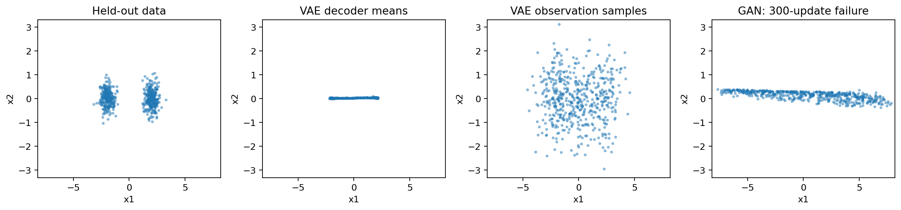

# 19.1 Autoencoders, VAEs, and GANs: Three Different Objectives

第四编目录 · 本章导读

> English-first · guided self-study · CPU laboratory · reading and mastery recorded separately.


## 1. Reconstruction is not yet generation

A classifier predicts a label. A generative model aims to describe or sample plausible observations. An autoencoder compresses an input into a latent code and reconstructs it, but that alone does not tell us which latent codes to sample to obtain realistic new data.

This lesson compares three objectives rather than treating AE, VAE, and GAN as interchangeable architectures. The experiment uses a two-dimensional mixture, so the learned distribution can be inspected directly. No image dataset or pretrained generator is downloaded.

## 2. The autoencoder: learn a bottleneck

Let input $\mathbf{x}\in\mathbb{R}^{d_x}$, encoder $f_\phi$, latent $\mathbf{z}=f_\phi(\mathbf{x})\in\mathbb{R}^{d_z}$, and decoder $g_\theta$. A squared-reconstruction objective is

$$
L_{\mathrm{AE}}
=\mathbb{E}_{\mathbf{x}\sim p_{\mathrm{data}}}
\left[\frac12\lVert \mathbf{x}-g_\theta(f_\phi(\mathbf{x}))\rVert_2^2\right].
$$

Here $\phi,\theta$ are encoder and decoder parameters. The bottleneck or other regularization encourages useful structure. If capacity is too high, the model may memorize inputs or learn an unhelpful near-identity map.

After training, drawing $\mathbf{z}\sim\mathcal{N}(\mathbf{0},\mathbf{I})$ is not justified unless the encoded data distribution was made compatible with that prior. Latent regions never visited during training can decode poorly.

A reconstruction anomaly detector has another limitation: an expressive autoencoder may also reconstruct anomalous inputs well. Reconstruction error is not automatically an anomaly probability.

## 3. A latent-variable probability model

A VAE makes the sampling story explicit. Choose a prior $p(\mathbf{z})$, commonly standard normal, and a conditional observation model $p_\theta(\mathbf{x}\mid\mathbf{z})$. The marginal likelihood is

$$
p_\theta(\mathbf{x})
=\int p_\theta(\mathbf{x}\mid\mathbf{z})p(\mathbf{z})\,\mathrm{d}\mathbf{z}.
$$

This integral averages over every possible latent explanation and is generally difficult for a neural decoder. Introduce an approximate posterior $q_\phi(\mathbf{z}\mid\mathbf{x})$ to infer plausible latent explanations from an observed input.

The encoder now predicts a distribution, not only one deterministic code.

## 4. Derive the ELBO before writing a training loss

Multiply and divide the integrand by $q_\phi(\mathbf{z}\mid\mathbf{x})$, assuming suitable support:

$$
\log p_\theta(\mathbf{x})
=\log\mathbb{E}_{q_\phi(\mathbf{z}\mid\mathbf{x})}
\left[
\frac{p_\theta(\mathbf{x}\mid\mathbf{z})p(\mathbf{z})}
{q_\phi(\mathbf{z}\mid\mathbf{x})}
\right].
$$

Because logarithm is concave, Jensen's inequality says the log of an expectation is at least the expectation of the log. Thus

$$
\log p_\theta(\mathbf{x})\geq
\mathbb{E}_{q_\phi}\left[\log p_\theta(\mathbf{x}\mid\mathbf{z})\right]
-D_{\mathrm{KL}}\!\left(q_\phi(\mathbf{z}\mid\mathbf{x})\Vert p(\mathbf{z})\right).
$$

The right side is the evidence lower bound, or ELBO. The first term rewards explaining the data; the second penalizes the inferred latent distribution for departing from the prior.

The exact gap is $D_{\mathrm{KL}}(q_\phi(\mathbf{z}\mid\mathbf{x})\Vert p_\theta(\mathbf{z}\mid\mathbf{x}))$, which is nonnegative. This explains both “lower bound” and why improving the approximate posterior can tighten it.

We minimize negative ELBO. It is not an arbitrary sum of “MSE plus regularization”: the terms follow from the chosen probability model.

中文确认：重建项要求“这个隐变量能解释输入”，KL 项要求“编码后的分布不要与生成时使用的先验完全脱节”。

### Verify the bound with a tiny discrete latent model

Let latent $z$ be 0 or 1, with prior probabilities $(.5,.5)$. For one observed $x$, likelihoods are $(.2,.8)$, so joint masses are $(.1,.4)$ and evidence is $p(x)=.5$. Bayes' rule gives posterior $(.2,.8)$.

Choose approximate posterior $q=(.4,.6)$. Compute directly:

$$
\begin{aligned}
\mathrm{ELBO}
&=.4\log\frac{.1}{.4}+.6\log\frac{.4}{.6}
\approx-.797797,\\
D_{\mathrm{KL}}(q\Vert p(z\mid x))
&=.4\log\frac{.4}{.2}+.6\log\frac{.6}{.8}
\approx.104650,\\
\log p(x)&=\log .5\approx-.693147.
\end{aligned}
$$

The first two quantities add to the third. In general, expand posterior KL using
$p_\theta(z\mid x)=p_\theta(x,z)/p_\theta(x)$:

$$
D_{\mathrm{KL}}(q\Vert p_\theta(z\mid x))
=\mathbb E_q[\log q-\log p_\theta(x,z)]+\log p_\theta(x)
=\log p_\theta(x)-\mathrm{ELBO}.
$$

This gives an algebraic explanation of the gap, in addition to Jensen's inequality. For fixed decoder parameters, improving $q$ toward the true posterior reduces the gap. When both encoder and decoder change, the posterior itself moves.

## 5. Choose Gaussian assumptions and calculate the terms

Use a diagonal Gaussian posterior with mean $\boldsymbol{\mu}\in\mathbb{R}^{d_z}$ and log-variance $\boldsymbol{\ell}\in\mathbb{R}^{d_z}$:

$$
q_\phi(\mathbf{z}\mid\mathbf{x})
=\mathcal{N}\!\left(
\boldsymbol{\mu},\mathrm{diag}(\exp\boldsymbol{\ell})
\right).
$$

For a standard-normal prior, the KL is

$$
D_{\mathrm{KL}}(q_\phi\Vert p)
=\frac12\sum_{j=1}^{d_z}
\left(\mu_j^2+\exp\ell_j-1-\ell_j\right).
$$

To see where this comes from, the one-dimensional log density ratio contains the prior quadratic $z^2/2$, the posterior standardized quadratic $(z-\mu)^2/(2\sigma^2)$, and $-\log\sigma$. Under $q$, their expectations use $\mathbb E[z^2]=\mu^2+\sigma^2$ and $\mathbb E[(z-\mu)^2/\sigma^2]=1$. Substitute $\sigma^2=e^\ell$ and sum independent coordinates.

For observation likelihood $\mathcal{N}(g_\theta(\mathbf{z}),\sigma_x^2\mathbf{I})$ with fixed $\sigma_x^2$, negative log-likelihood, omitting constants, is

$$
\frac{1}{2\sigma_x^2}
\lVert\mathbf{x}-g_\theta(\mathbf{z})\rVert_2^2.
$$

Our lab uses $\sigma_x^2=1$. Changing that variance changes the reconstruction/KL balance. Averaging reconstruction over coordinates while summing KL also changes the relative weighting. State reductions explicitly.

For $\mu=1,\sigma^2=1$ in one dimension, KL is .5. If a two-dimensional reconstruction has squared error sum 2 under unit variance, its nonconstant negative log-likelihood is 1, and the combined negative ELBO contribution is 1.5 for that sampled latent.

## 6. Reparameterization: preserve a differentiable path

Directly asking a random sampler for $\mathbf{z}$ obscures how encoder parameters influence it. Instead draw parameter-independent noise $\boldsymbol{\epsilon}\sim\mathcal{N}(\mathbf{0},\mathbf{I})$ and define

$$
\mathbf{z}
=\boldsymbol{\mu}+
\exp(\boldsymbol{\ell}/2)\odot\boldsymbol{\epsilon}.
$$

Now randomness is an input and the rest is differentiable. Coordinate derivatives are

$$
\frac{\partial z_j}{\partial\mu_j}=1,
\qquad
\frac{\partial z_j}{\partial\ell_j}
=\frac12\exp(\ell_j/2)\epsilon_j.
$$

The factor $1/2$ converts log-variance to standard deviation. Mistaking `logvar` for log-standard-deviation doubles the exponent incorrectly.

```python
import torch
mu = torch.tensor([.4], requires_grad=True)
logvar = torch.tensor([.1], requires_grad=True)
epsilon = torch.tensor([.7])
z = mu + torch.exp(.5 * logvar) * epsilon
g_mu, g_logvar = torch.autograd.grad(z.sum(), (mu, logvar))
torch.testing.assert_close(g_mu, torch.ones_like(mu))
torch.testing.assert_close(g_logvar, .5 * torch.exp(.5 * logvar.detach()) * epsilon)
```

The full experiment also compares the closed-form KL with PyTorch's Gaussian KL implementation.

## 7. Why GANs use a different learning signal

A GAN has generator $G_\theta(\mathbf{z})$ mapping noise to samples and discriminator $D_\psi(\mathbf{x})\in(0,1)$ estimating real-versus-generated under the training mixture.

Train the discriminator to assign real examples probability one and generated examples zero:

$$
L_D=
-\mathbb{E}_{p_{\mathrm{data}}}\log D_\psi(\mathbf{x})
-\mathbb{E}_{p(\mathbf{z})}\log\left(1-D_\psi(G_\theta(\mathbf{z}))\right).
$$

For fixed generator density $p_g$, optimizing independently at an input gives
$-p_{\mathrm{data}}/D+p_g/(1-D)=0$, hence

$$
D^*(\mathbf{x})=
\frac{p_{\mathrm{data}}(\mathbf{x})}
{p_{\mathrm{data}}(\mathbf{x})+p_g(\mathbf{x})}
$$

where the denominator is nonzero and the discriminator has sufficient capacity. This ideal derivation does not mean a finite trained discriminator is an exact density-ratio estimator.

The original minimax generator objective uses $\log(1-D(G(\mathbf{z})))$. When the discriminator confidently rejects fake examples, this can provide weak gradients through sigmoid. A common non-saturating alternative minimizes

$$
L_G=-\mathbb{E}_{p(\mathbf{z})}\log D_\psi(G_\theta(\mathbf{z})).
$$

If the discriminator outputs logit $a$ with $D=\sigma(a)$, stable losses are $\mathrm{softplus}(-a)$ for a positive target and $\mathrm{softplus}(a)$ for a negative target. This avoids manually taking logarithms of rounded probabilities.

### Calculate why the original generator signal can saturate

Let $a$ be the discriminator logit on a generated sample and $D=\sigma(a)$. Since $\mathrm{d}D/\mathrm{d}a=D(1-D)$, chain rule gives

$$
\frac{\mathrm{d}\log(1-D)}{\mathrm{d}a}=-D,
\qquad
\frac{\mathrm{d}[-\log D]}{\mathrm{d}a}=D-1.
$$

At $a=-5$, $D\approx.00669$. The minimax gradient is about $-.00669$ while the non-saturating gradient is about $-.99331$. Both descent directions try to raise $a$, but the second gives a much stronger local signal when the discriminator rejects the fake.

The lab verifies these derivatives. Stronger local gradients still do not guarantee stable game dynamics or good coverage, as the retained GAN failure demonstrates.

## 8. Alternating gradients: detach only the intended path

During the discriminator update, generated samples are detached so the generator is not updated. During the generator update, freeze discriminator parameters but keep differentiation through its operations with respect to the generated input.

Wrapping the discriminator forward in `no_grad()` during the generator step would block the needed input gradient. Freezing parameters is not the same as removing the graph.

The companion performs actual alternating updates and asserts that only the intended parameter group receives gradients at each step. It trains a VAE and GAN on the same two-dimensional mixture and plots independent data and generated samples:



GAN losses need not monotonically decrease because both players change. Mode collapse can produce plausible samples from too few modes. A roughly balanced left/right sample fraction is only a coarse coverage diagnostic; it does not establish distributional equality.

In the recorded run, the VAE decoder means form a narrow band around the horizontal axis and bridge some of the gap between the true clusters. The GAN produces a stretched narrow band instead of the two compact data clusters. These are visible distributional failures, deliberately retained. An approximately balanced negative/positive $x_1$ fraction does not catch either failure. Compare per-coordinate spread and the scatter plot before claiming success.

The revised figure separately shows VAE decoder means **and full observation samples**. For the declared unit-variance likelihood, full sampling draws $\mathbf{z}\sim\mathcal N(0,I)$ and then $\mathbf{x}=g_\theta(\mathbf{z})+\boldsymbol{\eta}$ with independent $\boldsymbol{\eta}\sim\mathcal N(0,I)$. The means alone are not samples from that full observation distribution.

Why is the full VAE also unable to match the narrow data exactly? For coordinate $j$, total variance gives

$$
\mathrm{Var}(X_j)
=\mathrm{Var}_Z(g_\theta(Z)_j)+
\mathbb E_Z[\mathrm{Var}(X_j\mid Z)]
=\mathrm{Var}_Z(g_\theta(Z)_j)+1\geq1.
$$

But the generator's true vertical variance is $.35^2=.1225$. No choice of decoder mean can overcome the model's unit observation-variance floor. This is a **likelihood specification mismatch**, not proof that VAE training merely needs more updates.

Changing the observation variance changes the model and loss weighting; compare such variants under an explicit validation protocol. A narrow decoder-mean band alone also does not prove posterior collapse: it omits observation noise and can reflect a dimension whose mean signal is nearly constant. Report KL by latent dimension and sensitivity before making a collapse claim.

## 9. Failure cases and exercises

VAE posterior collapse occurs when the decoder ignores latents and the inferred posterior stays near the prior. A small KL alone is not necessarily a success. A GAN can fool its current discriminator while missing modes; discriminator accuracy alone is not a generator-quality metric.

1. Derive the one-dimensional Gaussian KL from log densities.
2. Explain why a deterministic AE reconstruction objective does not define a latent sampling prior.
3. Compute the reparameterization derivatives with fixed noise and verify them.
4. Change the VAE observation variance and record both reconstruction and KL.
5. Demonstrate what breaks if fake samples are detached during the generator update.
6. Repeat GAN training across several seeds and report variation without selecting only the prettiest plot.
7. Add observation noise to VAE decoder means and compare that panel with the likelihood assumption.

## Completion standard and English summary

Derive the ELBO, implement Gaussian reparameterization, state the likelihood reduction, and verify GAN gradient ownership. Compare reconstruction quality, sample quality, and mode coverage as different properties.

Write 180–250 words contrasting an autoencoder's reconstruction objective, a VAE's likelihood bound, and a GAN's adversarial objective.

Further reading: Kingma and Welling, *Auto-Encoding Variational Bayes* (2013/2014); Goodfellow et al., *Generative Adversarial Nets* (2014).


## Self-check after attempting the exercises

> [!tip]- Open after your own attempt
> Derive Gaussian KL from the **signed** log ratio: $\log q-\log p=-\log\sigma-(z-\mu)^2/(2\sigma^2)+z^2/2$. Compare its expectation with the implementation. To interpret the figure, identify separately the latent-decoder mean, observation noise, and the observed data spread.

## 配套实验与阅读导航

完整实验：[lab_19_1.py](../配套实验/lab_19_1.py)。运行说明与实测记录：实验指南。

上一节：18.3 分布式训练

下一节：19.2 Diffusion