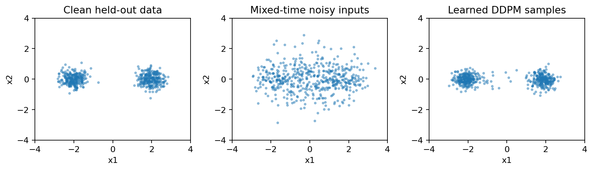

# 19.2 Diffusion: From Gaussian Corruption to Learned Denoising

第四编目录 · 本章导读

> English-first · guided self-study · CPU laboratory · reading and mastery recorded separately.


## 1. Why learn many small denoising steps?

Directly transforming noise into a complicated distribution can be difficult. Diffusion defines an easy forward process that gradually corrupts data, then learns to reverse that process.

The forward corruption is chosen, not learned in this basic DDPM setup. The reverse denoising network is learned. Sampling starts from approximate noise and repeatedly uses the reverse model.

This lesson derives the forward marginal, reverse mean, and noise-prediction objective. The companion actually trains and samples a two-dimensional DDPM. Conditional generation and modern sampling variants are explained but not implemented.

## 2. Define one forward step

Let clean data be $\mathbf{x}_0\in\mathbb{R}^{d}$ and time index $t=1,\ldots,T$. Choose noise variances $0<\beta_t<1$ and define $\alpha_t=1-\beta_t$.

A forward step retains a scaled signal and adds fresh standard Gaussian noise:

$$
\mathbf{x}_t=
\sqrt{\alpha_t}\mathbf{x}_{t-1}
+\sqrt{\beta_t}\boldsymbol{\epsilon}_t,
\qquad
\boldsymbol{\epsilon}_t\sim\mathcal{N}(\mathbf{0},\mathbf{I}).
$$

The noises are independent across steps. The square roots are required because multiplying a random variable by $c$ multiplies its variance by $c^2$.

If the input had unit variance, the retained variance $\alpha_t$ plus added variance $\beta_t$ would be one. This motivates the variance-preserving parameterization; arbitrary data need not have unit variance at every finite time.

## 3. Expand two steps to discover the direct formula

Substitute $\mathbf{x}_1$ into $\mathbf{x}_2$:

$$
\mathbf{x}_2=
\sqrt{\alpha_2\alpha_1}\mathbf{x}_0
+\sqrt{\alpha_2\beta_1}\boldsymbol{\epsilon}_1
+\sqrt{\beta_2}\boldsymbol{\epsilon}_2.
$$

The two noise terms are independent Gaussian vectors, so their variances add:

$$
\alpha_2\beta_1+\beta_2
=\alpha_2(1-\alpha_1)+(1-\alpha_2)
=1-\alpha_1\alpha_2.
$$

Define cumulative retention $\overline\alpha_t=\prod_{s=1}^{t}\alpha_s$. Repeating the argument gives

$$
q(\mathbf{x}_t\mid\mathbf{x}_0)
=\mathcal{N}\!\left(
\sqrt{\overline\alpha_t}\mathbf{x}_0,
(1-\overline\alpha_t)\mathbf{I}
\right).
$$

Therefore one can sample a random training time directly:

$$
\mathbf{x}_t=
\sqrt{\overline\alpha_t}\mathbf{x}_0+
\sqrt{1-\overline\alpha_t}\boldsymbol{\epsilon},
\qquad
\boldsymbol{\epsilon}\sim\mathcal{N}(\mathbf{0},\mathbf{I}).
$$

中文确认：这里的一个 $\boldsymbol{\epsilon}$ 汇总了多次加噪的分布效果，并不是说每一步复用同一份噪声。

If $\alpha_1=\alpha_2=.9$, then $\overline\alpha_2=.81$, signal coefficient is .9, and noise standard deviation is $\sqrt{.19}$. For scalar $x_0=2$ and sampled noise $\epsilon=-1$, $x_2=1.8-\sqrt{.19}\approx1.3641$.

## 4. Why the reverse conditional is tractable when clean data are known

The unknown reverse distribution $q(\mathbf{x}_{t-1}\mid\mathbf{x}_t)$ depends on the data distribution. During training we know $\mathbf{x}_0$, making
$q(\mathbf{x}_{t-1}\mid\mathbf{x}_t,\mathbf{x}_0)$ Gaussian.

Bayes' rule makes it proportional to the product of
$q(\mathbf{x}_t\mid\mathbf{x}_{t-1})$ and
$q(\mathbf{x}_{t-1}\mid\mathbf{x}_0)$. Treat $\mathbf{x}_{t-1}$ as the variable. The exponent, omitting constants, is

$$
-\frac{\lVert\mathbf{x}_t-\sqrt{\alpha_t}\mathbf{x}_{t-1}\rVert^2}{2\beta_t}
-\frac{\lVert\mathbf{x}_{t-1}-\sqrt{\overline\alpha_{t-1}}\mathbf{x}_0\rVert^2}
{2(1-\overline\alpha_{t-1})}.
$$

Collect the quadratic and linear terms in $\mathbf{x}_{t-1}$ and complete the square. The precision is

$$
\frac{\alpha_t}{\beta_t}+\frac{1}{1-\overline\alpha_{t-1}}
=\frac{1-\overline\alpha_t}
{\beta_t(1-\overline\alpha_{t-1})}.
$$

Invert it to obtain posterior variance

$$
\widetilde\beta_t
=\frac{1-\overline\alpha_{t-1}}{1-\overline\alpha_t}\beta_t.
$$

Multiplying that variance by the collected linear coefficient gives posterior mean

$$
\widetilde{\boldsymbol{\mu}}_t=
\frac{\sqrt{\overline\alpha_{t-1}}\beta_t}{1-\overline\alpha_t}\mathbf{x}_0+
\frac{\sqrt{\alpha_t}(1-\overline\alpha_{t-1})}{1-\overline\alpha_t}\mathbf{x}_t.
$$

The square-completion derivation is for $t>1$; at $t=1$, conditioning on $\mathbf{x}_0$ makes the previous state exactly known, and the limiting formula gives variance zero. Use $\overline\alpha_0=1$.

## 5. Replace the unavailable clean sample with a noise prediction

Rearrange the direct forward equation:

$$
\mathbf{x}_0=
\frac{\mathbf{x}_t-\sqrt{1-\overline\alpha_t}\boldsymbol{\epsilon}}
{\sqrt{\overline\alpha_t}}.
$$

At generation time the true noise is unknown. A network
$\boldsymbol{\epsilon}_\theta(\mathbf{x}_t,t)$ predicts it. Substitute this estimate into the posterior mean and simplify:

$$
\boldsymbol{\mu}_\theta(\mathbf{x}_t,t)
=\frac{1}{\sqrt{\alpha_t}}
\left(
\mathbf{x}_t-
\frac{\beta_t}{\sqrt{1-\overline\alpha_t}}
\boldsymbol{\epsilon}_\theta(\mathbf{x}_t,t)
\right).
$$

This explains the coefficients in the sampling update. They are not arbitrary denoising constants.

With fixed reverse variance, Gaussian KL terms in the variational objective reduce to weighted squared errors between true and predicted means, hence weighted noise-prediction errors. The commonly used **simple loss** drops those time-dependent weights:

$$
L_{\mathrm{simple}}
=\mathbb{E}_{\mathbf{x}_0,t,\boldsymbol{\epsilon}}
\left[
\lVert
\boldsymbol{\epsilon}-
\boldsymbol{\epsilon}_\theta(\mathbf{x}_t,t)
\rVert_2^2
\right].
$$

It is a useful reweighted training objective, not exactly the complete negative log-likelihood or variational bound. Our code uses mean squared error over batch and coordinates, differing from a coordinate sum by the fixed factor $d$.

Time conditioning matters because the same noisy vector can correspond to different signal-to-noise ratios. The toy concatenates normalized scalar time; larger models often use richer time embeddings.

### Derive the time-dependent weight, including its exception

For $t>1$, choose reverse model $p_\theta(\mathbf{x}_{t-1}\mid\mathbf{x}_t)=\mathcal N(\boldsymbol{\mu}_\theta,\sigma_t^2I)$ with fixed positive $\sigma_t^2$. Gaussian KL's parameter-dependent mean term is

$$
\frac{1}{2\sigma_t^2}
\lVert\widetilde{\boldsymbol{\mu}}_t-\boldsymbol{\mu}_\theta\rVert_2^2.
$$

Subtract the two noise-parameterized means. The shared $\mathbf{x}_t/\sqrt{\alpha_t}$ cancels, leaving a coefficient
$\beta_t/(\sqrt{\alpha_t}\sqrt{1-\overline\alpha_t})$ multiplying the noise error. Squaring gives

$$
L_t^{(\theta)}
=\frac{\beta_t^2}{2\sigma_t^2\alpha_t(1-\overline\alpha_t)}
\lVert\boldsymbol{\epsilon}-\boldsymbol{\epsilon}_\theta\rVert_2^2.
$$

The simple loss replaces these weights with a uniform choice under uniformly sampled times. It is not identical to the full variational objective.

At $t=1$, $\widetilde\beta_1=0$ because the **forward posterior conditioned on known clean data** is deterministic. Do not divide by this zero variance in the KL expression. A likelihood derivation needs a separate reconstruction/decoder term at $t=1$ with a specified observation model. The toy uses an all-time simple MSE objective and a deterministic final generation step; it is a denoising/sampling demonstration, not an exact implemented likelihood bound.

A deterministic final step does not mean the network knows the true clean sample exactly. It returns its estimated mean without adding another random perturbation.

## 6. Why predicting noise also relates to a score

A score is the gradient of log density with respect to the input. For the known forward Gaussian,

$$
\nabla_{\mathbf{x}_t}\log q(\mathbf{x}_t\mid\mathbf{x}_0)
=-\frac{\mathbf{x}_t-\sqrt{\overline\alpha_t}\mathbf{x}_0}
{1-\overline\alpha_t}
=-\frac{\boldsymbol{\epsilon}}{\sqrt{1-\overline\alpha_t}}.
$$

The first equality comes from differentiating a quadratic log density. Under squared loss, the optimal noise predictor is the conditional mean
$\mathbb E[\boldsymbol{\epsilon}\mid\mathbf{x}_t,t]$. Averaging the conditional score over possible clean inputs gives the marginal score, under the usual differentiability assumptions:

$$
\nabla_{\mathbf{x}_t}\log q_t(\mathbf{x}_t)
\approx
-\frac{\boldsymbol{\epsilon}_\theta(\mathbf{x}_t,t)}
{\sqrt{1-\overline\alpha_t}}.
$$

This is the bridge to score-based generative modeling. Predicting one sampled noise realization exactly is generally impossible because multiple clean inputs can yield the same noisy observation.

### Why the optimal prediction is a conditional mean

Fix a noisy input and time. Let $m=\mathbb E[\boldsymbol{\epsilon}\mid\mathbf{x}_t,t]$ and let $\mathbf{f}$ be any proposed prediction. Expanding the square and using the zero conditional mean of $\boldsymbol{\epsilon}-m$ gives

$$
\mathbb E[\lVert\boldsymbol{\epsilon}-\mathbf{f}\rVert^2\mid\mathbf{x}_t,t]
=
\mathbb E[\lVert\boldsymbol{\epsilon}-m\rVert^2\mid\mathbf{x}_t,t]
+\lVert m-\mathbf{f}\rVert^2.
$$

The second term is minimized at $\mathbf{f}=m$. The first is irreducible conditional uncertainty. Thus even a population-optimal denoiser generally has nonzero noise MSE.

The revised lab adds a **known-generator oracle**, not a learned baseline. Our clean distribution is an equal mixture with centers $(-2,0),(2,0)$ and within-component variance $.35^2$. At time $t$, each component remains Gaussian with scaled center $\sqrt{\overline\alpha_t}\boldsymbol{\mu}_k$ and variance

$$
v_t=\overline\alpha_t(.35^2)+(1-\overline\alpha_t).
$$

Compute component responsibilities from their Gaussian densities, then their weighted score:
$\mathbf{s}(\mathbf{x}_t)=\sum_kr_k[-(\mathbf{x}_t-\sqrt{\overline\alpha_t}\boldsymbol{\mu}_k)/v_t]$.
Multiplying by $-\sqrt{1-\overline\alpha_t}$ gives the exact conditional-mean noise prediction for this generator.

The experiment checks that score against autograd on the mixture log density and reports learned/oracle error by time band. The oracle uses privileged knowledge of the synthetic data distribution and is unavailable for a generic real dataset. A finite-sample oracle MSE is also a noisy estimate of the population lower bound.

## 7. Sampling and the final-step boundary

Choose a schedule with small $\overline\alpha_T$ so the final forward distribution is approximately standard normal. Start with $\mathbf{x}_T\sim\mathcal{N}(\mathbf{0},\mathbf{I})$. For decreasing $t$,

$$
\mathbf{x}_{t-1}
=\boldsymbol{\mu}_\theta(\mathbf{x}_t,t)
+\sqrt{\widetilde\beta_t}\mathbf{z},
\qquad
\mathbf{z}\sim\mathcal{N}(\mathbf{0},\mathbf{I}).
$$

At $t=1$, use zero added noise. Other fixed or learned reverse variance choices exist; the lab explicitly uses $\widetilde\beta_t$. Starting from a standard normal is approximate when the final retained signal is nonzero.

Do not skip arbitrary time steps in this adjacent-step formula and assume it remains valid. Accelerated samplers need a consistent schedule and update rule. DDIM, continuous-time solvers, and flow-matching methods are further topics, not synonyms for the implemented DDPM.

## 8. Conditioning and classifier-free guidance

For condition $c$, such as text or a class, train
$\boldsymbol{\epsilon}_\theta(\mathbf{x}_t,t,c)$. Cross-attention can provide the condition. Classifier-free guidance trains a null-condition path by sometimes dropping $c$.

At sampling, combine conditional and unconditional predictions:

$$
\widehat{\boldsymbol{\epsilon}}
=
\boldsymbol{\epsilon}_{\mathrm{uncond}}
+w\left(
\boldsymbol{\epsilon}_{\mathrm{cond}}
-\boldsymbol{\epsilon}_{\mathrm{uncond}}
\right).
$$

In this convention, $w=0$ is unconditional, $w=1$ is ordinary conditional prediction, and $w>1$ extrapolates toward stronger conditioning. Some references use a shifted scale convention; always state it.

Greater guidance can increase condition adherence while reducing diversity or introducing artifacts. It is a sampling modification, not proof that samples follow the original conditional data distribution. The lab is unconditional and does not implement guidance.

## 9. Experiment and executable forward formula

```python
import torch
beta = torch.tensor([.1, .1])
alpha_bar = (1 - beta).cumprod(0)
x0 = torch.tensor([2.])
epsilon = torch.tensor([-1.])
xt = alpha_bar[1].sqrt() * x0 + (1 - alpha_bar[1]).sqrt() * epsilon
recovered = (xt - (1 - alpha_bar[1]).sqrt() * epsilon) / alpha_bar[1].sqrt()
torch.testing.assert_close(recovered, x0)
```

The companion checks Monte Carlo forward means/variances, oracle inversion, equivalence of the two posterior-mean formulas at every schedule index, and zero final-step variance. Mathematical time $t=1$ corresponds to Python index 0, so the network receives normalized time $(\text{index}+1)/T$, not an accidental zero-time clean input. It then trains a time-conditioned MLP on 1,024 mixture samples, evaluates noise MSE on independently sampled data/noise, compares a zero predictor, and performs all 80 reverse steps.



A low denoising error is not a complete generation metric. Inspect distribution coverage, means, spreads, and sample diversity. The chart is a real toy run, not a natural-image diffusion result.

## 10. Exercises and completion

1. Derive the three-step forward variance from independent noise terms.
2. Complete the Gaussian square to recover posterior mean and variance.
3. Explain why $\alpha_t$ and $\overline\alpha_t$ cannot be interchanged.
4. Derive the reverse mean after substituting predicted noise.
5. Train with time input removed and compare independent noise-prediction error.
6. Change the schedule so $\overline\alpha_T$ is large; explain the starting-distribution mismatch.
7. Compare more/fewer training updates without claiming sample quality from training loss alone.
8. Explain the guidance scale convention and why it alters the sampling distribution.

Complete the topic by deriving the forward marginal and reverse mean, running actual denoising training and sampling, and reporting both mathematical checks and distributional limitations.

English summary: write 200–250 words connecting forward corruption, noise prediction, score estimation, and reverse sampling.

Further reading: Ho et al., *Denoising Diffusion Probabilistic Models* (2020); Song et al., *Score-Based Generative Modeling through Stochastic Differential Equations* (2021); Ho and Salimans, *Classifier-Free Diffusion Guidance* (2022).


## Self-check after attempting the exercises

> [!tip]- Open after your own attempt
> Check the limits before training: $\overline\alpha_0=1$, $\widetilde\beta_1=0$, and the oracle posterior mean at $t=1$ equals the known clean point. Do not apply a positive-variance Gaussian KL formula with $\sigma_1^2=0$. Distinguish a known-noise inversion test from a learned denoiser recovering unknown noise.

## 配套实验与阅读导航

完整实验：[lab_19_2.py](lab_19_2.py)。运行说明与实测记录：实验指南。

上一节：19.1 Autoencoder VAE与GAN

下一节：19.3 Safety Alignment与研究前沿