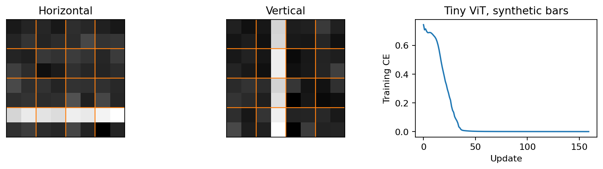

# 第四编配套实验指南

第四编目录 · 学习与排版标准

## 实验环境与运行

初次生成 2026-09-17，本轮复核 2026-09-18；实际环境：Windows，Python 3.11.15，PyTorch 2.13.0+cpu，NumPy 1.23.5，Matplotlib 3.7.2。所有实验使用 CPU；训练脚本设置单线程和固定 seed。每个脚本可单独运行，不依赖上一节保存的权重，也不依赖其他编的隐式导入。

PowerShell 中运行一节：

```powershell
& 'D:\miniconda3\envs\d2l\python.exe' 'C:\Users\关俊烨\Documents\Obsidian Vault\AI学习手册\第四编 多模态、评测与系统\配套实验\lab_15_1.py'
```

批量运行并在首次失败时停止：

```powershell
$labDir = 'C:\Users\关俊烨\Documents\Obsidian Vault\AI学习手册\第四编 多模态、评测与系统\配套实验'
Get-ChildItem -LiteralPath $labDir -Filter 'lab_*.py' |
    Sort-Object Name |
    ForEach-Object {
        Write-Output $_.Name
        & 'D:\miniconda3\envs\d2l\python.exe' $_.FullName
        if ($LASTEXITCODE -ne 0) {
            throw "Experiment failed: $($_.Name)"
        }
    }
```

其他电脑请改用自己的 Python 环境路径。本轮没有安装软件或下载模型。训练数据均在内存中合成；实验不读取个人数据、交通科研项目或算法题单，不调用付费 API。带绘图的实验会覆盖本编 `图示/` 下对应的四幅生成图；Python 可能自动生成 `__pycache__/`。

计时随机器、负载和版本变化。训练结果也可能因版本/数值实现有小差异。测试检查的是数学性质、实现边界和有限的训练 sanity check，不要求所有实验输出完美分数。

## 共用模块

- [multimodal_core.py](multimodal_core.py)：可复现设置、合成 bar 图像、TinyViT、微型图文 decoder、response loss、保存图示。
- [eval_core.py](eval_core.py)：二分类指标、接受任意有限分数的 AUROC/AP、binary reliability、paired bootstrap 与 selective risk；严格区分分数/概率，未定义指标返回 `None`。
- [generative_core.py](generative_core.py)：二维混合数据、VAE、明确 reduction 的重建/KL、时间条件 denoiser，以及已知混合分布的解析最优噪声预测（仅诊断）。

这些模块是教学代码，不是生产库或预训练模型。各实验的 `main()` 清楚标出实际训练、手工 fixture 和公式模拟的边界。

## 17 个实验与本次实测记录

2026-09-18 全部原实验与新增检查已重跑。基础训练随机序列尽量保持不变；不通过改变种子或训练预算来掩盖既有失败。17.2 的三种子训练、19.1 的完整观测样本、19.2 的解析对照是新增结果。

以下数值来自本机实际运行，不是要求学习者必须得到的标准答案。固定测试集上的结果也不是统计显著性结论。

| 节 | 脚本 | 实际验证与结果 |
|---|---|---|
| 15.1 | [lab_15_1.py](lab_15_1.py) | patch/Conv2d 数值等价；TinyViT 独立图像测试准确率 1.0000，末次训练 CE 约 0.0003 |
| 15.2 | [lab_15_2.py](lab_15_2.py) | 双向 contrastive logit 梯度吻合；toy 新图分类 1.0000；全同类 fixture 的 diagonal CE 为 1.3863，multi-positive 为 0 |
| 15.3 | [lab_15_3.py](lab_15_3.py) | cross-attention shape、padding 扰动隔离、视觉梯度和同步置换等价通过 |
| 15.4 | [lab_15_4.py](lab_15_4.py) | 实际图文 decoder 自由生成 exact match 1.0000；blank-image 0.5000；图像翻转后对原标签评分 0.0000；response mask/因果性检查通过 |
| 16.1 | [lab_16_1.py](lab_16_1.py) | 反序列均值相同；causal 扰动检查通过；toy EMA 在 onset=4 后于 index=5 报警，延迟 1 个采样间隔 |
| 16.2 | [lab_16_2.py](lab_16_2.py) | nonlinear early 模型学会 XOR 真值表，additive late 输出约 0.5；缺失模态归一化得 0.62/0.9/0.2 |
| 16.3 | [lab_16_3.py](lab_16_3.py) | 忽略坐标的 OOD 构造中 confidence AUROC=.5，distance=1；coverage/risk 为 1/.4、.6/.3333、.2/0 |
| 17.1 | [lab_17_1.py](lab_17_1.py) | 手算 fixture AUROC=.75、AP=.8333；验证集选温度 3；独立 test Brier .2340→.2044，ECE .1626→.0284 |
| 17.2 | [lab_17_2.py](lab_17_2.py) | 原 fixture 改善 .1、CI [-.2,.4]；新增三种子训练：baseline MSE≈1.29076，交互特征模型≈.00305–.00306；同测试集、同 80 updates，参数 3 vs 4 |
| 17.3 | [lab_17_3.py](lab_17_3.py) | 标准化找到一条 raw-string 漏掉的重复；shortcut 规则 ID=1、shift=0；局部有界扰动改变 toy 决策 |
| 17.4 | [lab_17_4.py](lab_17_4.py) | fixture 候选总分 .5→.75，但 critical 1→0，门禁拒绝；缺失/重复/空 case 和无效 timing 测试通过 |
| 18.1 | [lab_18_1.py](lab_18_1.py) | GEMM 131,072 FLOPs、理想 38,912 bytes、强度 3.368；一次本机 CPU median 约 2.49 μs，非 GPU 测量 |
| 18.2 | [lab_18_2.py](lab_18_2.py) | FP16 溢出/BF16 有限；INT8 最大权重误差 .010435、输出误差 .033684；存储 512→160 bytes；KV .75 MiB |
| 18.3 | [lab_18_3.py](lab_18_3.py) | 不等 rank 样本数的正确梯度与全局批次吻合；naive L1 误差 .162139；张量切分和 AdamW 恢复通过 |
| 19.1 | [lab_19_1.py](lab_19_1.py) | VAE test 重建项 .2866、KL .7398；Gaussian KL/重参数化正确；GAN 梯度归属正确，但生成分布仍明显不佳 |
| 19.2 | [lab_19_2.py](lab_19_2.py) | 正向矩/反演/两种 posterior mean/最后一步检查通过；80-step DDPM 实际训练采样；test noise MSE .2613，对照零预测 .9978 |
| 19.3 | [lab_19_3.py](lab_19_3.py) | 12 个提案 fixture，加作用域/精确 payload 审批/confidence 不授予权限测试；无真实执行；独立风险计算上界 .02951 |

15.2 只学习两个 text ID 向量，不是自然语言 CLIP 或 unseen-class zero-shot。15.4 是随机初始化的微型条件模型，不是通用 LLM 的多模态微调。16.2 是覆盖全部四点的容量测试，不是泛化评测。17.4 的输出和 latency 为人工 fixture。18.3 为单进程模拟，没有通信集群。

## 新增复核结果与可复现边界

- 15.1：RGB patch 的输入/权重/bias backward 等价；position-free pooling 不变性；总参数 2,626。
- 15.2–15.4：非对称对比矩阵、完整归一化梯度、多正样本梯度；all-masked/NaN 拒绝；微型图文模型参数 6,214；swap 新标签准确率 1.0000，旧标签 0.0000；批次置换通过。
- 16.1：事件手算 TP=1/FP=2/FN=1，与实现一致；居中平滑的未来泄漏复现。
- 16.2：同一输入下概率平均 .75、logit 平均 .786061、logit 相加 .931034；available/NaN 和全缺失策略测试。
- 16.3–17.1：无接受样本的 risk=None；更严阈值风险反增反例；原始 distance/logit 的 AUROC；NaN 阈值、非法维度/bin、AP tie、单类等边界；一-bin ECE=0 但 Brier=.81。
- 17.2：三种子真实消融的 candidate-minus-baseline MSE 差约 -1.2877；各 seed 的 paired 95% CI 均在零以下。**这是人为设计的交互任务，同一测试集，不是跨任务优势或三份独立测试证据。** 原十例 fixture 的区间仍跨零。
- 17.3–17.4：importance weights=.25/4，source risk=.2、target risk=.8；保留 C++/C 误合并反例；无效 case/额外输出/布尔或字符串 latency 均拒绝。
- 18.1–18.3：checkpoint 重算梯度等价，非显存基准；先 unscale 再 clip；单 token speculative 的 accepted+residual 分布等于 target；空 rank 归一化，空 global batch 不能误 step。
- 19.1：枚举 ELBO=-.797797，log evidence=-.693147，KL gap=.104650；GAN logit=-5 时两种梯度约 -.00669/-.99331；完整 VAE 样本 std≈(1.985,.970)，模型垂直 variance 至少 1 而真实为 .1225。
- 19.2：noise MSE：learned=.2613、零预测=.9978、已知生成器 oracle=.2417；三时间段 learned/oracle 分别约 .5514/.5147、.2300/.2133、.0504/.0413。解析对照利用生成器信息，不是训练得到的模型；全时间 posterior mean 与 score 微分检查通过。
- 19.3：scope 与 approval 分离，修改 payload 需重新审批；无真实动作，也不实现用户鉴权、审批持久化或 replay 防护。

本轮不宣称实现 GPU AMP、整数加速、真实 DDP、生产 serving、多 token speculative 引擎或自然图像生成。增加数学/CPU 测试不自动扩大实现范围。

## 四幅实测图

1. 
2. 
3. 
4. 

19.1 的 VAE 图现有 decoder means 与加上单位观测噪声后的完整 likelihood samples 两个面板。本轮标准差：真实数据约 (2.005, .355)，VAE means 约 (1.735, .0098)，GAN 约 (4.037, .170)。VAE 均值图的垂直方差偏小；GAN 的短程结果横向过宽且未恢复真实双峰。左右占比接近一半并不能证明分布匹配，图中不足是保留的学习材料。

19.2 的 DDPM 图虽更接近该合成分布，也只说明这一次二维任务的有限结果。没有进行自然图像质量或跨任务优势比较。

## 如何把实验变成自己的能力

先不看输出预测一个数学性质，再运行；随后修改一个因素并解释变化。例如：patch 大小、正样本集合、response mask、未来帧、融合方式、阈值、重采样单位、量化 outlier、rank token 数、VAE 似然方差或 diffusion 时间输入。

每次记录：假设、改动、保持不变的条件、实际结果、失败解释和下一步。不要只运行一次就标记为掌握。个人状态由你确认后更新，本轮未改动 学习记录。

## 检查范围

2026-09-18 复核：17 个实验和新增边界检查全部实际运行通过；20 个 Python 文件通过语法检查，正文 17 个 Python 代码块单独执行通过。本编 24 份 Markdown 加全书入口/章节总纲共 26 页，检查 289 个本地链接、122 组独立公式和 655 个行内公式，以及代码围栏、括号和环境配对；17 节均有默认折叠的自检提示。四幅 PNG 已逐幅查看，VAE 图新增完整观测采样面板。

未实际打开 Obsidian 阅读模式验证 MathJax 渲染，也未进行 GPU、真实分布式或外部模型/API 测试。静态 LaTeX 检查不等同于渲染器逐页验收。
